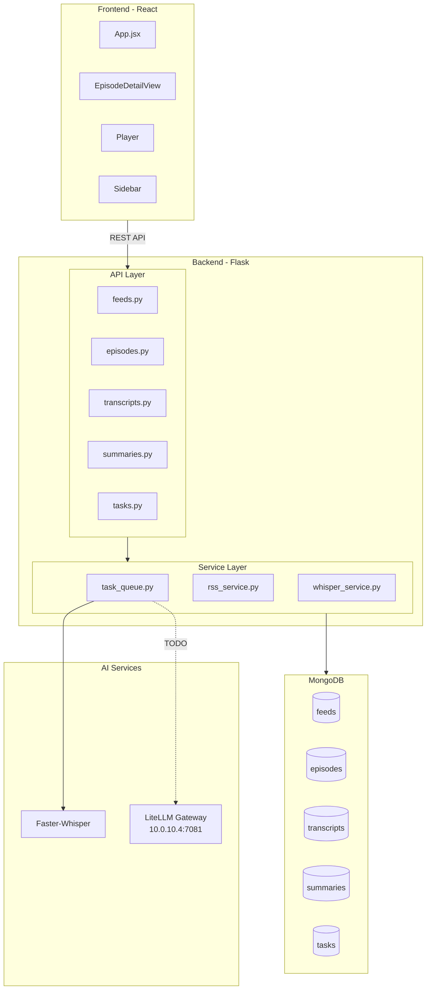
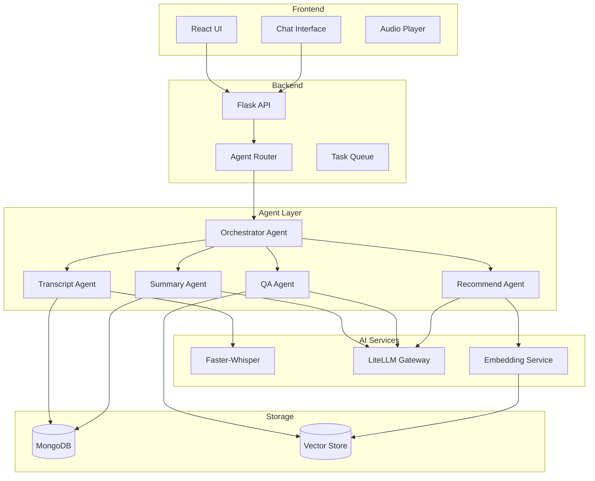
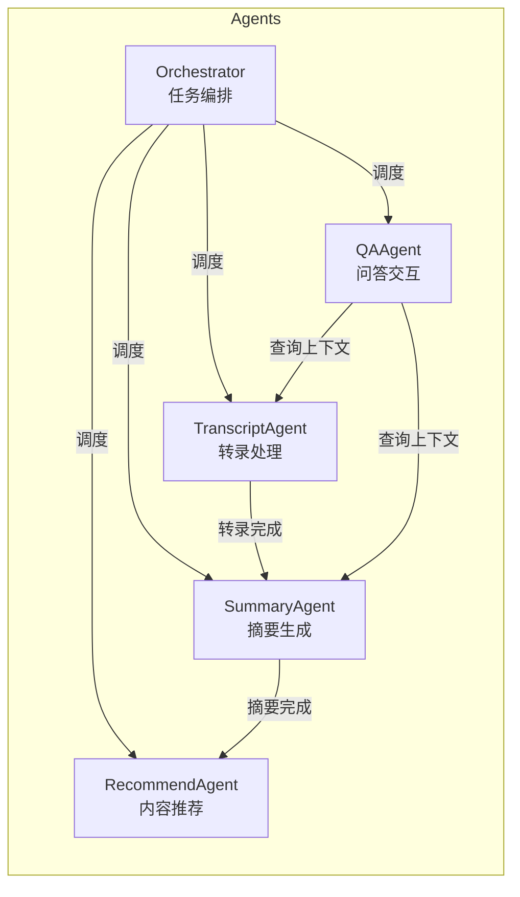
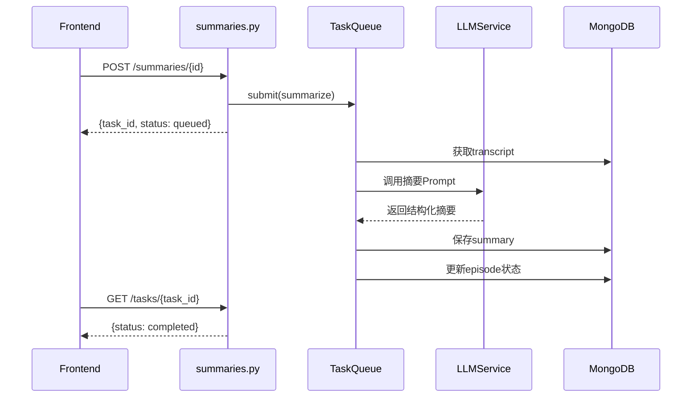
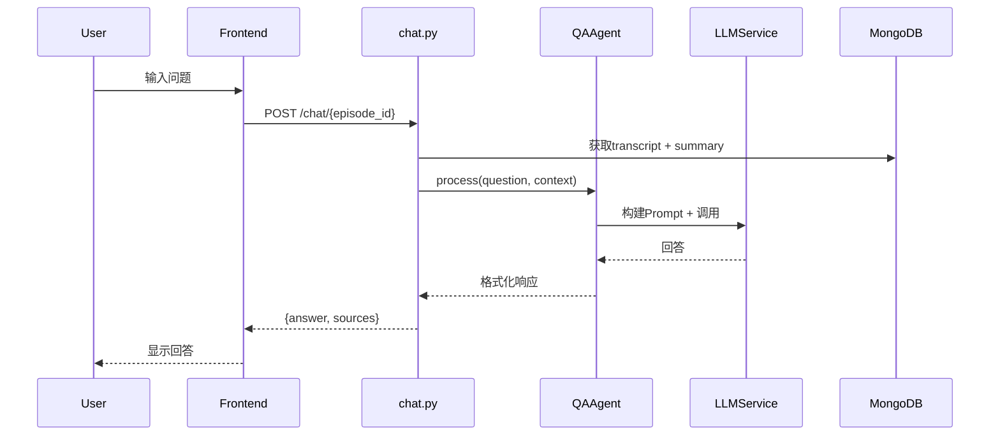
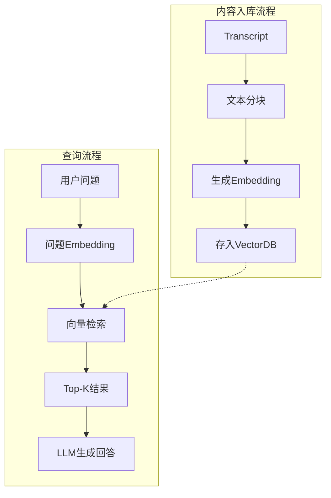
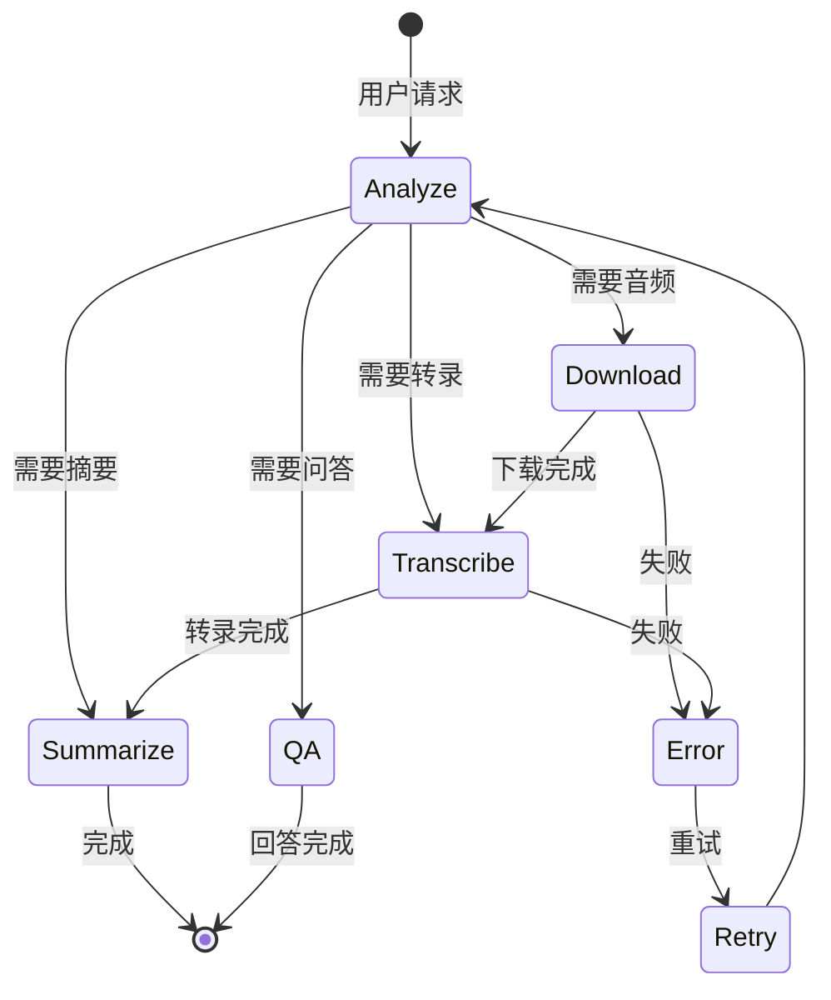
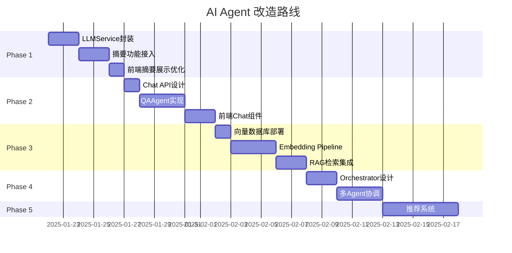

# PodMaster AI Agent 改造计划

## 一、项目现状分析

### 1.1 当前架构



### 1.2 现有AI能力

| 功能 | 实现状态 | 技术方案 |
|------|----------|----------|
| 音频转录 | 已完成 | Faster-Whisper (small模型) |
| 内容摘要 | Placeholder | 待接入LLM |
| 智能问答 | 未实现 | - |
| 内容推荐 | 未实现 | - |

### 1.3 LLM接入方式

通过内部LiteLLM网关统一调用多种模型：

```python
import openai

client = openai.OpenAI(
    api_key="sk-xxx",
    base_url="http://10.0.10.4:7081"
)

# 可用模型
models = [
    "google/gemini-2.5-flash",
    "google/gemini-2.5-pro",
    "openai/gpt-5",
    "qwen3-32b"
]
```

---

## 二、Agent改造方案

### 2.1 整体架构升级



### 2.2 Agent职责划分



---

## 三、具体实现方案

### 3.1 Phase 1: 基础LLM接入 (优先级: 高)

**目标**: 完成摘要功能的真实LLM调用

**改动文件**:
- `backend/app/services/llm_service.py` (新建)
- `backend/app/api/summaries.py` (修改)

**架构**:



**LLMService设计**:

```python
# backend/app/services/llm_service.py
class LLMService:
    def __init__(self):
        self.client = openai.OpenAI(
            api_key="sk-xxx",
            base_url="http://10.0.10.4:7081"
        )
        self.default_model = "google/gemini-2.5-flash"

    def summarize(self, text: str, language: str = "zh") -> dict:
        """生成结构化摘要"""
        prompt = f"""请为以下播客内容生成摘要，返回JSON格式：
{{
    "tldr": "一句话总结(50字以内)",
    "key_takeaways": ["要点1", "要点2", "要点3"],
    "keywords": ["关键词1", "关键词2"],
    "summary": "详细摘要(200-300字)"
}}

内容：
{text[:8000]}
"""
        response = self.client.chat.completions.create(
            model=self.default_model,
            messages=[{"role": "user", "content": prompt}],
            response_format={"type": "json_object"}
        )
        return json.loads(response.choices[0].message.content)
```

### 3.2 Phase 2: QA Agent (优先级: 高)

**目标**: 支持用户针对单集内容进行问答

**新增文件**:
- `backend/app/api/chat.py`
- `backend/app/services/qa_agent.py`

**前端改动**:
- `EpisodeDetailView` 添加聊天面板

**架构**:



**QAAgent设计**:

```python
# backend/app/services/qa_agent.py
class QAAgent:
    def __init__(self, llm_service: LLMService):
        self.llm = llm_service

    def answer(self, question: str, episode_id: str) -> dict:
        # 1. 获取上下文
        transcript = db.transcripts.find_one({"episode_id": oid})
        summary = db.summaries.find_one({"episode_id": oid})

        # 2. 构建Prompt
        context = self._build_context(transcript, summary)

        # 3. 调用LLM
        prompt = f"""基于以下播客内容回答问题。

内容摘要：
{summary.get('content', '')}

详细转录：
{context}

问题：{question}

请直接回答，如果内容中没有相关信息请明确说明。
"""
        response = self.llm.chat(prompt)
        return {"answer": response, "episode_id": episode_id}
```

### 3.3 Phase 3: 向量检索增强 (优先级: 中)

**目标**: 支持跨集内容搜索和语义检索

**新增组件**:
- ChromaDB 或 Qdrant 向量数据库
- Embedding服务

**架构**:



### 3.4 Phase 4: Orchestrator Agent (优先级: 中)

**目标**: 智能任务编排，自动化处理流程

**能力**:
- 自动判断下一步操作
- 多Agent协调
- 错误恢复



### 3.5 Phase 5: 智能推荐 (优先级: 低)

**目标**: 基于用户行为和内容相似度推荐

**数据维度**:
- 用户收听历史
- 内容Embedding相似度
- 播客主题标签

---

## 四、技术选型建议

| 组件 | 推荐方案 | 备选方案 |
|------|----------|----------|
| LLM调用 | LiteLLM Gateway (已有) | 直接调用API |
| Agent框架 | 自建轻量Agent | LangChain / AutoGen |
| 向量数据库 | ChromaDB | Qdrant / Milvus |
| Embedding | text-embedding-3-small | BGE-M3 |
| 流式响应 | SSE | WebSocket |

---

## 五、实施路线图



---

## 六、文件结构规划

```
backend/
├── app/
│   ├── api/
│   │   ├── chat.py          # 新增: Chat API
│   │   └── ...
│   ├── services/
│   │   ├── llm_service.py   # 新增: LLM封装
│   │   ├── qa_agent.py      # 新增: QA Agent
│   │   ├── embedding.py     # 新增: Embedding服务
│   │   └── ...
│   ├── agents/              # 新增: Agent目录
│   │   ├── __init__.py
│   │   ├── base.py          # Agent基类
│   │   ├── orchestrator.py  # 编排Agent
│   │   ├── summary.py       # 摘要Agent
│   │   ├── qa.py            # 问答Agent
│   │   └── recommend.py     # 推荐Agent
│   └── ...
└── ...

frontend/
└── src/
    ├── components/
    │   ├── ChatPanel.jsx    # 新增: 聊天面板
    │   └── ...
    └── ...
```

---

## 七、关键注意事项

1. **渐进式改造**: 保持现有功能稳定，逐步引入Agent能力
2. **模型选择**: 优先使用`gemini-2.5-flash`平衡速度与质量
3. **错误处理**: LLM调用需完善超时、重试、降级机制
4. **成本控制**: 记录Token消耗，设置限额
5. **用户体验**: 流式输出提升响应感知

---

## 八、立即可执行的第一步

修改 `backend/app/api/summaries.py` 中的 `_summarize_sync` 函数，接入真实LLM：

```python
def _summarize_sync(episode_id: str, progress_callback=None):
    """同步执行摘要生成"""
    import openai
    import json

    # ... 获取transcript代码保持不变 ...

    if progress_callback:
        progress_callback(20)

    # 调用LLM
    client = openai.OpenAI(
        api_key="sk-xxx",
        base_url="http://10.0.10.4:7081"
    )

    prompt = f"""请为以下播客内容生成摘要，返回JSON格式：
{{
    "tldr": "一句话总结",
    "key_takeaways": ["要点1", "要点2", "要点3"],
    "keywords": ["关键词1", "关键词2"]
}}

内容：
{transcript_text[:8000]}
"""

    if progress_callback:
        progress_callback(40)

    response = client.chat.completions.create(
        model="google/gemini-2.5-flash",
        messages=[{"role": "user", "content": prompt}],
        max_tokens=1024
    )

    if progress_callback:
        progress_callback(80)

    result = json.loads(response.choices[0].message.content)

    # ... 保存到数据库代码保持不变 ...
```

---

*文档生成时间: 2025-01-21*
