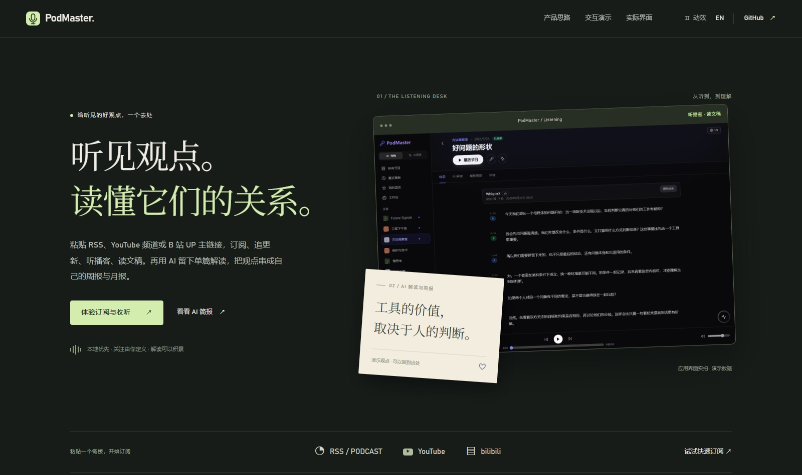
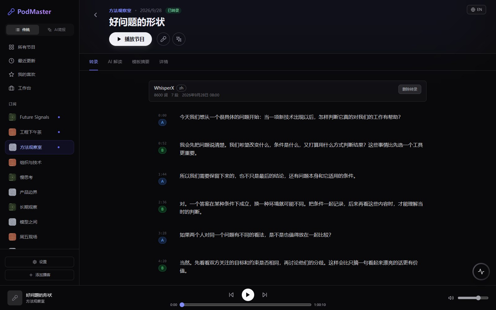

# PodMaster

**把订阅、收听和 AI 整理，放在同一个工作台。**

PodMaster 是一个本地优先的播客与视频订阅工具。粘贴 RSS、YouTube 频道或 B 站 UP 主链接，就能集中管理节目、查看更新、收听音频和阅读文稿；再用 AI 保存单篇解读，整理成自己关注的周报与月报。

**[在线产品展示](https://zhong-ze-wei.github.io/podcast/)** · **[快速启动](#快速启动)** · **[产品说明](./docs/product-showcase.md)** · [完整文档](./docs/index.md) · [English](./README_EN.md)

[](https://zhong-ze-wei.github.io/podcast/)

**点击上图，直接体验在线展示。** 页面包含产品介绍、实际界面截图，以及订阅与收听、AI 简报两个交互演示，手机上也可以打开。演示使用示例内容，播放器模拟进度；实际订阅、音频播放和 AI 分析需启动本地应用。

## 界面预览

### 订阅与收听

把不同平台的内容放在一起，查看最近更新、收藏节目，边听边读文稿。底部播放器支持播放暂停、进度拖动、快进后退和音量调整。

[](https://zhong-ze-wei.github.io/podcast/#demo)

### AI 解读与简报

基于完整文稿保存摘要、议题、原话、新词与方法；周报和月报继续复用单篇分析，整理共性与分歧。观点可以收藏，原话可以回到出处，完整报告可以导出 PDF。

[](https://zhong-ze-wei.github.io/podcast/#screenshots)

截图来自实际应用，使用演示数据。[打开在线交互演示](https://zhong-ze-wei.github.io/podcast/#demo) · [更多截图与演示说明](./docs/product-showcase.md)。

## 可以做什么

- **快速订阅**：自动识别 RSS 地址、YouTube 频道和 B 站 UP 主主页。
- **追更新、听节目**：集中查看最近更新；点进订阅源后，其未查看更新提示自动清除。
- **获得完整文稿**：优先获取平台字幕；没有字幕时，可手动按需进行本地转写。
- **留下单篇解读**：保存核心摘要、议题、观点、原话、新词与方法，也支持可选模板的摘要。
- **生成个性化简报**：按关注话题整理周报、月报，复用已保存的单篇分析，再比较跨节目的共性与分歧。
- **共享内容、各有进度**：多人共用订阅库，已读、收藏与收听进度按用户保留；界面支持中英文切换。

## 快速启动

准备 Git、Python（建议 3.13）、[uv](https://docs.astral.sh/uv/)、Node.js 18+。数据库使用 MongoDB；可以使用本机已有的 MongoDB，也可以先启动 Docker Desktop，由后端创建数据库容器。

以下使用 PowerShell。先下载项目：

```powershell
git clone https://github.com/Zhong-Ze-Wei/podcast.git
cd podcast
```

**终端一：从项目根目录启动后端。**

```powershell
cd backend
Copy-Item .env.example .env   # 仅首次运行；已有 .env 时跳过
uv sync
uv run python run.py
```

后端默认监听 `http://localhost:5000`。本机 `27017` 端口没有 MongoDB 时，启动脚本会尝试创建或启动 Docker 容器 `podcast-mongodb`。

**终端二：在项目根目录另开一个终端，启动前端。**

```powershell
cd frontend
npm install
npm run dev
```

打开 **http://localhost:3000**。如果端口已被占用，以 Vite 输出的实际地址为准；前端会把 `/api` 请求转发到后端。

启动后，可以直接打开 **[产品交互演示](http://localhost:3000/product/index.html)**。只想预览产品介绍，也可以下载仓库后，用浏览器打开 [静态产品介绍页](./frontend/public/product/index.html)，不必启动后端。

### 首次使用

1. 添加订阅：粘贴 RSS、YouTube 频道或 B 站 UP 主地址，等待同步节目。
2. 打开一期节目，收听音频、阅读已有文稿；需要时再手动转写。
3. 要使用 AI 时，在设置中启用 AI 功能并配置模型服务，再生成单篇解读或摘要。
4. 在 AI 简报中选择关注话题，按周或按月整理内容。

开启登录后，第一个注册用户成为管理员，后续注册需要审批；AI 服务配置由管理员统一维护。账号、代理、字幕与模型配置详见 **[完整启动指南](./docs/getting-started.md)**。

### 可选：本地转写

需要 Whisper / WhisperX 转写时，在**项目根目录**执行：

```powershell
python setup_local_ai.py
```

安装脚本会按机器选择 GPU 或 CPU 依赖。使用已有字幕或远程模型生成解读时，不需要安装本地转写组件。[转写安装与配置](./docs/getting-started.md#本地转写组件可选加载)。

## 文档导航

| 想了解什么 | 快捷入口 |
| --- | --- |
| 不安装，先了解产品与体验交互 | [在线产品展示](https://zhong-ze-wei.github.io/podcast/) |
| 项目介绍、截图、交互演示 | [产品说明与演示](./docs/product-showcase.md) |
| 环境安装、首次使用、配置与常见问题 | [快速启动指南](./docs/getting-started.md) |
| 周报、月报、关注话题与阅读风格 | [内容报告说明](./docs/briefing-reports.md) |
| 字幕、转写、摘要与 AI 配置机制 | [AI 功能说明](./docs/ai-features.md) |
| 系统结构、数据流与权限 | [架构概览](./docs/architecture.md) |
| 开发接口与数据库 | [API 接口](./docs/api.md) · [数据库设计](./docs/database.md) |
| AI 分析算法与实验 | [AI 研究入口](./docs/ai/README.md) |
| 文档总览、技术决策与待办 | [文档地图](./docs/index.md) · [技术决策](./docs/decisions/) · [待办](./docs/backlog.md) |

## 技术栈与开发

前端使用 React 18、Vite、TailwindCSS 与 i18next；后端使用 Flask、MongoDB 与后台任务队列。内容接入包括 RSS、YouTube 与 B 站；模型服务支持 OpenAI 兼容接口与 Anthropic 协议，本地转写支持 faster-whisper / WhisperX。

在 `frontend` 目录运行前端检查：

```powershell
npm test
npm run build
```

在 `backend` 目录运行后端测试：

```powershell
uv run pytest
```
