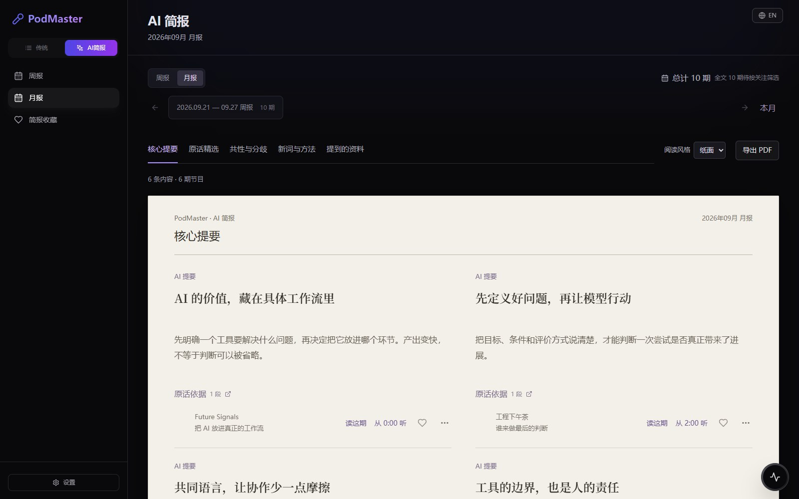
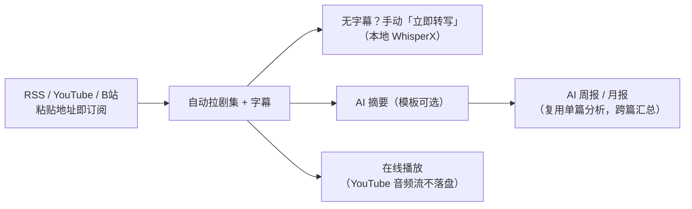

# PodMaster — 本地优先的播客与视频订阅工作台

订阅 RSS 播客、YouTube 频道、B站 UP 主，自动拉字幕/文稿，手动按需转写，AI 摘要与周报/月报，全家人共享一个库、各有各的进度。

> English version: [README.md](./README.md)

## 产品说明与演示

**[本地打开产品介绍页](http://localhost:3000/product/index.html)** · **[GitHub Pages 发布说明](./docs/product-showcase.md#github-pages)** · [页面源码](./frontend/public/product/index.html)

独立静态页，包含应用截图、动效、中英文切换、五栏目简报试读、收藏、原话卡片拖动和截图放大。演示使用示例数据，不需要登录、后端或调用 AI。

[](http://localhost:3000/product/index.html)

启动前端后可点击本地快捷入口，也可直接打开 `frontend/public/product/index.html`。已提供 GitHub Pages 发布工作流；发布后的预期地址为 [zhong-ze-wei.github.io/podcast](https://zhong-ze-wei.github.io/podcast/)。

## 三十秒理解它



- **共享库**：所有成员看同一个订阅库；已读/加星/播放进度按人隔离
- **账号体系**：注册需管理员审批；admin / user / viewer 三档角色
- **AI 配置全局一套**：管理员维护服务商和 Key，成员零配置（不存个人 API Key）
- **转写策略**：平台字幕自动拉（含 B站字幕串台防御校验），本地转写一律手动

## 快速启动

```powershell
# 后端（会自动用 Docker 拉起 MongoDB）
cd backend
Copy-Item .env.example .env
uv sync
uv run python run.py        # → http://localhost:5000

# 前端
cd frontend
npm install
npm run dev                 # 配置端口 3000，被占自动递增（本机常为 3002）

# 可选：本地 AI 转写组件（torch/WhisperX，约 1-3GB，按机器自动选 CUDA/CPU 版）
python setup_local_ai.py
```

首次使用流程、全部配置变量（含 `YOUTUBE_PROXY` / `BILI_SESSDATA` 等视频源必需项）、常见问题：**[快速启动文档](./docs/getting-started.md)**。

## 技术栈

| 层 | 技术 |
| --- | --- |
| 前端 | React 18, Vite, TailwindCSS, i18next（中/英），PWA |
| 后端 | Python 3.13, Flask, ThreadPoolExecutor 任务队列 |
| 数据库 | MongoDB（Docker 容器 `podcast-mongodb`） |
| 内容接入 | feedparser / yt-dlp + youtube-transcript-api / curl_cffi（B站 wbi 签名） |
| AI | OpenAI 兼容 + Anthropic 双协议；本地 faster-whisper / WhisperX |

## 文档

| 想了解 | 文档 |
| --- | --- |
| 跑起来、配置、常见问题 | [docs/getting-started.md](./docs/getting-started.md) |
| 架构、数据流、权限模型 | [docs/architecture.md](./docs/architecture.md) |
| AI 能力机制与策略 | [docs/ai-features.md](./docs/ai-features.md) |
| 接口 / 数据库（给开发与 AI 读） | [docs/api.md](./docs/api.md) · [docs/database.md](./docs/database.md) |
| 技术决策记录 | [docs/decisions/](./docs/decisions/) |
| 待办与产品决策 | [docs/backlog.md](./docs/backlog.md) |

文档地图与内容边界见 [docs/index.md](./docs/index.md)。

## 常用命令

```powershell
cd backend && uv run pytest      # 测试（116 用例）
cd backend && uv run python run.py   # 后端
cd frontend && npm run build     # 前端构建
```
