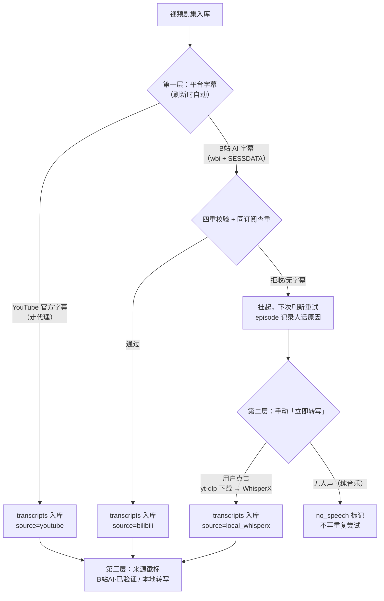
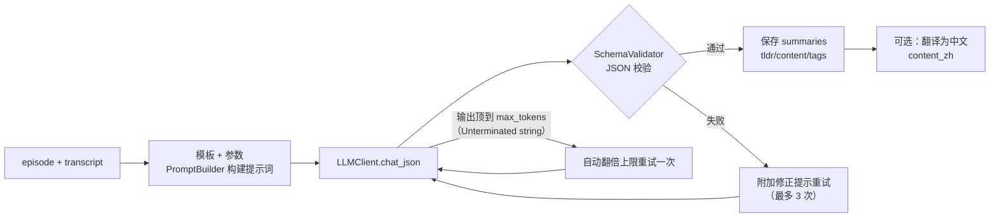
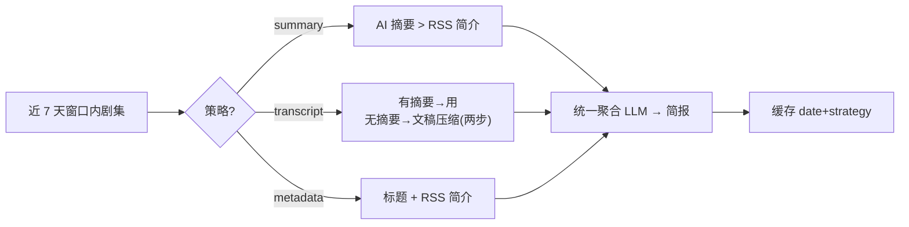

# AI 功能

> 讲清楚每个 AI 能力的机制与产品策略。字段表见[数据库设计](./database.md)，端点见 [API](./api.md)。

## 总开关与成本观念

- **AI 总开关**（admin 在设置页切换，存 settings）：关闭时摘要/简报生成直接返回 423，简报读取退回最近缓存。
- **全局一套 LLM 配置**：服务商、模型、任务路由由 admin 维护，全员共用——成员账号不存任何 API Key。
- **任务路由**：`summary` / `briefing` / `transcript_normalize` 三类任务可各指定模型（例如摘要用强模型、文本清理用便宜模型）。
- 双协议支持：OpenAI 兼容（SDK）与 Anthropic messages（HTTP），`api_format` 字段切换（ADR-001）。

## 字幕/文稿：三层策略

产品决策（2026-09-28 定稿）：**接口捞的全自动，本地转写全手动**——平台字幕成本≈0 所以自动重试；本地转写消耗算力，一律由人点"立即转写"触发。

**B站为什么需要校验**：B站 AI 字幕存在系统性"串台"（旧接口返回其他视频的脏缓存，实测 28 集中招，字幕和内容完全对不上）。四重校验：时间轴 ≤ 时长×1.05、行密度 ≥ 每 60 秒 1 行、行均字数 ≥ 2、标题词窗命中率 ≥ 18%（正常 ≥30%，串台 ≤14%）；再加同订阅文本 md5 查重（串台时多个视频返回同一份字幕）。

**为什么校验必须在后端**：字幕原始数据由后端用 wbi 签名从 B站接口拉取，前端拿不到也不该拿到；校验是入库闸门，放前端等于可绕过。前端负责展示结果（来源徽标、无字幕原因）。

## 摘要引擎

模板化生成，带校验-重试闭环：

- 模板存 `prompt_templates` 集合，5 个系统模板已中文化；用户可复制自定义。
- 参数化：模板声明参数（长度/语言等），详情页可直接选，不必去设置页改默认。
- 摘要结果带 `tokens_used` 与耗时，便于观察成本。

## AI 简报

**三种取材策略并列**（前端 AI 简报页顶部 tab 切换，独立缓存独立生成，供对比选择）：

| 策略 | 取材 | 特点 |
|------|------|------|
| `summary` 摘要聚合 | AI 摘要优先，RSS 简介兜底 | 原有逻辑，质量取决于已有摘要量 |
| `transcript` 文稿直析 | 有摘要用摘要；**无摘要的单集从文稿现场压缩要点**（两步法：先逐集 LLM 压缩 ≤10 集，再全局聚合） | 不依赖预先生成摘要，覆盖最全 |
| `metadata` 元数据雷达 | 标题 + RSS 简介，单次 LLM | 零依赖最快（实测 ~17s） |

- 数据源窗口：**近 7 天内发布**的剧集（严格 `published >= cutoff`，不会拉到历史旧内容）。
- 按天 + 策略缓存，同一天同策略读取不重复调 LLM；`force` 可强制重生成。
- 输出包含：总览、热点话题、新概念、趋势、推荐剧集、Markdown 报告；支持 PDF 导出（按策略命名）。
- `_meta.material_note` 记录取材构成（如"2 集已有摘要 + 5 集文稿压缩"），前端头部展示。

## 转录后处理

所有转录入库前统一处理：中文间不自然空格清理、标点规范化；装了 OpenCC 时繁转简。可选 AI 规范化（`TRANSCRIPTION_AI_NORMALIZE_ENABLED=1`，消耗 LLM token，默认关）。

## 已知限制

| 限制 | 说明 |
|------|------|
| 简报窗口硬编码 7 天 | 不支持自定义时间范围 |
| 单次 LLM 聚合 | 聚合步骤无多步编排（文稿直析的逐集压缩除外） |
