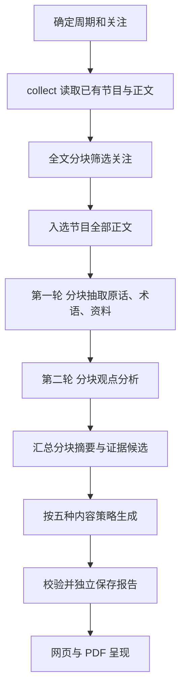

# AI 简报算法研究

记录日期：2026-10-01，香港时区。源码基线：`a7869fe8bdf7d6dc35e82cd55e5da5daff6b9d89`；九月数据在当日香港时间 18:21 导出，完整起止时刻见 manifest。本文是 AI 简报后续独立研究的交接文档，不是已经确定的新算法设计。本轮只整理实现、研究问题和固定数据，不修改生产分析流程、不启动新的模型生成。

**研究目标：从用户关注的播客正文中，快速找出值得读、值得听、值得进一步了解的内容。首页简洁，分析覆盖清楚，原话可信；先用固定的九月数据证明效果，再接入产品。**

本文中的“现状”来自源码；“产品目的”来自用户明确要求；“研究方向”和“建议判据”尚待实验。不要把候选方案写成已实现，也不要把一次样例的好效果当作整月结论。

## 1. 用户真正要解决的问题

用户订阅了多个播客，没有时间逐期听完。AI 简报帮助他决定：这段时间大家真正讨论了什么，哪些内容值得继续听，是否出现有价值的共同判断或实质差异。

希望读者完成以下动作：

1. 快速了解某周或某月的重要内容，以及它为什么与自己关注的话题有关。
2. 看到完整真实的原话，AI 只补必要的简短语境，不用泛泛的“洞察”“速览”替代原话。
3. 知道报告分析了哪些节目、每期大致讲什么、最终精选实际引用了哪些节目。
4. 对感兴趣的内容打开单篇解读、完整文稿，或直接从对应位置回听。
5. 获得可延伸阅读的新词、方法、书、文章、论文或工具；确实需要时再补背景并明确外部来源。
6. 保存或导出一页／两页的纸面、报刊报告，便于后续使用。

### 1.1 已确定的产品原则

| 原则 | 对算法与结果的要求 |
| --- | --- |
| 少即多 | 首页只展示少量有价值的精选；少的是首屏文字，不是材料覆盖、来源透明度或可展开内容。 |
| 原话优先 | 原话不能润色后继续标成原话；译文、AI 概括、背景和跨节目推断分别标明。 |
| 先让人读懂 | 摘要说清具体命题、理由、必要条件；避免用户不知道在谈什么的抽象大道理。 |
| 五种内容模式 | 核心提要、原话精选、共性与分歧、新词与方法、提到的资料需要不同的选择策略，而不是五个排版。 |
| 风格独立 | 同一份内容可以换纸面、报刊等样式，不因此重新调用模型。未来风格可以继续扩充。 |
| 兴趣与正文相关 | AI、LLM 等关注标签可以增加、删除、停用；正文筛选不能只看节目标题。具体的前置／后置筛选方式仍需研究。 |
| 周期独立 | 九月与十月报告及任务分别管理；相同文稿的基础分析可以合理复用。自然周跨月属于日历定义，不是月报串数据。 |
| 渐进打开 | 精选 → 原话与语境 → 单篇解读 → 完整文稿／回听。详细分析不必全部堆在首页。 |
| 模型能力与速度 | 用户愿意接受合理的摘要成本，希望用好现有模型能力，减少没有收益的分块、重复调用和等待。并未要求盲目换弱模型。 |

“内容多”不能等同于“好”；“首页只有十条”也不能自动证明中间分析浪费。需要评价精选价值、未展示的分析能否用于单篇阅读和后续报告，以及产生这些价值的时间与 token 成本。

## 2. 研究范围与固定数据

### 2.1 九月是完整研究样本，不是只导出相关的 32 期

研究周期为香港时区 **2026-09-01 00:00 至 2026-10-01 00:00，右侧不包含**。按节目发布时间归属，沿用当前账号可访问订阅的去重规则。

当前观测基线：

| 数量 | 含义 |
| --- | --- |
| 111 行 | 导出时九月原始数据库节目记录，含重复订阅副本与已删除订阅的关联记录。 |
| 17 行 | 原始节目中关联订阅已不存在，不计入当前产品材料池。 |
| 78 期 | 九月当前订阅池去重后的全部节目。 |
| 36 期 | 已保存可用真实正文，可直接做文本实验。 |
| 42 期 | 当前没有正文，保留元数据；不得宣称已读、不得用标题冒充全文摘要。 |
| 32 期 | 使用当前 AI／LLM 关注筛选，被判定相关的有正文节目。 |
| 4 期 | 有正文，但现有筛选未判定与 AI／LLM 相关；保留它们检验筛选漏判。 |
| 135 段 | 36 份文稿按旧 `split_text` 算法切出的基线分块。 |
| 127 段 | 32 份相关文稿按同一算法切出的分块。 |
| 1,300,505 字符 | 全部 36 份正文的长度；其中相关 32 份共 1,245,580 字符。 |
| 63 份 | 导出的原始转录，含重复副本及孤立节目的转录；孤立节目有正文的 12 份另行保留，不混入主样本。 |

这些是导出时的观测值，不是写死的业务常量。文件中的 `manifest` 是固定快照的数量与校验依据。导出完成以后新增转录或改变数据库，不应悄悄改变这轮实验的数据。

产品按当前可访问订阅去重取材，因此 78 期是本次目标范围。原始 111 行不能直接与 78 期相减当成无稿数量：既有重复副本，也有订阅已不存在的记录。此前页面观察或数据库查询的数量会随更新变化；本轮只采用 manifest 所记录的导出数量。

### 2.2 为什么同时需要 CSV 和完整正文文件

CSV 适合检查节目、筛选结果、正文长度、分块数量等表格信息；完整长文稿和字幕时间段用 JSONL 保留结构，避免 CSV 多行正文难读、时间映射丢失。实验直接读取快照，不再次拉取网页、不调用转录、不依赖正在变化的线上数据库。

数据位于 [`data/2026-09/`](./data/2026-09/)，导出与使用说明见 [README](./README.md)。快照中保留：节目元数据、36 份完整正文、已有字幕时间段、全部旧分块及字符偏移、既有筛选与分析缓存的统计、导出时间及哈希。模型输出与缓存是旧算法结果，不是人工标准答案。

导出是只读逐次采集，不是数据库事务快照；导出期间现有任务可能继续写缓存。文件完成后固定，研究比较必须使用这些相同文件，不假定所有缓存来自同一轮生成或同一时刻。

正文与字幕属于本地研究材料，不随普通代码提交上传；导出脚本和字段说明可以提交。实验日志不得包含访问令牌、账号密码、API 密钥、供应商认证信息。

## 3. 当前生产流程：源码事实

主要入口是 `POST /api/briefing-reports/modes/generate`。当前页面传递 `mode`、`period_type`、`period_start`、启用的 `interests`，后端创建异步任务。读取已有报告、换日期、换风格不会自动调用模型。

**这不是一次将九月全文交给最终模型的 one-step 分析。** 当前最终模型读取的是两轮分析产生的压缩记录和证据候选。用户提出更直接的处理思路，是值得公平测试的候选方案，不能在研究开始前假定多阶段一定必要，也不能假定整月单次必然更好。

### 3.1 取材与周期

[`BriefingScopeService.collect`](../../backend/app/services/briefing_scope_service.py) 从当前订阅和数据库中的转录取材，优先实际非空正文，并执行已有来源去重。标准视频 ID 可跨重复订阅去重；普通 RSS 的同名 guid 不能跨不同订阅借用正文。

- 自然周：香港时间周一至下周一；自然月：每月一日至次月一日，均左闭右开。
- 元数据含没有正文的节目，分析正文只来自已有文本。
- **此入口不抓取字幕、不下载音频、不启动转录。** 更新与转录能力是其他流程，本次算法研究不混入。
- `selection_key` 包含周期、启用兴趣、全部材料是否有正文、正文哈希。生成过程中材料变化会拒绝保存，避免混合快照。

### 3.2 共用分块算法

[`briefing_lab_service.split_text`](../../backend/app/services/briefing_lab_service.py) 的 `CHUNK_SIZE` 为 **12,000 字符，字符不是 token**。

算法从头连续覆盖到文末。若不是最后一段，就在本段后半范围寻找最后一个普通空格作为边界；找不到则在字符上限处切开。相邻分块没有重叠，保留 `start/end` 字符偏移以及 `C001` 等编号。

这保证完整覆盖与原文定位，但**没有根据话题、论证、字幕时间、说话人或句子语义切分**。英文有空格时可能比较接近词边界；中文正文没有空格时仍可能切在句子或论证中间。一个否定、条件与对应判断落在不同片段中，当前没有专门的跨片段补偿策略。

需要分开评价两个问题：是否必须分块，以及必须分块时怎样切。不能仅凭“127 段很多”就认定全是无效，也不能以全文没有漏字符证明分块语义质量良好。

### 3.3 关注筛选

`BriefingScopeService._screen_source` 检查每个正文片段，模型给出匹配的关注话题、理由、连续原文证据。顶层 `matches` 使用 JSON Schema 约束，话题只能来自用户列表，每段每话题最多一条匹配。

- 最多 3 期节目并发，同一期的分块串行筛选。
- 任意分块匹配，就把**整期节目**纳入后续分析；后续分析其全部正文，并非只处理相关段落。
- 仍检查文稿尾部，避免把没有阅读的部分误判为不相关。
- 未启用关注时，全部有正文节目纳入；无需按兴趣排除。
- 缓存按正文哈希和关注组合复用。最终可见的每个话题只保留一条直接依据，不代表模型只读了一段。

Schema 是结构约束，不能证明关联理由正确、语义理解准确。标题里有 AI、广告偶然提到模型等，不足以纳入，是提示词规则；仍需人工抽查模型执行情况。

### 3.4 第一轮：摘录抽取

[`BriefingReportService.extract/_extract_chunk`](../../backend/app/services/briefing_report_service.py) 对全部入选正文分块调用模型，最多 **3 段并发**。每段结果包括简短摘要，以及：

- `concepts`：具体术语、原词、简短解释和原文；
- `quotes`：连续原话、必要语境、非中文原句的译文；
- `resources`：实际提到的具名作品或工具、类型、提到／推荐关系、原文；
- `backgrounds`：文稿明确给出的背景，不主动外查。

每段可能产生多项，数量由提示词建议控制，缺项返回空列表。原词、作品原名和引文需要在该片段实际存在；网址只保留正文出现的有效 URL。说话人没有直接归属证据时留空，不能猜嘉宾姓名。

“已整理 44/127 段 · Latent Space”就是这一轮完成了 44 个分块作业，含缓存命中；频道名表示最近完成的分块来源，不意味着只分析该频道。进度不区分“复用缓存”和“新请求”。

### 3.5 第二轮：观点分析

当前模式路径在 [`BriefingModesService._material`](../../backend/app/services/briefing_modes_service.py) 调用 `lab._source_notes`：对每个来源、每个分块依次得到片段摘要、主要观点、解释与条件、逐字证据、未回答问题。

**此路径来源与分块是串行的。** `BriefingLabService.analyze_sources` 虽有另一个三并发入口，当前周期五模式不是通过它执行这一步，不能看到类中有线程池就认为全部分析都并发。

第二轮对同一批正文再次调用模型，摘要与原话任务存在重叠，但命题和条件要求更细。它的有效增益尚未经过对照评估。该阶段没有逐段更新当前模式任务进度，因此第一轮显示 127/127 后仍可能长时间等待。

### 3.6 最终生成：完整材料记录不等于完整原文

`BriefingModesService._material` 把分块摘要、观点说明、可定位时间的证据候选、已有单篇解读、关注匹配理由合并成最终输入。无法定位收听时间的候选会被过滤，可能减少某些文稿对最终报告的贡献。

最终输入中叫 `full_text_chunks` 的字段装的是**分块摘要**，不是 `full_text` 原文；`evidence_candidates` 装的是提取过的候选。最终模型无法重新发现第一、第二轮都遗漏的原文重点。

五种模式共用这份材料，各自用不同提示词与校验逻辑，生成全部模式时最多 **3 模式并发**：

| 模式 ID | 内容目的 | 当前上限／条件 |
| --- | --- | --- |
| `core` | 整期核心判断、理由与边界 | 最多 10 条，每期至多 1 条，证据来自同一期。 |
| `quotes` | 完整、有具体含义的原话 | 最多 10 句，只能选已校验的原话候选。 |
| `connections` | 共同点、分歧或互补 | 最多 4 组，每组至少两个不同节目证据。 |
| `concepts` | 真正术语或方法及其用法 | 最多 8 项，只能选真实概念候选，可补同期解释证据。 |
| `resources` | 实际提及的作品或工具 | 最多 10 项，只能选真实资料候选。 |

这些是上限，不是一定凑齐的数量。页面默认只展示前 6 条，更多可以展开。固定配额没有随月报的节目数自动调整。

`TOPIC_TAGS` 写死为 AI、编程、商业、管理、历史、科学，每条 1–2 个。**关注标签 LLM 可以参与筛选，但不是结果标签。** Agent、推理、AI 开发工具等具体话题不会自动形成结果分类，这能解释大量条目看起来都属于一个 AI 标签。

### 3.7 校验、失败、缓存与报告保存

[`quote_offset`](../../backend/app/services/briefing_lab_service.py) 接受连续原话，允许空白差异，其余要求在对应分块中逐字匹配。改标点、修字幕噪音、拼接多个句子、引用跨分块文本都可能匹配失败；失败不自动等于模型捏造。

`_model_call` 最多两次调用：第一次校验失败，附错误让模型完整重返该分块／模式 JSON；第二次仍失败就抛错。当前不是逐条修复，局部候选问题可能中止整个月报。已有成功缓存不会被删除，但线程池中已经在执行的其他请求可能仍完成。

- 筛选失败会保存两次原始输出与原因到 `Cxxx.failure.json`。
- 摘录与观点失败没有相同的专门落盘，不能从一句报错还原其具体原始错误。
- 筛选已发送原生 JSON Schema；摘录、观点和最终模式当前不是同样的 Schema 合约。所有模式仍有应用侧校验。
- 结构正确、引文存在、不同来源数量正确，都不证明“代表整期核心”或“语义上真有分歧”。这些需要另外评估。
- 摘录缓存以正文哈希和版本区分，观点缓存以正文哈希和片段编号区分。提示词改动若不同步隔离缓存，实验会误用旧结果。
- 报告按新 UUID 独立写 JSON，记录周期、兴趣、材料指纹、来源、生成时间、模式、模型 usage 等；九月和十月不会互相覆盖文件。
- 当前历史报告查询按实时 `selection_key` 匹配。补转录、改关注或材料变化可能让旧报告不再展示，文件仍存在；这不同于固定期刊归档。

### 3.8 其他相关流程

| 功能 | 实际状态 |
| --- | --- |
| 单篇解读 | [`BriefingReadingService.generate_reading`](../../backend/app/services/briefing_reading_service.py) 使用分块摘要与已有候选，生成一句要点和 1–3 个精选解读，仍不是直接再读全文的稳定单篇分析层。 |
| 单篇复用 | 模式路径按整个周期的 `corpus_id` 查单篇结果，而日常单篇入口使用单篇材料集的 `corpus_id`，多篇周期通常无法命中；需要独立验证并修正这种键错位。 |
| 外部背景 | 当前五模式只使用已保存、核实的网页笔记解析资料链接，不主动调用 web search。旧服务存在搜索能力，不能据此声称当前入口已联网补充。 |
| 自动报告 | [`BriefingAutoReporter`](../../backend/app/services/briefing_auto_reporter.py) 周／月结束后检查并调用相同算法；当前支持每周或每月一种自动计划。失败等待一小时，最多三次。不自动补开启前的历史周期。 |
| 任务隔离 | 周／月任务和页面状态已按周期隔离；旧的无周期在途任务保留兼容。此问题不是本轮要重做的算法。 |
| 展示与 PDF | [`BriefingReportsView`](../../frontend/src/components/views/BriefingReportsView.jsx) 负责渐进展开、原话浮窗、收藏、单篇入口等。风格和纸面／报刊 PDF 消费已保存内容，不参与正文理解。 |

## 4. 时间、token 与“浪费”应该怎样理解

九月 32 期入选正文有 127 段。如果全冷启动，仅两轮正文处理就需要 **127 + 127 = 254 次请求**，还未算 36 期的全部筛选、五模式汇总、失败重试。缓存会明显减少真实调用数，所以不能把 254 当作每次点击的实际账单。

旧保存样本里第一轮分块调用记录的耗时中位数约 27.5 秒，第二轮约 18.3 秒；记录的 `elapsed_seconds` 可能包含该次模型调用内部的一次重试，不能视作每个 HTTP 请求的独立耗时。这些只说明已有样本的情况，不是 SLA，不是本次剩余时间预测，也不能直接乘以分块数量当整月墙钟时间。并发、缓存、限流、重试、模型输出长度都会影响结果。

九月导出文件中已有缓存如下。此处检查的是全部 36 份正文的 135 段，不是只统计相关 127 段：

| 阶段 | 已有分块缓存／基线分块 | 保存的累计 total token | 保存的请求秒数之和 |
| --- | --- | --- | --- |
| 关注筛选 | 135／135 | 718,592 | 1,997.48 |
| 摘录抽取 | 128／135 | 1,310,350 | 3,898.46 |
| 观点分析 | 32／135 | 268,791 | 687.16 |

这是跨历史运行、按现存文件去重的记录样本，不是本次生成的完整费用或墙钟时间，不能把并发请求秒数之和当等待时长。未保存失败、已被覆盖的历史缓存和后续写入不在这份文件中；结果级 usage 也不能再与分块级重复相加。缓存缺失不证明从来没有调用过。

### 4.1 不能仅凭“最后十条”判断浪费

全文阅读是发现少量真正重点的必要投入之一。问题在于当前中间结果是否产生了可持续价值：

- 某条分析没有进入首页，但是否进入其他四模式、单篇解读、专题或后续周报？
- 每一期是否至少形成了可读摘要，用户是否能看见其是否参与分析？
- 第一轮与第二轮重复了多少文本和信息，第二轮实际提高了哪些判断？
- 很多证据因为时间映射失败被过滤，是否有好的内容因此永久丢失？
- 高频返回的泛泛观点、广告、普通工具名和边缘金句占用了多少输出？

建议记录“分析覆盖率”和“首页选择率”两种指标，而不是用后者否定前者：

| 指标 | 定义与限制 |
| --- | --- |
| 文稿覆盖 | 成功处理有正文节目／全部有正文节目，另记录每期正文覆盖。不能用读标题代替。 |
| 精选来源覆盖 | 最终某模式实际引用的去重节目／参与分析的相关节目；不是越大越好，仍要评估价值。 |
| 证据利用率 | 被某模式引用的唯一证据候选／全部合格候选。低利用率是调查信号，不等于没用。 |
| 中间结果复用 | 候选或单篇结果被其他模式、周报、月报、单篇阅读复用的次数，以及减少的调用。 |
| 单位价值成本 | 人工认定有价值且准确的条目，对应完整调用 token、费用、时间。不同策略按相同输出目标比较。 |
| 无收益调用 | 只增加重复内容、失败或噪音且未改善人工质量／覆盖／复用的调用，应靠消融实验确认。 |

## 5. 当前问题清单：事实与待验证假设分开

| 观察／源码事实 | 风险或假设 | 研究怎样确认 |
| --- | --- | --- |
| 12,000 字符分块，无重叠，无语义边界 | 可能切断判断与条件，影响原话和核心理解 | 标记跨界论证，对照全文、字幕／句界切分、适度重叠。 |
| 同一正文筛选后又做两轮分析 | 可能重复花费 token；也可能提高证据质量 | 合并一轮与现状做消融，比较准确性、遗漏、token、时间。 |
| 一段匹配即整期纳入 | 与兴趣弱关联的部分也被全面抽取 | 比较整篇语境保留、相关段与邻近语境、后置主题选择的效果。 |
| 最终模型只见摘要和候选 | 上游遗漏可能不可恢复；压缩可能丢主旨 | 人工按原文核查，测量最终重点在上游是否已出现。 |
| 没有必经的稳定整期综合层 | 月报中整期核心被边缘摘句替代 | 加单篇综合的对照，评估完整中心、论证、条件和复用价值。 |
| 月报最多十条核心、默认显示六条 | 看不出 32 期材料范围，并可能遗漏高价值内容 | 覆盖索引与精选分开，按兴趣和具体话题测漏掉的主旨。 |
| 固定六类结果标签 | AI 相关结果全部挤进一类 | 从正文提炼具体话题，再看聚合是否帮助找内容，避免标签爆炸。 |
| 材料列表“已纳入报告”只是筛选通过 | 用户误以为最终每期都被引用；无单篇摘要 | 分别展示总材料、有正文、相关、已分析、实际引用、未引用。 |
| 单条引文失败可导致整体失败 | 连续读取进度很久后没有任何成品 | 原文 ID 回填、局部修复／丢弃与部分完成状态对照。 |
| 观点阶段串行，缺少进度 | 慢且用户不理解等待；扩大并发也可能限流 | 记录分阶段耗时、真实请求数、缓存命中，测安全并发与首屏延迟。 |
| 当前查找依赖实时材料指纹 | 旧刊内容随着补稿或兴趣变化消失于页面 | 独立归档快照设计；不要把它混为正文算法质量问题。 |

用户对“核心不足、空洞、少、看不懂、太慢”的反馈是研究问题，不能只通过增加条目数、加长文本或放宽所有证据校验来解决。

## 6. 候选算法：先对照，再决定

以下都是候选，暂不修改生产入口。优先简单脚本和清楚的数据结构，无需先引入 LangGraph 或复杂 agent 框架。框架不会自动提高核心理解。

| 策略 | 操作方式 | 主要要验证什么 |
| --- | --- | --- |
| A：现状基线 | 保留旧分块、筛选、摘录、观点、五模式规则 | 提供同样数据与模型的参照，测真正花费和错误点。 |
| B：单篇全文一步分析 | 能放入模型上下文的节目一次生成摘要、具体话题、核心判断与证据位置；过长节目明确采用另外策略 | 用现有强模型是否可以减少重复分析且更懂整期，不能盲目截尾。 |
| C：合并分块分析后单篇综合 | 必须分块的节目一次提取摘要、主张、原话、术语、资料，然后单篇综合，再做月报 | 比较两轮合并、单篇综合分别带来的质量／成本增益。 |
| D：话题优先的月报 | 先形成单篇内容，再按具体命题和主题聚合，保留来源；五模式在共同产物上编辑 | 是否得到具体有用的共性／分歧，避免全都归为“AI”。 |
| E：直接全月／大批全文分析 | 在验证模型上下文容量、费用、请求限制后，测试可容纳的一批或整月正文直接生成 | 与层次压缩比较长期依赖和跨节目联系；超过容量就记录不适用，不偷偷截断。 |

策略 B／C 可以配合“关注前置”与“关注后置”的对照：前置降低后续成本，后置让稳定单篇分析复用更多兴趣。先选少量合理组合，不把所有选项做成排列组合烧预算。

更大并发也是实验变量，不是默认更优：明确供应商速率限制、实际可用上下文、长输入输出行为后，逐步测试。不要仅根据模型名字推测上下文或 web search 能力，使用当前供应商实际 API 支持并记录证据。

### 6.1 原话定位：优先减少模型复写负担

给原文句子／字幕段稳定 ID，模型选取 ID 或起止位置，由程序从原文回填真实引句。模型负责理解和选择，代码负责逐字文本与回听映射。这是候选设计，不是已有实现。

需要验证：一句跨多个字幕段时能否完整回填，自动字幕不完整标点如何选边界，没有时间段的纯文章如何仍保留正文定位，译文和解释是否加入原文没有的含义。不能只选 ID 正确就认为解释准确。

研究时应区分“能追溯到完整正文”和“能定位播放器时间”。真实文章、无时间转录或正文与字幕难对齐，都可能具备可靠原文依据却没有 `start`。它们是否应该被排除，或保留依据并仅禁用定位播放，需要验证；目前不能宣称已确认九月漏掉了多少条。

局部错误应定位到具体条目／证据。候选失效可以修复、降级或舍弃，但必须记录并提示覆盖情况，不把部分成功宣传为完整读取。原话真实性标准保留，失败的影响范围可以缩小。

### 6.2 全部覆盖与精选结果分别保存

建议实验产物形成两个层级：

1. **单篇稳定记录**：每期简短摘要、真实核心判断及条件、具体话题、少量证据、原文／时间位置、实际资料、处理状态。缺正文和分析失败明确标明。
2. **周期编辑结果**：五模式精选，精确引用单篇记录／证据，注明本模式实际来源；月报是否需要更多可展开内容由价值验证决定。

这让十条首页精选背后的三十多份单篇结果有去处，也让周月共享同一份文稿分析。单篇记录适宜按“节目身份＋正文哈希＋算法／提示词版本”定位；报告另按周期、关注与数据快照归档。具体接口确认效果后再定。

## 7. 怎么判断分析足够好

### 7.1 先做小样本人工标准

从 36 份正文选少量有代表性的节目，覆盖中文／英文、长节目／短片、有／无时间段、单主题／多主题、强相关／弱相关与现有排除的节目。第一轮可以 6–8 期，不只挑最容易出漂亮金句的材料。

人工按完整原文标记：整期核心问题与判断、主要理由和条件、重要话题、值得选的原话、实际具名资料、可能混淆的说话人／字幕错误。人工摘要可以有合理分歧，要记理由；不以旧模型输出当标准。

### 7.2 用同一数据、同一目标比较

- 小样本确定有潜力的 2–3 个策略后，再跑整月，避免一开始全量试遍。
- 第一轮尽量保持模型与输出目标相同，只改变处理策略。模型更换单独做变量，防止混淆。
- 冷启动与暖缓存分别报告；不能拿现状暖缓存对比新策略冷启动，也不能把历史耗时当本次重跑时间。
- 若输出数量不同，同时评价质量和可用内容覆盖；文本多的策略不能仅凭更多条目获胜。
- 三种时间分别记录：首次可读结果、完整单篇层、五模式全部完成。首屏很快而后台不完整不是最终完成。

### 7.3 建议评估维度

| 维度 | 要看什么 |
| --- | --- |
| 主旨 | 是否抓到整期中心，而不是好听的边缘金句；主要理由、条件、反例是否保留。 |
| 易懂与价值 | 用户无需重新找上下文就能理解；是否真正有助决定继续听或了解；重复空话多少。 |
| 原话与来源 | 连续真实原文、没有改写／拼接、说话人不过度归属、正文位置和回听时间可靠。 |
| 兴趣与话题 | AI／LLM 的实际关联，排除节目漏判，具体话题是否帮助筛选而不是堆标签。 |
| 联系与分歧 | 同命题和相近条件下的真实联系，不能靠都提到 AI 制造共识；缺证据可以为空。 |
| 材料覆盖 | 哪些节目已读、失败、排除、未引用；所有正文尾部是否真正处理。 |
| 速度 | 墙钟总耗时、首次结果、各阶段耗时、请求延迟 P50／P95、并发、等待与重试。小样本 P95 仅作描述。 |
| token 与成本 | 包含筛选、处理、汇总、重试的全部实际调用 usage；仅复用缓存、没有新模型调用时，记 0 新 token。reasoning 等明细缺失写未知，不能自行估计为免费。 |
| 可靠性 | 单段／单篇失败率、局部失败影响范围、错误是否可复现、断点复用与缓存正确性。 |
| 复用 | 单篇结果供周月与不同模式复用后，增加了多少可用价值、减少多少真实请求。 |

供应商实际定价未核实前，只报告测得 token／请求／耗时，不编造费用。等确认当前 API 的具体计费规则，再保存价格来源、日期与计算公式。

硬性底线建议是：不能出现伪原话／伪来源、不能把未读的材料说成已读、不能把假设改成确定事实。速度、数量和主旨质量的可接受阈值需要基于基线与人工结果确定，不在本轮文档中承诺秒数或虚构质量分。

## 8. 每次实验必须可复现

研究输出放在独立实验目录，例如 `docs/ai/experiments/<run_id>/`，不要覆盖现有生产缓存、报告和九月原始快照。完整正文、模型原始输入输出仍属于本地数据；可提交脱敏的实验说明、提示词和汇总。

最低记录要求：

| 类别 | 内容 |
| --- | --- |
| 数据 | 固定快照 manifest、文件哈希、原节目／正文 ID、正文哈希、使用的样本列表、是否排除与理由。 |
| 算法 | 策略版本、分块算法与参数、实际分块边界、是否重叠、是否全文截断、聚合规则。 |
| 模型 | 供应商及模型版本、API 功能、temperature、max_tokens／上下文限制、并发、请求参数；不存密钥。 |
| 提示词 | 完整 system／user 模板、版本与哈希；动态输入另外保存并能关联到正文。 |
| 调用 | 每次开始结束、阶段、样本、原始响应、解析结果、usage、finish_reason、错误、重试次数与原因。 |
| 缓存 | 是否命中、命中来源版本／哈希、新产生 token，与旧缓存样本耗时分开。 |
| 评估 | 人工判断、原文位置、发现的遗漏／错误、盲评顺序、摘要表与实际产物。 |

一个片段解析失败时也要保留原响应；不能只留下成功结果，然后说成功调用的 token 就是整轮花费。若 API 不返回某项 usage 或原有缓存不保留失败，则对应成本明确为下界或未知。

## 9. 推荐执行顺序与本轮边界

1. 读本文、README 与九月 manifest，校验固定文件与计数，确认当前模型实际上下文和结构化输出能力。
2. 不调用模型，先检查文稿长度分布、语言、字幕时间段、广告和重复、旧分块边界、已保存失败与阶段耗时。
3. 建立小样本人工标准，列出具体策略、预期收益、样本、调用数量／token 预算与可比输出目标。
4. 在独立目录试验现状基线与最有价值的直接／合并策略，保存原始输入输出与完整成本。
5. 缩小候选后用整月评价核心、具体话题、精选、跨节目关系和材料覆盖。写清失败和不适用情况。
6. 确认效果后选择算法，再用薄的业务接口接入现有周期任务、读取、收藏与 PDF。不要为了研究提前重写整站。

本轮已授权的是文档与本地固定数据准备。**不把这份文档当作现在立即重做生产算法、修改模型配置、触发全量生成或抓取缺失转录的指令。** 未来独立窗口按用户任务执行研究，先把策略与样本预算写明即可；本文不增设额外审批流程。

## 10. 源码与已有资料导航

| 位置 | 研究时看什么 |
| --- | --- |
| [`backend/app/api/briefing_reports.py`](../../backend/app/api/briefing_reports.py) | 当前模式、单篇与旧版入口，队列参数。 |
| [`briefing_scope_service.py`](../../backend/app/services/briefing_scope_service.py) | 周期取材、来源身份、关注筛选、快照与缓存键。 |
| [`briefing_report_service.py`](../../backend/app/services/briefing_report_service.py) | 第一轮抽取、证据校验、候选、三并发与进度。 |
| [`briefing_lab_service.py`](../../backend/app/services/briefing_lab_service.py) | 共用分块、观点分析、quote_offset、模型调用、重试。 |
| [`briefing_modes_service.py`](../../backend/app/services/briefing_modes_service.py) | 五模式实际提示词、限制、最终输入、结果校验与保存。 |
| [`briefing_reading_service.py`](../../backend/app/services/briefing_reading_service.py) | 单篇解读、已有读取与材料集缓存键。 |
| [`briefing_auto_reporter.py`](../../backend/app/services/briefing_auto_reporter.py) | 自动生成、周期去重与失败重试。 |
| [`briefing_task_service.py`](../../backend/app/services/briefing_task_service.py) | 当前周期任务隔离规则。 |
| [`llm_client.py`](../../backend/app/services/llm_client.py) | 当前供应商接口、JSON 模式与 Schema、usage；不输出配置密钥。 |
| [`BriefingReportsView.jsx`](../../frontend/src/components/views/BriefingReportsView.jsx) | 材料列表、状态命名、前六条、标签、单篇与回听。 |
| [`docs/briefing-reports.md`](../briefing-reports.md) | 已上线能力和此前样例；人工复核样例不等于每次自动输出都有人工校验。 |
| [`docs/briefing-report-plan.md`](../briefing-report-plan.md) | 历史方案，别把旧版本策略当现入口。 |

源码事实以研究时实际 checkout 为准。记录 git 版本，遇到本文与后来实现不一致，先核对实现，再更新文档；不要据旧文档覆盖别人已完成的修改。
