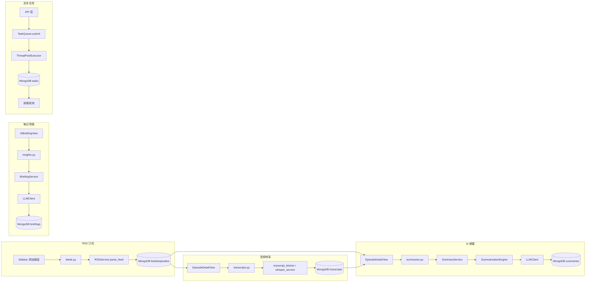

# 00 - 项目全景图

> 文档版本：2026-05-17 | 基于代码库实际结构编写

## 一句话定位

**播客 AI 阅读助手**：订阅 RSS 播客，自动转录音频，用 LLM 生成结构化摘要和每日简报。

## 顶层目录

```
podcast/
├── backend/          Flask + MongoDB 后端，Python 3.12
├── frontend/         React 18 + Vite + TailwindCSS
├── docs/             项目文档
├── CLAUDE.md         项目约束（TDD 流程、架构约束、代码规范）
├── BACKLOG.md        待处理改进事项
├── README.md         项目简介（2026-03-06，偏旧）
└── plan.md           早期开发计划（2026-02-27，严重过时）
```

---

## 后端目录结构（backend/）

| 路径 | 职责 | 关键文件 |
|------|------|----------|
| `run.py` | 入口，启动 Flask + 自动管理 MongoDB Docker 容器 | `backend/run.py` |
| `app/__init__.py` | Flask 应用工厂 `create_app()`，初始化 DB/索引/蓝图/自动刷新 | `backend/app/__init__.py` |
| `app/config.py` | 配置管理（MongoDB/LLM/media 路径/任务线程数） | `backend/app/config.py` |
| `app/api/` | 9 个蓝图路由层 | 见下方 API 蓝图表 |
| `app/services/` | 业务逻辑层 | 见下方 Service 表 |
| `app/services/prompts/` | v2 legacy prompts | `base.py`, `general.py`, `investment.py`, `translate.py` |
| `app/core/summarization/` | v3 template engine | `engine.py`, `prompt_builder.py`, `schema_validator.py` |
| `app/core/summarization/defaults/` | 默认模板定义 | `templates.py` |
| `app/models/` | 纯数据模型（7 个） | 见领域模型文档 |
| `media/audio/` | 下载的音频文件存储目录 | 本地文件系统 |

### API 蓝图（app/api/）

| 蓝图文件 | 路由前缀 | 职责 |
|----------|----------|------|
| `feeds.py` | `/api/feeds` | RSS 订阅源 CRUD + 刷新 |
| `episodes.py` | `/api/episodes` | 单集列表/详情/下载/状态管理 |
| `transcripts.py` | `/api/transcripts` | 转录触发/获取/删除 |
| `summaries.py` | `/api/summaries` | AI 摘要生成/获取/翻译 |
| `tasks.py` | `/api/tasks` | 异步任务状态查询/取消 |
| `stats.py` | `/api/stats` | 统计信息 |
| `settings.py` | `/api/settings` | LLM/Tavily 配置管理 |
| `prompt_templates.py` | `/api/prompt-templates` | Prompt 模板 CRUD |
| `insights.py` | `/api/insights` | 每日 AI 简报 |
| `utils.py` | — | 通用响应工具函数 |
| `decorators.py` | — | 路由装饰器 |

### Service 层（app/services/）

| Service 文件 | 职责 | 依赖 |
|-------------|------|------|
| `rss_service.py` | RSS 解析、Feed/Episode 创建与更新 | feedparser |
| `summary_service.py` | AI 摘要生成（v2/v3 双路径） | LLMClient, SummarizationEngine |
| `llm_client.py` | LLM 调用封装（OpenAI 兼容） | openai |
| `task_queue.py` | 异步任务队列（ThreadPoolExecutor） | MongoDB tasks |
| `transcript_fetcher.py` | 从播客官方 URL 拉取转录文本 | requests |
| `whisper_service.py` | 本地 Whisper 模型转录音频 | whisper |
| `briefing_service.py` | 每日 AI 简报生成与缓存 | LLMClient |
| `briefing_prompts.py` | 简报 prompt 模板 | — |
| `auto_refresher.py` | 定时自动刷新 RSS 订阅 | RSSService |
| `tavily_service.py` | Tavily 网络搜索服务 | tavily |

---

## 前端目录结构（frontend/）

| 路径 | 职责 |
|------|------|
| `src/App.jsx` | 主组件，管理全部 16 个状态变量，通过 view 字符串做条件渲染（无 Router） |
| `src/main.jsx` | 入口，挂载 React 应用 |
| `src/i18n.js` | 中英双语国际化配置 |
| `src/services/api.js` | axios 实例，8 个 API 对象封装 |
| `src/locales/zh.json` | 中文翻译 |
| `src/locales/en.json` | 英文翻译 |

### 视图组件（components/views/）

| 组件 | 职责 |
|------|------|
| `WorkspaceView.jsx` | 工作区主视图（默认视图） |
| `EpisodeDetailView.jsx` | 单集详情（最复杂的视图） |
| `FeedDetailView.jsx` | 订阅源详情 |
| `AIBriefingView.jsx` | AI 每日简报 |
| `SettingsView.jsx` | 设置面板容器 |
| `LlmSettingsView.jsx` | LLM 配置（旧版，被 SettingsView 子面板替代） |
| `FavoritesView.jsx` | 收藏夹 |
| `DownloadedView.jsx` | 已下载视图 |
| `TranscribedView.jsx` | 已转录视图 |

### 设置子面板（components/views/settings/）

| 组件 | 职责 |
|------|------|
| `LlmConfigPanel.jsx` | LLM 配置管理 |
| `PromptTemplatesPanel.jsx` | Prompt 模板管理（CRUD） |

### 其他组件

| 目录/文件 | 职责 |
|-----------|------|
| `components/layout/Sidebar.jsx` | 侧边栏导航 |
| `components/player/PlayerBar.jsx` | 底部音频播放器 |
| `components/cards/FeedCard.jsx` | 订阅源卡片 |
| `components/cards/EpisodeCard.jsx` | 单集卡片 |
| `components/common/TaskProgress.jsx` | 任务进度组件 |
| `components/common/StatusBadge.jsx` | 状态徽章 |
| `components/common/LanguageSwitcher.jsx` | 语言切换 |
| `components/tasks/TaskPanel.jsx` | 浮动任务面板 |

---

## 已有文档

| 文档 | 说明 | 最后更新 |
|------|------|----------|
| `docs/index.md` | 文档索引 | 2026-05-16 |
| `docs/prd.md` | 产品需求文档 | 2026-05-16 |
| `docs/backend.md` | 后端架构报告 | 2026-05-16 |
| `docs/frontend.md` | 前端架构报告 | 2026-05-16 |
| `docs/database.md` | 数据库报告 | 2026-05-16 |
| `docs/data-flow.md` | 数据流转报告 | 2026-05-16 |
| `docs/architecture-review/` | 架构评审系列 | 2026-05-17 |
| `BACKLOG.md` | 改进事项 | 2026-05-16 |
| `README.md` | 项目简介 | 2026-03-06，偏旧 |
| `plan.md` | 早期开发计划 | 2026-02-27，严重过时 |
| `api.md` | API 文档 | 2026-02-27，缺 Insights API |

---

## 核心业务链路



### 链路说明

1. **RSS 订阅链路**：`frontend/src/components/layout/Sidebar.jsx` → `backend/app/api/feeds.py` → `backend/app/services/rss_service.py` → MongoDB `feeds`/`episodes`
2. **转录链路**：`frontend/src/components/views/EpisodeDetailView.jsx` → `backend/app/api/transcripts.py` → `backend/app/services/transcript_fetcher.py` + `backend/app/services/whisper_service.py` → MongoDB `transcripts`
3. **AI 摘要链路**：`frontend/src/components/views/EpisodeDetailView.jsx` → `backend/app/api/summaries.py` → `backend/app/services/summary_service.py` → `backend/app/core/summarization/engine.py` → `backend/app/services/llm_client.py` → MongoDB `summaries`
4. **每日简报链路**：`frontend/src/components/views/AIBriefingView.jsx` → `backend/app/api/insights.py` → `backend/app/services/briefing_service.py` → `backend/app/services/llm_client.py` → MongoDB `briefings`
5. **任务异步链路**：API 层 → `backend/app/services/task_queue.py` → ThreadPoolExecutor → MongoDB `tasks` → 前端轮询 `frontend/src/components/tasks/TaskPanel.jsx`

---

## 核心文件清单

### 后端核心文件

| 文件路径 | 作用 | 重要程度 | 建议重构 |
|----------|------|----------|----------|
| `backend/run.py` | 应用入口，启动 Flask + Docker MongoDB | H | N |
| `backend/app/__init__.py` | 应用工厂，初始化 DB/蓝图/索引/自动刷新 | H | N |
| `backend/app/config.py` | 配置管理 | H | N |
| `backend/app/services/llm_client.py` | LLM 调用封装，全局单例 | H | N |
| `backend/app/services/summary_service.py` | AI 摘要核心业务，v2/v3 双路径 | H | Y |
| `backend/app/core/summarization/engine.py` | v3 模板引擎 | H | N |
| `backend/app/core/summarization/prompt_builder.py` | Prompt 组装器 | H | N |
| `backend/app/services/rss_service.py` | RSS 解析与 Feed/Episode 管理 | H | N |
| `backend/app/services/task_queue.py` | 异步任务队列 | H | N |
| `backend/app/services/briefing_service.py` | 每日简报生成 | M | Y |
| `backend/app/services/transcript_fetcher.py` | 官方转录文本获取 | M | N |
| `backend/app/services/whisper_service.py` | 本地 Whisper 转录 | M | N |
| `backend/app/services/auto_refresher.py` | 定时 RSS 刷新 | M | N |
| `backend/app/services/tavily_service.py` | Tavily 搜索 | L | N |
| `backend/app/services/prompts/base.py` | v2 基础 prompt | M | Y（v2 legacy） |
| `backend/app/api/summaries.py` | 摘要 API 路由 | H | N |
| `backend/app/api/feeds.py` | 订阅源 API 路由 | H | N |
| `backend/app/api/episodes.py` | 单集 API 路由 | H | N |
| `backend/app/api/transcripts.py` | 转录 API 路由 | M | N |
| `backend/app/api/tasks.py` | 任务 API 路由 | M | Y |
| `backend/app/api/insights.py` | 简报 API 路由 | M | N |
| `backend/app/api/settings.py` | 配置 API 路由 | M | N |
| `backend/app/api/prompt_templates.py` | 模板 API 路由 | M | N |
| `backend/app/models/feed.py` | Feed 数据模型 | H | N |
| `backend/app/models/episode.py` | Episode 数据模型 + 状态机 | H | Y |
| `backend/app/models/summary.py` | Summary 数据模型 | H | Y |
| `backend/app/models/transcript.py` | Transcript 数据模型 | M | Y |
| `backend/app/models/task.py` | Task 数据模型 | M | Y |
| `backend/app/models/setting.py` | Setting 数据模型 | M | N |
| `backend/app/models/prompt_template.py` | PromptTemplate 模型 + DB 操作 | M | N |
| `backend/app/core/summarization/schema_validator.py` | 摘要输出 schema 校验 | M | N |
| `backend/app/core/summarization/defaults/templates.py` | 默认模板定义 | M | N |

### 前端核心文件

| 文件路径 | 作用 | 重要程度 | 建议重构 |
|----------|------|----------|----------|
| `frontend/src/App.jsx` | 主组件，16 个状态变量，view 字符串路由 | H | Y |
| `frontend/src/main.jsx` | 入口 | H | N |
| `frontend/src/services/api.js` | axios 实例，8 个 API 对象 | H | N |
| `frontend/src/i18n.js` | 国际化配置 | M | N |
| `frontend/src/components/views/EpisodeDetailView.jsx` | 单集详情（最复杂视图） | H | Y |
| `frontend/src/components/views/WorkspaceView.jsx` | 工作区主视图 | H | N |
| `frontend/src/components/views/AIBriefingView.jsx` | AI 简报视图 | M | N |
| `frontend/src/components/views/FeedDetailView.jsx` | 订阅源详情 | M | N |
| `frontend/src/components/views/SettingsView.jsx` | 设置面板 | M | N |
| `frontend/src/components/views/settings/LlmConfigPanel.jsx` | LLM 配置面板 | M | N |
| `frontend/src/components/views/settings/PromptTemplatesPanel.jsx` | Prompt 模板管理 | M | N |
| `frontend/src/components/layout/Sidebar.jsx` | 侧边栏导航 | M | N |
| `frontend/src/components/player/PlayerBar.jsx` | 底部播放器 | M | N |
| `frontend/src/components/cards/FeedCard.jsx` | Feed 卡片 | L | N |
| `frontend/src/components/cards/EpisodeCard.jsx` | Episode 卡片 | L | N |
| `frontend/src/components/common/TaskProgress.jsx` | 任务进度 | L | N |
| `frontend/src/components/common/StatusBadge.jsx` | 状态徽章 | L | N |
| `frontend/src/components/tasks/TaskPanel.jsx` | 浮动任务面板 | M | N |

---

## 新人阅读顺序

| 序号 | 文件 | 为什么先读这个 |
|------|------|---------------|
| 1 | `CLAUDE.md` | 项目约束：TDD 流程、架构分层、代码规范 |
| 2 | `docs/prd.md` | 产品定位与功能范围 |
| 3 | `docs/data-flow.md` | 数据在系统中的流转路径 |
| 4 | `backend/app/__init__.py` | 后端初始化流程：DB/蓝图/索引/自动刷新 |
| 5 | `backend/app/models/` | 7 个数据模型，理解领域对象 |
| 6 | `backend/app/api/summaries.py` + `backend/app/services/summary_service.py` | 最复杂的业务链路（v2/v3 双路径） |
| 7 | `frontend/src/App.jsx` | 前端入口，理解状态管理和视图路由 |
| 8 | `frontend/src/services/api.js` | 前后端 API 契约 |
| 9 | `frontend/src/components/views/EpisodeDetailView.jsx` | 最复杂的前端视图 |
