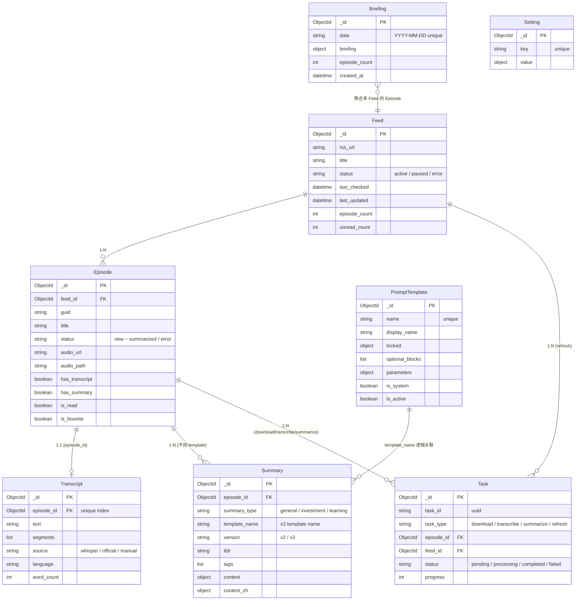
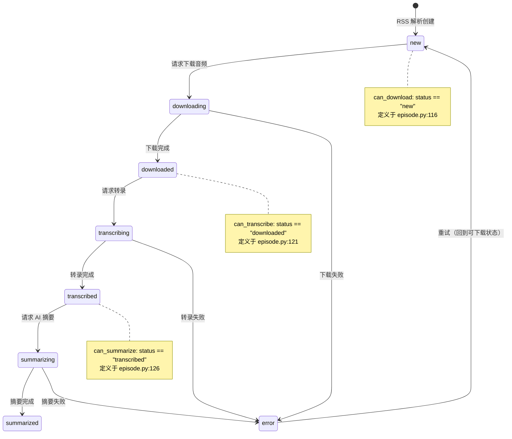
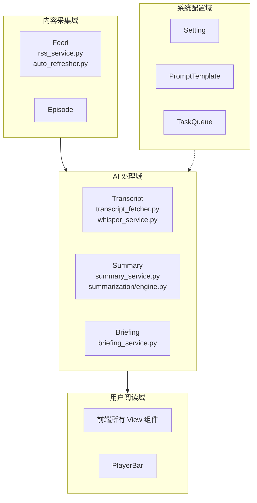

# 01 - 领域模型

> 文档版本：2026-05-17 | 基于代码库实际结构编写

## 领域对象一览

| 对象 | MongoDB Collection | 职责 | 生命周期 | 代码位置 |
|------|-------------------|------|----------|----------|
| Feed | `feeds` | 播客订阅源，RSS 元数据 | 用户订阅时创建，删除时级联清除 | `backend/app/models/feed.py`, `backend/app/api/feeds.py`, `backend/app/services/rss_service.py` |
| Episode | `episodes` | 单集，RSS Entry 映射 | 订阅/刷新时创建，删除 feed 时级联清除 | `backend/app/models/episode.py`, `backend/app/api/episodes.py` |
| Transcript | `transcripts` | 转录文本，1 集 1 条 | 转录完成后创建，可删除重新生成 | `backend/app/models/transcript.py`, `backend/app/api/transcripts.py`, `backend/app/services/transcript_fetcher.py`, `backend/app/services/whisper_service.py` |
| Summary | `summaries` | AI 摘要，1 集可多条 | LLM 生成后写入，force 时覆盖 | `backend/app/models/summary.py`, `backend/app/api/summaries.py`, `backend/app/services/summary_service.py` |
| PromptTemplate | `prompt_templates` | 摘要 Prompt 模板定义 | 系统初始化 + 用户自定义 | `backend/app/models/prompt_template.py`, `backend/app/api/prompt_templates.py`, `backend/app/core/summarization/defaults/templates.py` |
| Task | `tasks` | 异步任务状态跟踪 | 提交时创建，完成后留存（无 TTL） | `backend/app/models/task.py`, `backend/app/api/tasks.py`, `backend/app/services/task_queue.py` |
| Setting | `settings` | LLM/Tavily 配置（key-value） | 首次使用时初始化 | `backend/app/models/setting.py`, `backend/app/api/settings.py` |
| Briefing | `briefings` | 每日 AI 简报缓存 | 按日期生成，同日 upsert | `backend/app/services/briefing_service.py`, `backend/app/api/insights.py` |

---

## 实体关系图

### 关系说明

- **Feed 1:N Episode**：通过 `episode.feed_id` 关联。删除 Feed 时级联删除所有 Episode。
- **Episode 1:1 Transcript**：通过 `transcript.episode_id` 关联（唯一索引）。一集最多一条转录记录。
- **Episode 1:N Summary**：通过 `summary.episode_id` 关联。同一集可以有不同 `template_name` 的多条摘要。
- **Task N:1 Episode 或 N:1 Feed**：`task.episode_id` 或 `task.feed_id` 关联到对应实体。refresh 类型关联 Feed，其他类型关联 Episode。
- **PromptTemplate 与 Summary**：无外键约束，通过 `summary.template_name` = `prompt_template.name` 逻辑关联。
- **Briefing 独立**：聚合多个 Feed 的 Episode 数据生成，不直接关联单一实体。

---

## Episode 状态机

### 状态常量定义

定义在 `backend/app/models/episode.py` 第 13-20 行：

| 常量 | 值 | 含义 |
|------|-----|------|
| `STATUS_NEW` | `"new"` | 刚从 RSS 创建 |
| `STATUS_DOWNLOADING` | `"downloading"` | 音频下载中 |
| `STATUS_DOWNLOADED` | `"downloaded"` | 音频已下载 |
| `STATUS_TRANSCRIBING` | `"transcribing"` | 音频转录中 |
| `STATUS_TRANSCRIBED` | `"transcribed"` | 转录完成 |
| `STATUS_SUMMARIZING` | `"summarizing"` | AI 摘要生成中 |
| `STATUS_SUMMARIZED` | `"summarized"` | 摘要完成 |
| `STATUS_ERROR` | `"error"` | 任意阶段出错 |

### 状态检查方法

| 方法 | 条件 | 代码位置 |
|------|------|----------|
| `can_download(status)` | `status == STATUS_NEW` | `backend/app/models/episode.py:116-118` |
| `can_transcribe(status)` | `status == STATUS_DOWNLOADED` | `backend/app/models/episode.py:121-123` |
| `can_summarize(status)` | `status == STATUS_TRANSCRIBED` | `backend/app/models/episode.py:126-128` |
| `is_processing(status)` | `status in PROCESSING_STATUSES` | `backend/app/models/episode.py:131-133` |

---

## 设计问题

### 1. Summary v2/v3 字段混存

**位置**：`backend/app/models/summary.py` 第 36-51 行 + 第 103-138 行

**现象**：v2 使用 `summary_type`（general/investment/learning），v3 使用 `template_name`。两个系统的字段同时存在于 Summary 文档中，`to_response()` 需要分别处理两种情况。

**影响**：查询和解析逻辑分支增多，难以统一处理。

### 2. Transcript 模型字段不完整

**位置**：`backend/app/models/transcript.py` 第 18-32 行

**现象**：Transcript.create() 只接受 `text`, `segments`, `language`, `source`, `model` 字段。AssemblyAI 等服务产出的 `chapters`, `entities`, `speakers` 字段无模型定义。

**影响**：第三方转录服务的高级元数据无法被模型层约束和校验。

### 3. Task.to_response() 未被使用

**位置**：`backend/app/models/task.py` 第 44-60 行 vs `backend/app/api/tasks.py` 第 113-127 行

**现象**：`Task.to_response()` 已定义但 API 层（`tasks.py`）使用了自己的 `_format_task()` 函数做格式化，字段名和结构不同（如 `id` vs `task_id`，`type` vs `task_type`）。

**影响**：模型层的 `to_response` 成为死代码，两套格式化逻辑可能产生不一致。

### 4. Episode 冗余字段

**位置**：`backend/app/models/episode.py` 第 104-105 行

**现象**：Episode 文档中 `has_transcript` 和 `has_summary` 是布尔标记，与 `transcripts`/`summaries` 集合中是否存在记录重复。更新逻辑分散在 `backend/app/api/transcripts.py`（第 207/355/452 行）、`backend/app/core/summarization/engine.py`（第 211 行）、`backend/app/services/summary_service.py`（第 195 行）等多处。

**影响**：如果不同更新路径遗漏维护，会导致标记与实际数据不一致。

### 5. audio_path 和 audio_url 使用不一致

**位置**：`backend/app/models/episode.py` 第 37 行（`audio_url`）和第 45 行（`audio_path: None`）

**现象**：`audio_url` 是 RSS 中的远程地址，`audio_path` 是本地下载路径。创建时 `audio_path` 为 None，下载后只更新 `audio_path`，但 `audio_url` 仍然保留。消费端需要判断使用哪个。

**影响**：消费端逻辑需要自行判断使用本地路径还是远程 URL，容易出错。

### 6. Briefing 文档结构嵌套

**位置**：`backend/app/services/briefing_service.py` 第 64-69 行

**现象**：MongoDB 中存储的 Briefing 文档结构为 `{ date, briefing: {...}, episode_count, created_at }`。API 返回时整体包裹为 `{ success, briefing: { _id, date, briefing: {...} }, cached }`。前端获取简报内容需要 `response.briefing.briefing`，存在三层嵌套。

**影响**：前端取值路径深，可读性差。

---

## 领域边界

### 领域职责

| 领域 | 包含的对象/模块 | 核心职责 |
|------|----------------|----------|
| **内容采集** | Feed, Episode, RSSService, auto_refresher | RSS 订阅管理、Episode 发现与同步 |
| **AI 处理** | Transcript, Summary, TranscriptFetcher, WhisperService, SummaryService, SummarizationEngine, BriefingService | 音频转录、AI 摘要生成、每日简报 |
| **用户阅读** | 前端所有 View 组件, PlayerBar | 内容浏览、摘要阅读、音频播放 |
| **系统配置** | Setting, PromptTemplate, TaskQueue | LLM 配置、Prompt 模板、异步任务调度 |

### 跨域依赖

- 内容采集 -> AI 处理：Episode 状态流转驱动下游 AI 处理
- AI 处理 -> 系统配置：依赖 LLM 配置（Setting）和 Prompt 模板（PromptTemplate）
- 用户阅读 -> AI 处理：通过 API 触发转录/摘要/简报
- 用户阅读 -> 系统配置：通过 API 修改配置
