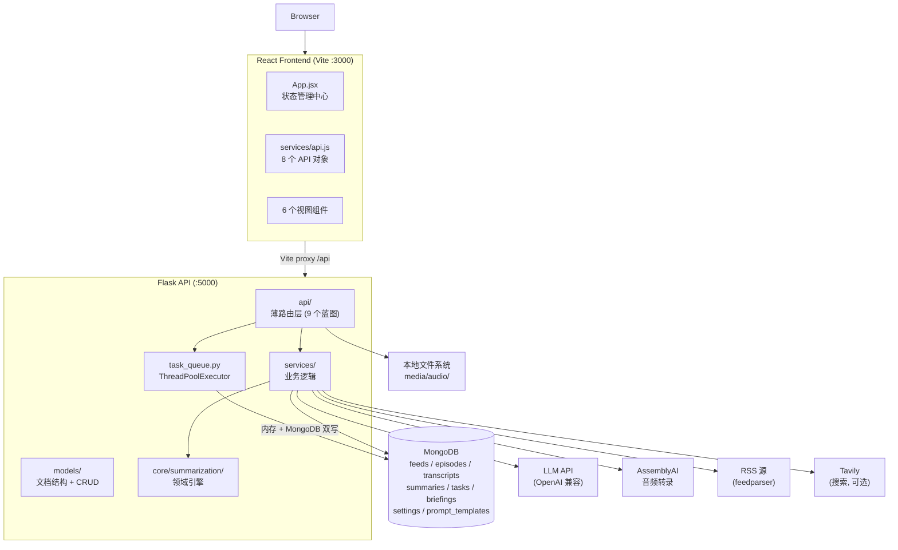
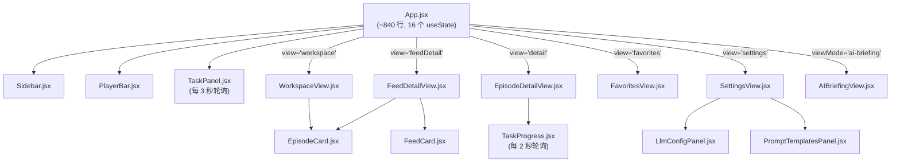
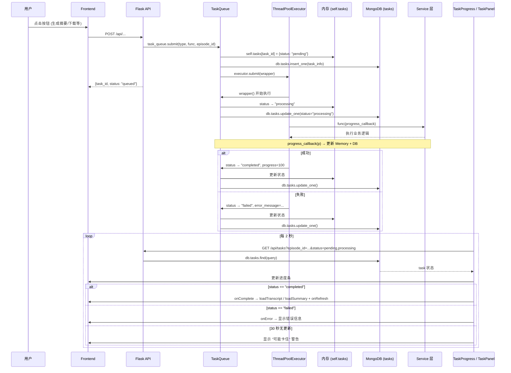

# 02 - 系统架构总览

> 生成日期: 2026-05-17
> 基于代码库实际结构分析，所有结论引用具体文件路径。

---

## 1. 当前架构总览

### 请求链路

1. 浏览器访问 `http://localhost:3000`
2. Vite 开发服务器将 `/api/*` 请求代理到 Flask (`localhost:5000`)
3. Flask 蓝图路由分发到 API 层
4. API 层调用 Service 或直接操作 MongoDB
5. 异步任务通过 `TaskQueue` 提交到 `ThreadPoolExecutor`

**代码位置:**
- 前端入口: `frontend/src/App.jsx`
- API 统一出口: `frontend/src/services/api.js`
- Flask 应用工厂: `backend/app/__init__.py` (`create_app()`)
- Vite 代理配置: `frontend/vite.config.js`

---

## 2. 后端分层架构

### 分层职责表

| 层 | 目录 | 职责 | 是否越界 |
|---|------|------|----------|
| **API** | `backend/app/api/` | 薄路由层，参数校验，调 service | **有越界** — `feeds.py` 中 `delete_feed()` 直接执行级联删除 (`db.transcripts.delete_many`, `db.summaries.delete_many`, `db.episodes.delete_many`)；`episodes.py` 中 `list_episodes()` 直接查 `db.feeds` 做 feed_title 映射；`_download_episode_sync()` 和 `_refresh_feed_sync()` 包含完整业务逻辑 |
| **Service** | `backend/app/services/` | 业务逻辑 | `summary_service.py` 同时负责 v2/v3 路由分发和 LLM 调用编排，职责偏重 |
| **Model** | `backend/app/models/` | 文档结构定义 + 格式转换 | **有越界** — `setting.py` 中的 `SettingModel` 包含完整 CRUD + 业务验证逻辑；`prompt_template.py` 中的 `PromptTemplateModel` 包含 `create()`、`update()`、`duplicate()`、`delete()` 等数据库操作 |
| **Core** | `backend/app/core/summarization/` | 领域逻辑 | 职责清晰 — `engine.py` 编排摘要生成，`prompt_builder.py` 构建 prompt，`schema_validator.py` 校验输出 |

### API 层文件清单

| 文件 | 蓝图前缀 | 职责 |
|------|----------|------|
| `backend/app/api/feeds.py` | `/api/feeds` | 订阅源 CRUD + 刷新 |
| `backend/app/api/episodes.py` | `/api/episodes` | 单集列表/详情/下载/状态 |
| `backend/app/api/transcripts.py` | `/api/transcripts` | 转录获取/创建/外部获取 |
| `backend/app/api/summaries.py` | `/api/summaries` | 摘要 CRUD + 翻译 |
| `backend/app/api/tasks.py` | `/api/tasks` | 任务状态查询/取消 |
| `backend/app/api/settings.py` | `/api/settings` | LLM/Tavily 配置管理 |
| `backend/app/api/prompt_templates.py` | `/api/prompt-templates` | 提示词模板 CRUD |
| `backend/app/api/insights.py` | `/api/insights` | AI 简报生成/导出 |
| `backend/app/api/stats.py` | `/api` | 统计信息 |

**蓝图注册位置:** `backend/app/__init__.py` 第 110-132 行 `register_blueprints()`

### Service 层文件清单

| 文件 | 职责 |
|------|------|
| `backend/app/services/rss_service.py` | RSS 解析 (`feedparser`) |
| `backend/app/services/summary_service.py` | 摘要生成门面 (v2/v3 路由 + 翻译) |
| `backend/app/services/briefing_service.py` | AI 简报生成 + 缓存 |
| `backend/app/services/llm_client.py` | OpenAI 兼容 API 封装 |
| `backend/app/services/task_queue.py` | 异步任务队列 |
| `backend/app/services/transcript_fetcher.py` | 官方字幕抓取 (SRT/VTT/JSON) |
| `backend/app/services/tavily_service.py` | Tavily 搜索服务 |
| `backend/app/services/auto_refresher.py` | 定时自动刷新订阅 |
| `backend/app/services/whisper_service.py` | Whisper 本地转录 (预留) |
| `backend/app/services/prompts/` | 旧版提示词 (general, investment, translate) |
| `backend/app/services/briefing_prompts.py` | 简报生成提示词 |

### Core 层文件清单

| 文件 | 职责 |
|------|------|
| `backend/app/core/summarization/engine.py` | 摘要引擎：模板加载 → prompt 构建 → LLM 调用 → schema 校验 → 重试 → 存储 |
| `backend/app/core/summarization/prompt_builder.py` | 动态 prompt 构建，处理 enabled_blocks 和 parameters |
| `backend/app/core/summarization/schema_validator.py` | 输出 schema 校验 + `ensure_required_fields()` 兜底 |
| `backend/app/core/summarization/defaults/templates.py` | 默认模板定义 |

### Model 层文件清单

| 文件 | 职责 |
|------|------|
| `backend/app/models/feed.py` | Feed 文档结构 + `validate_rss_url()` |
| `backend/app/models/episode.py` | Episode 文档结构 + 状态常量 |
| `backend/app/models/transcript.py` | Transcript 文档结构 |
| `backend/app/models/summary.py` | Summary 文档结构 + `validate_type()` |
| `backend/app/models/task.py` | Task 文档结构 |
| `backend/app/models/setting.py` | **SettingModel**: 含 CRUD + LLM/Tavily 配置业务逻辑 |
| `backend/app/models/prompt_template.py` | **PromptTemplateModel**: 含完整 CRUD + duplicate + 索引管理 |

---

## 3. 前端架构

### 组件树

### 状态管理

App.jsx 管理 **16 个状态变量**，通过 `view` 字符串条件渲染 6 个视图:

| 状态变量 | 类型 | 用途 |
|----------|------|------|
| `view` | string | 当前视图: workspace / feedDetail / detail / favorites / settings |
| `previousView` | string | 进入详情页前的视图，用于返回 |
| `viewMode` | string | traditional / ai-briefing |
| `activeFeed` | object/null | 当前选中 feed |
| `selectedFeed` | object/null | FeedDetailView 使用的 feed |
| `selectedEpisode` | object/null | 详情页 episode |
| `currentPlaying` | object/null | 当前播放 episode |
| `isPlaying` | boolean | 播放状态 |
| `feeds` | array | 订阅列表 |
| `episodes` | array | 全局 episode 列表 |
| `workspaceEpisodes` | array | 已转录/摘要的 episodes |
| `feedEpisodes` | array | 当前 feed 的 episodes |
| `feedEpisodesLoading` | boolean | feed episodes 加载中 |
| `loading` | boolean | 全局加载状态 |
| `searchQuery` | string | 搜索关键词 |
| `episodeViewMode` | string | grid / list |

**代码位置:** `frontend/src/App.jsx` 第 30-47 行

所有子组件通过 props 接收数据和回调，**无 Context/Redux**。

### API 层

`frontend/src/services/api.js` 统一管理 **8 个 API 对象**:

| API 对象 | 端点前缀 | 方法数 |
|----------|----------|--------|
| `feedsApi` | `/api/feeds` | 8 |
| `episodesApi` | `/api/episodes` | 7 |
| `transcriptsApi` | `/api/transcripts` | 5 |
| `summariesApi` | `/api/summaries` | 6 |
| `promptTemplatesApi` | `/api/prompt-templates` | 8 |
| `tasksApi` | `/api/tasks` | 3 |
| `statsApi` | `/api` | 1 |
| `settingsApi` | `/api/settings` | 4 |
| `insightsApi` | `/api/insights` | 3 |

所有请求通过 `axios.create()` 单例 + 响应拦截器统一处理。

**代码位置:** `frontend/src/services/api.js`

---

## 4. 异步任务架构

### 关键代码

| 组件 | 文件位置 | 说明 |
|------|----------|------|
| TaskQueue | `backend/app/services/task_queue.py` | `submit()` 包装函数，自动管理 pending → processing → completed/failed，max_workers=3 |
| 任务 API | `backend/app/api/tasks.py` | `/api/tasks` 查询/取消 |
| TaskProgress | `frontend/src/components/common/TaskProgress.jsx` | **每 2 秒**轮询 `tasksApi.list()`，30 秒无更新显示卡住警告 |
| TaskPanel | `frontend/src/components/tasks/TaskPanel.jsx` | **每 3 秒**轮询活跃任务 + 最近完成任务，浮动面板 |

### 支持的任务类型

| task_type | 触发位置 | 说明 |
|-----------|----------|------|
| `download` | `episodes.py:download_episode` | 音频文件下载 |
| `transcribe` | `transcripts.py:create_transcript` | AssemblyAI 转录 |
| `summarize` | `summaries.py:create_summary` | AI 摘要生成 |
| `translate` | `summaries.py:translate_summary` | 摘要翻译 |
| `refresh` | `feeds.py:refresh_feed` | RSS 订阅刷新 |

---

## 5. 外部服务依赖

| 依赖 | 用途 | 失败影响 | 代码位置 |
|------|------|----------|----------|
| **MongoDB** | 全部数据存储 (8 个集合) | 整个后端不可用 | `backend/app/__init__.py` 第 37-38 行 `MongoClient` |
| **LLM API** | 摘要/简报/翻译生成 | AI 功能不可用 | `backend/app/services/llm_client.py` 第 28 行 `openai.OpenAI()` |
| **AssemblyAI** | 音频转录 | 转录功能不可用 (但官方字幕仍可用) | `backend/app/api/transcripts.py` 第 258-283 行 `assemblyai` |
| **RSS 源** | 订阅和刷新 | 无法添加/更新播客 | `backend/app/services/rss_service.py` `parse_feed()` |
| **Tavily** | 搜索增强 | 前端未使用，不影响 | `backend/app/services/tavily_service.py` |
| **本地文件系统** | 音频文件存储 | 下载功能不可用 | `backend/app/config.py` 第 21 行 `MEDIA_ROOT` |

### MongoDB 集合

| 集合 | 主要索引 | 代码位置 |
|------|----------|----------|
| `feeds` | `rss_url` (unique), `status` | `backend/app/__init__.py` 第 66-69 行 |
| `episodes` | `(feed_id, guid)` (unique), `status` | `backend/app/__init__.py` 第 72-77 行 |
| `transcripts` | `episode_id` (unique) | `backend/app/__init__.py` 第 80 行 |
| `summaries` | `(episode_id, template_name)`, `(episode_id, summary_type)` | `backend/app/__init__.py` 第 82-94 行 |
| `tasks` | `task_id` (unique), `status` | `backend/app/__init__.py` 第 102-104 行 |
| `briefings` | `date` (unique) | `backend/app/__init__.py` 第 107 行 |
| `settings` | `key` | 无显式索引 (upsert 查询) |
| `prompt_templates` | `name` (unique), `is_active` | `backend/app/__init__.py` 第 97-99 行 |

---

## 6. 架构风险

### 高风险

#### 6.1 App.jsx 状态过重
- **现状:** 16 个 `useState`，约 840 行，6 个视图条件渲染
- **代码位置:** `frontend/src/App.jsx`
- **风险:** 继续增加视图将导致组件膨胀、props drilling 加剧、状态同步困难
- **影响范围:** 所有视图组件

#### 6.2 v2/v3 摘要双路径
- **现状:** `SummaryService.generate_summary()` 根据模板是否存在分流到 `_generate_with_engine()` (v3) 或 `_generate_legacy()` (v2)
- **代码位置:** `backend/app/services/summary_service.py` 第 42-102 行
- **风险:** 两套代码路径增加维护复杂度，v2/v3 输出格式不同增加下游处理负担
- **影响范围:** 摘要生成、翻译、前端展示

### 中风险

#### 6.3 TaskQueue 内存 + MongoDB 双写
- **现状:** `task_queue.py` 的 `_update_status()` 同时写 `self.tasks` 字典和 `db.tasks` 集合
- **代码位置:** `backend/app/services/task_queue.py` 第 131-144 行
- **风险:** 服务重启后内存清空，依赖 MongoDB 恢复；并发场景下可能出现不一致
- **影响范围:** 所有异步任务 (download/transcribe/summarize/refresh/translate)

#### 6.4 LLM 配置三层 fallback
- **现状:** `get_llm_client()` 依次尝试: Flask 上下文 → 直接连接 MongoDB → 环境变量
- **代码位置:** `backend/app/services/llm_client.py` 第 165-219 行
- **风险:** 三层 fallback 使配置来源不明确，调试困难
- **影响范围:** 所有 LLM 调用 (摘要/简报/翻译)

### 低风险

#### 6.5 无 Redis 缓存层
- **现状:** 所有缓存依赖 MongoDB upsert (如 briefings by date, settings by key)
- **代码位置:** `backend/app/services/briefing_service.py` 第 70 行 `update_one(upsert=True)`
- **风险:** 高频查询场景下 MongoDB 压力大，但当前用户量下影响有限
- **影响范围:** 简报缓存、设置读取

#### 6.6 API 层越界操作 MongoDB
- **现状:** `feeds.py` 中级联删除、`episodes.py` 中 feed_title 映射、同步业务函数 (`_download_episode_sync`, `_refresh_feed_sync`) 均直接操作 MongoDB
- **代码位置:** `backend/app/api/feeds.py` 第 203-209 行, `backend/app/api/episodes.py` 第 83-91 行
- **风险:** 违反分层原则，后续重构时容易遗漏
- **影响范围:** feeds/episodes API
