# 03 - 数据流详解

> 生成日期: 2026-05-17
> 每条流程用 Mermaid sequenceDiagram 展示，包含具体文件路径和行号引用。

---

## 1. 添加 RSS 订阅流程

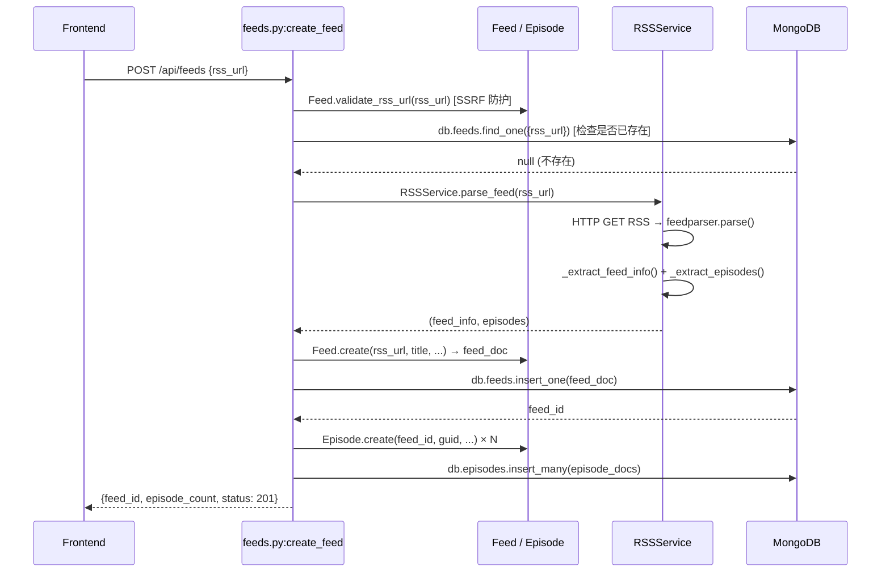

**代码位置:**
- API 入口: `backend/app/api/feeds.py` 第 82-153 行 (`create_feed`)
- RSS 解析: `backend/app/services/rss_service.py` (`parse_feed`)
- Model: `backend/app/models/feed.py` (`Feed.validate_rss_url`, `Feed.create`), `backend/app/models/episode.py` (`Episode.create`)
- 前端调用: `frontend/src/services/api.js` 第 47 行 (`feedsApi.create`)

---

## 2. 刷新订阅流程

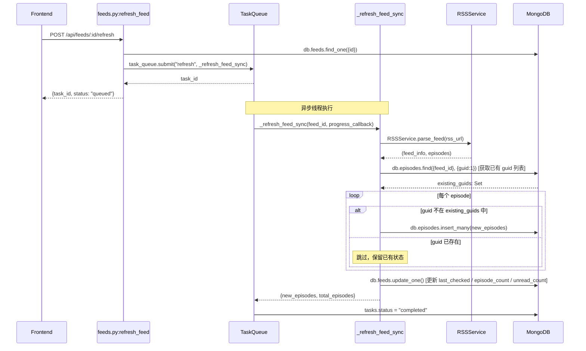

**代码位置:**
- API 入口: `backend/app/api/feeds.py` 第 217-237 行 (`refresh_feed`)
- 同步逻辑: `backend/app/api/feeds.py` 第 240-328 行 (`_refresh_feed_sync`)
- 前端调用: `frontend/src/services/api.js` 第 50 行 (`feedsApi.refresh`)

---

## 3. 下载音频流程

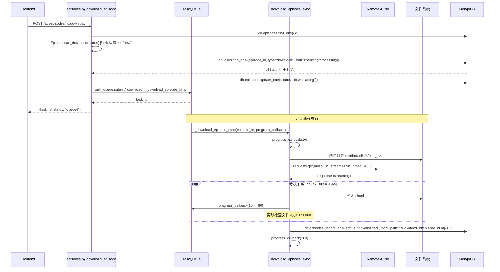

**代码位置:**
- API 入口: `backend/app/api/episodes.py` 第 221-284 行 (`download_episode`)
- 同步逻辑: `backend/app/api/episodes.py` 第 287-377 行 (`_download_episode_sync`)
- 配置: `backend/app/config.py` 第 20-21 行 (`MEDIA_ROOT`)
- 前端调用: `frontend/src/services/api.js` 第 65 行 (`episodesApi.download`)

---

## 4. 获取官方字幕流程

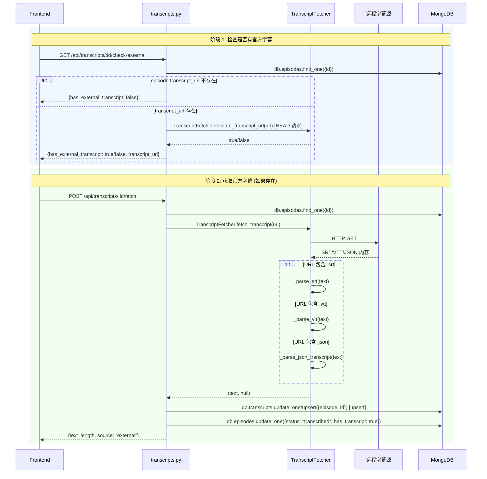

**代码位置:**
- 检查入口: `backend/app/api/transcripts.py` 第 463-490 行 (`check_external_transcript`)
- 获取入口: `backend/app/api/transcripts.py` 第 396-460 行 (`fetch_external_transcript`)
- 抓取服务: `backend/app/services/transcript_fetcher.py` (`TranscriptFetcher.fetch_transcript`, `validate_transcript_url`)
- 前端调用: `frontend/src/services/api.js` 第 73-74 行 (`transcriptsApi.checkExternal`, `transcriptsApi.fetch`)
- 前端自动获取逻辑: `frontend/src/components/views/EpisodeDetailView.jsx` 第 120-156 行 (`loadTranscriptWithAutoFetch`)

---

## 5. AssemblyAI 转录流程

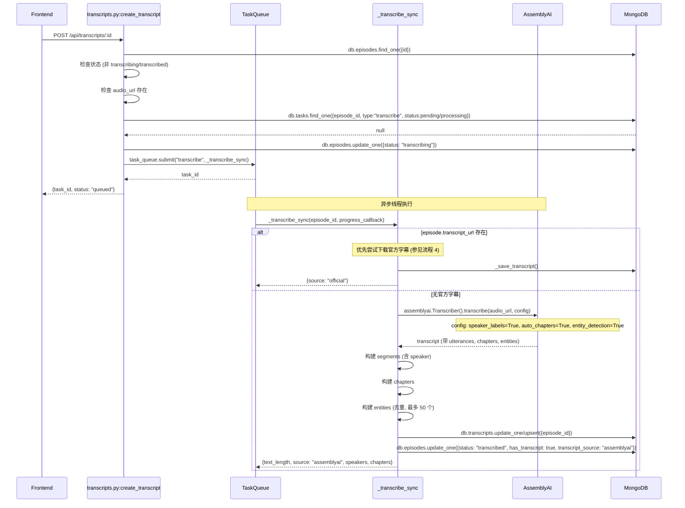

**代码位置:**
- API 入口: `backend/app/api/transcripts.py` 第 47-138 行 (`create_transcript`)
- 同步逻辑: `backend/app/api/transcripts.py` 第 212-252 行 (`_transcribe_sync`)
- AssemblyAI 调用: `backend/app/api/transcripts.py` 第 255-365 行 (`_transcribe_with_assemblyai`)
- 配置: `backend/app/api/transcripts.py` 第 275-279 行 (`TranscriptionConfig`)
- 前端调用: `frontend/src/services/api.js` 第 71 行 (`transcriptsApi.create`)

---

## 6. 生成 AI 摘要流程 (最重要)

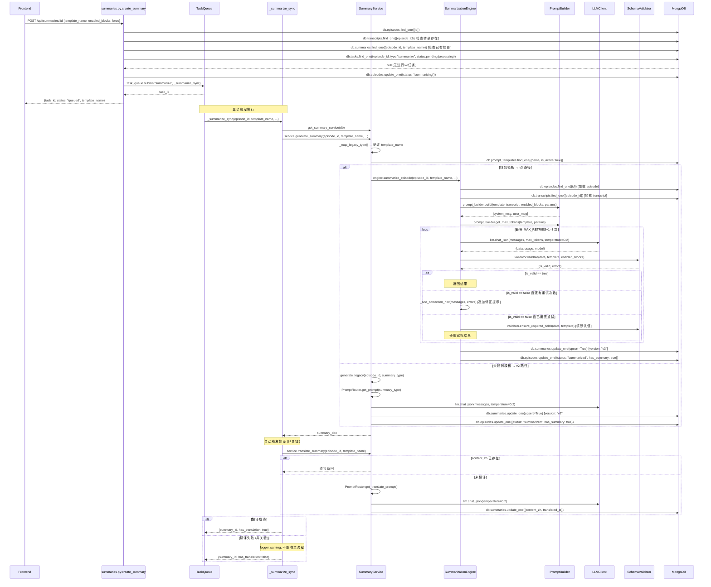

**代码位置:**
- API 入口: `backend/app/api/summaries.py` 第 74-201 行 (`create_summary`)
- 同步逻辑: `backend/app/api/summaries.py` 第 204-269 行 (`_summarize_sync`)
- Service 门面: `backend/app/services/summary_service.py` 第 42-102 行 (`generate_summary`)
- v3 引擎: `backend/app/core/summarization/engine.py` 第 46-118 行 (`summarize`) + 第 120-218 行 (`summarize_episode`)
- Prompt 构建: `backend/app/core/summarization/prompt_builder.py` (`build`)
- Schema 校验: `backend/app/core/summarization/schema_validator.py` (`validate`, `ensure_required_fields`)
- 重试逻辑: `backend/app/core/summarization/engine.py` 第 227-275 行 (`_call_with_retry`)
- v2 Legacy: `backend/app/services/summary_service.py` 第 121-201 行 (`_generate_legacy`)
- 翻译: `backend/app/services/summary_service.py` 第 203-268 行 (`translate_summary`)
- 前端调用: `frontend/src/services/api.js` 第 84-86 行 (`summariesApi.create`)

---

## 7. 翻译摘要流程

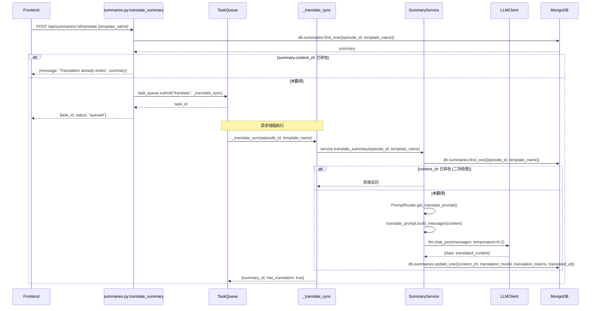

**代码位置:**
- API 入口: `backend/app/api/summaries.py` 第 272-329 行 (`translate_summary`)
- 同步逻辑: `backend/app/api/summaries.py` 第 332-363 行 (`_translate_sync`)
- Service: `backend/app/services/summary_service.py` 第 203-268 行 (`translate_summary`)
- 翻译 prompt: `backend/app/services/prompts/translate.py`
- 前端调用: `frontend/src/services/api.js` 第 88-89 行 (`summariesApi.translate`)

---

## 8. 生成 AI Briefing 流程

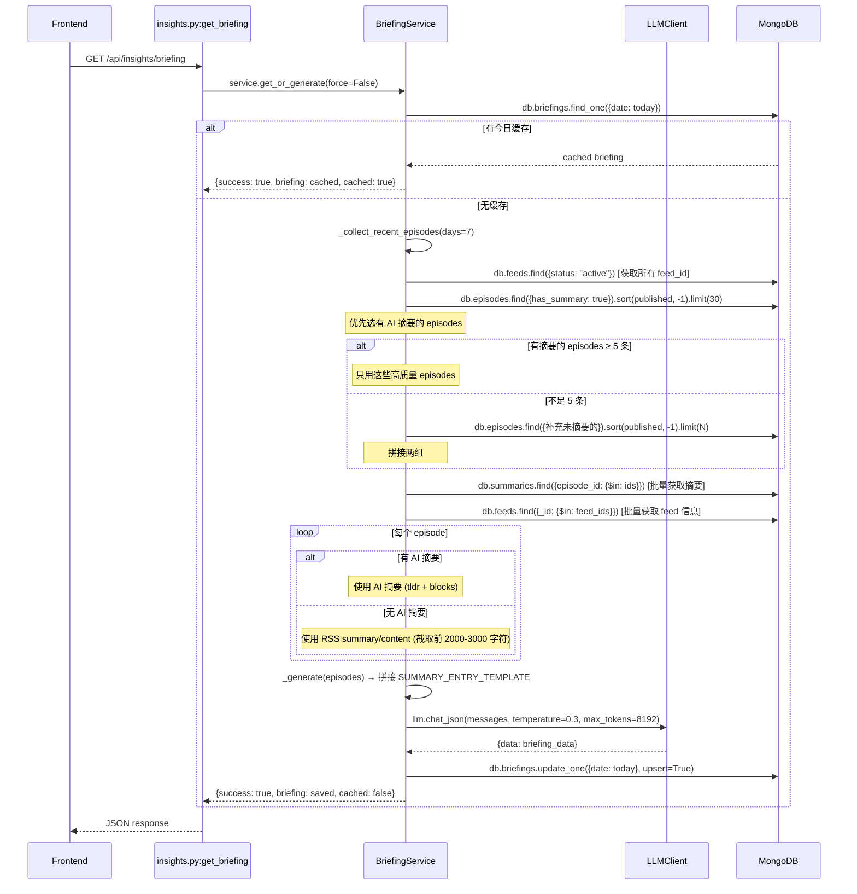

**代码位置:**
- API 入口: `backend/app/api/insights.py` 第 19-28 行 (`get_briefing`)
- Service: `backend/app/services/briefing_service.py` 第 36-77 行 (`get_or_generate`)
- 数据收集: `backend/app/services/briefing_service.py` 第 91-213 行 (`_collect_recent_episodes`)
- 生成逻辑: `backend/app/services/briefing_service.py` 第 215-266 行 (`_generate`)
- 提示词: `backend/app/services/briefing_prompts.py`
- 前端调用: `frontend/src/services/api.js` 第 135 行 (`insightsApi.getBriefing`)

---

## 9. 前端进入 Episode 详情页流程

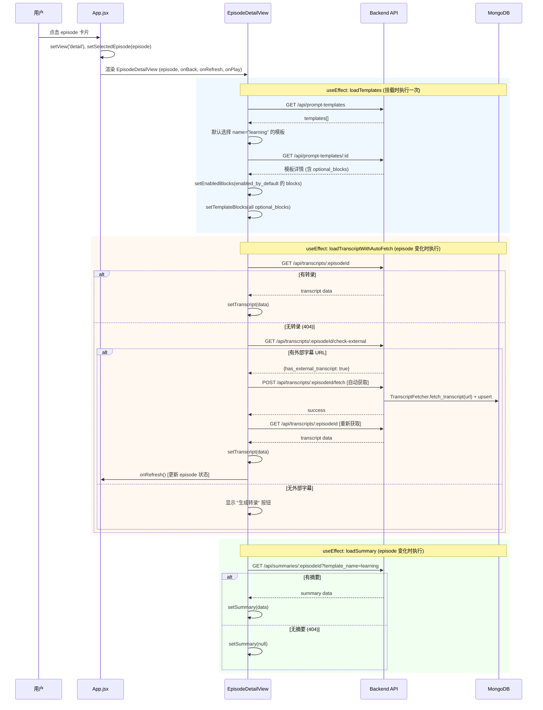

**代码位置:**
- App.jsx 入口: `frontend/src/App.jsx` (handleEpisodeClick → setView + setSelectedEpisode)
- 详情视图: `frontend/src/components/views/EpisodeDetailView.jsx`
- 模板加载: `EpisodeDetailView.jsx` 第 52-77 行 (useEffect `loadTemplates`)
- 转录加载: `EpisodeDetailView.jsx` 第 120-156 行 (`loadTranscriptWithAutoFetch`)
- 摘要加载: `EpisodeDetailView.jsx` 第 167-176 行 (`loadSummary`)
- 前端 API: `frontend/src/services/api.js` (transcriptsApi, summariesApi, promptTemplatesApi)

---

## 10. 任务轮询流程

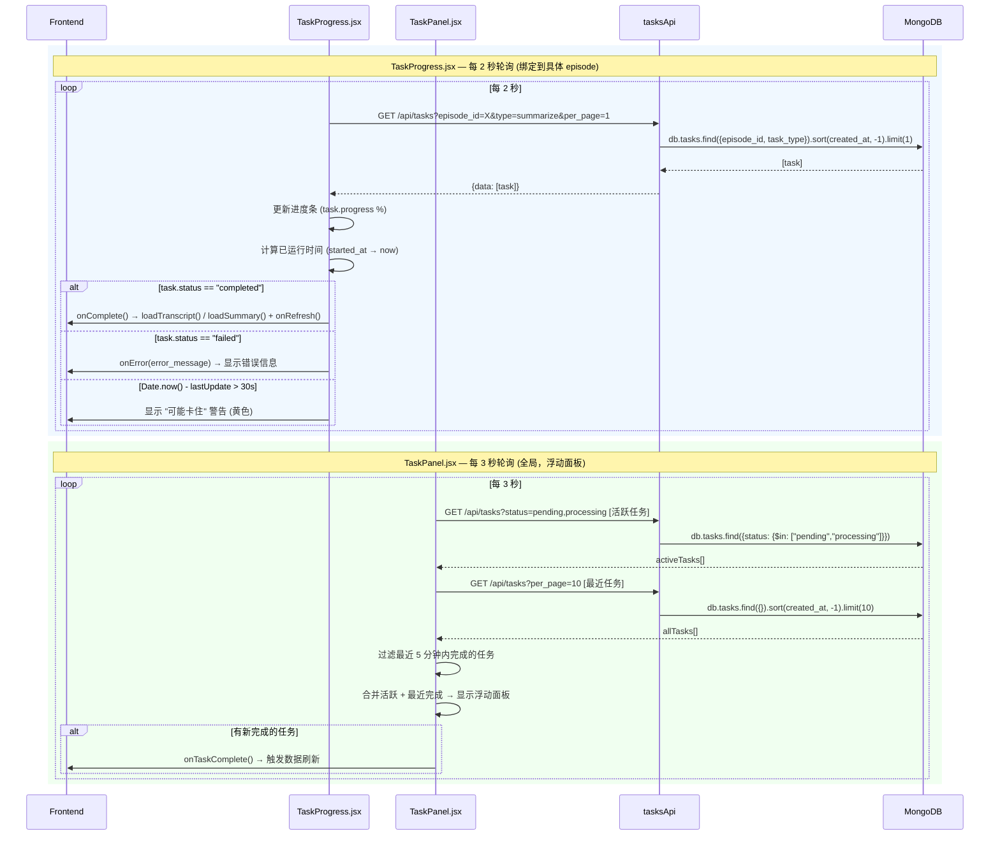

### 轮询参数对比

| 属性 | TaskProgress | TaskPanel |
|------|-------------|-----------|
| **轮询间隔** | 2 秒 | 3 秒 |
| **作用域** | 单个 episode | 全局 |
| **查询参数** | `episode_id` + `task_type` | `status=pending,processing` + 全量 |
| **卡住检测** | 30 秒无更新 | 无 |
| **位置** | 嵌入 EpisodeDetailView | 浮动面板 (fixed bottom-right) |
| **代码位置** | `frontend/src/components/common/TaskProgress.jsx` 第 91-95 行 | `frontend/src/components/tasks/TaskPanel.jsx` 第 50-54 行 |

### 任务状态流转

```
pending → processing → completed
                    → failed
pending → failed (用户取消: task_queue.cancel())
```

**代码位置:**
- TaskQueue 状态管理: `backend/app/services/task_queue.py` 第 82-123 行 (wrapper 函数)
- 任务 API: `backend/app/api/tasks.py`
- TaskProgress: `frontend/src/components/common/TaskProgress.jsx` 第 53-88 行 (`fetchTaskStatus`)
- TaskPanel: `frontend/src/components/tasks/TaskPanel.jsx` 第 21-47 行 (`fetchTasks`)
- 前端 API: `frontend/src/services/api.js` 第 114-118 行 (`tasksApi`)

---

## 附录: 数据集合关系

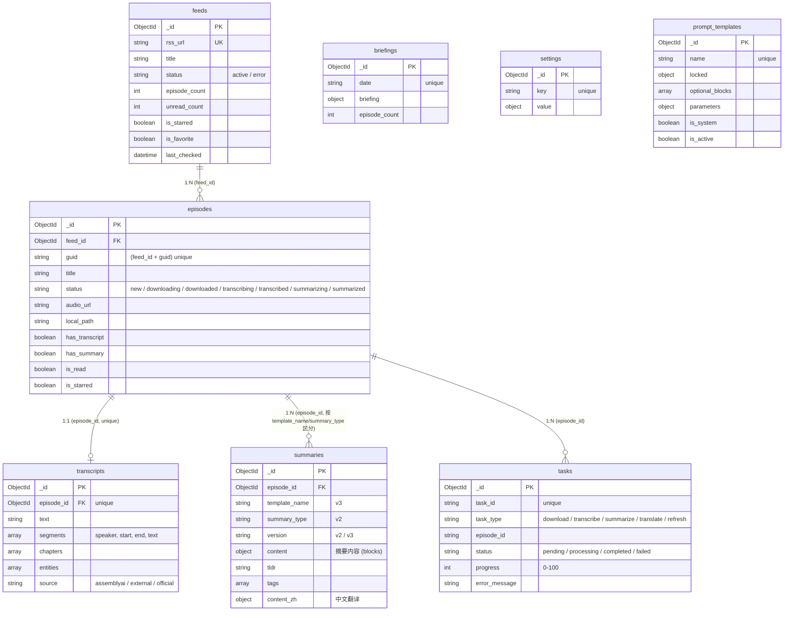

**索引定义位置:** `backend/app/__init__.py` 第 63-107 行 (`ensure_indexes`)
