# 06 - 摘要引擎架构审查

> **文档版本**: v1.0
> **审查日期**: 2026-05-17
> **审查范围**: 摘要生成全链路（v2 legacy + v3 template engine）
> **核心结论**: v2/v3 双路径并存是当前最大的技术债，`Summary.to_response()` 中 v3 字段硬编码展开是扩展性瓶颈，需要引入统一的 SummaryBlock 模型来解决。

---

## 1. 当前摘要系统总览

### 1.1 端到端流程图

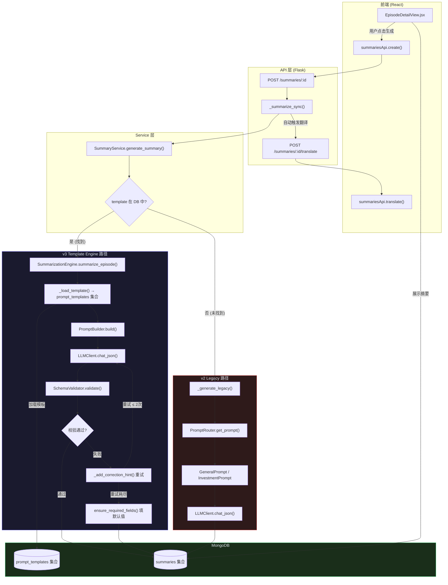

### 1.2 路径选择逻辑

路径判断在 `SummaryService.generate_summary()` 中完成（`backend/app/services/summary_service.py` 第 73-102 行）：

1. 如果调用方传了 `summary_type` 但没传 `template_name`，通过 `_map_legacy_type()` 映射为 template_name
2. 如果都没传，默认使用 `"learning"` 模板
3. 用 template_name 去 `prompt_templates` 集合中查找 `is_active=True` 的文档
4. **找到** -> 走 v3 路径（`_generate_with_engine`）
5. **没找到** -> 走 v2 路径（`_generate_legacy`），并记录 warning 日志

legacy 映射关系（`_map_legacy_type`）：

| summary_type | template_name |
|-------------|---------------|
| general | learning |
| investment | investment |
| tech | tech |
| startup | startup |
| interview | interview |

---

## 2. v2 Legacy 路径说明

### 2.1 调用链

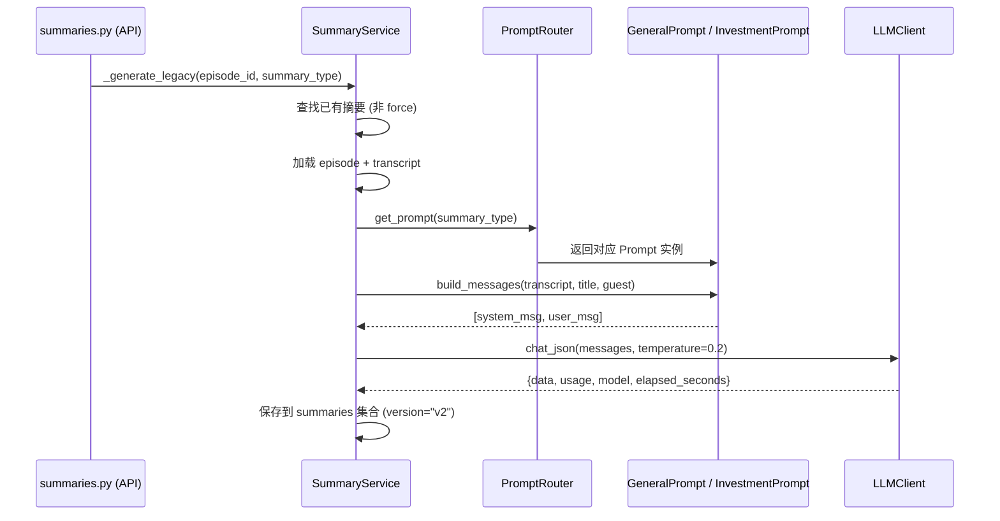

### 2.2 支持的 summary_type

| summary_type | Prompt 类 | 文件位置 |
|-------------|----------|---------|
| `general` | `GeneralPrompt` | `backend/app/services/prompts/general.py` |
| `investment` | `InvestmentPrompt` | `backend/app/services/prompts/investment.py` |

### 2.3 输出结构

**general 类型**：
```json
{
  "tldr": "一句话摘要",
  "key_points": ["要点1", "要点2", "..."],
  "why_it_matters": "重要性说明",
  "tags": ["tag1", "tag2"]
}
```

**investment 类型**：
```json
{
  "tldr": "核心投资要点",
  "investment_signals": [
    {"type": "bullish/bearish/neutral", "target": "...", "sector": "...", "reason": "...", "confidence": "high/medium/low"}
  ],
  "mentioned_tickers": ["GOOGL", "NVDA"],
  "market_insights": ["洞察1", "洞察2"],
  "key_quotes": [
    {"speaker": "...", "quote": "...", "topic": "..."}
  ],
  "risk_alerts": ["风险1"],
  "tags": ["AI", "Semiconductors"],
  "investment_thesis": "综合投资观点"
}
```

### 2.4 为什么成为技术债

1. **硬编码 Prompt**：`GeneralPrompt` 和 `InvestmentPrompt` 的 prompt 模板直接写在 Python 代码中（`backend/app/services/prompts/general.py`、`backend/app/services/prompts/investment.py`），无法通过 UI 自定义
2. **双版本共存**：v2 和 v3 摘要存储在同一个 `summaries` 集合中，用 `version` 字段区分
3. **字段标识不一致**：v2 使用 `summary_type` 字段，v3 使用 `template_name` 字段
4. **前端必须处理两种格式**：`EpisodeDetailView.jsx` 中 `summary.investment_signals` 和 `summary.key_points` 的渲染逻辑必须兼容两种数据来源

---

## 3. v3 Template Engine 路径说明

### 3.1 核心组件关系图

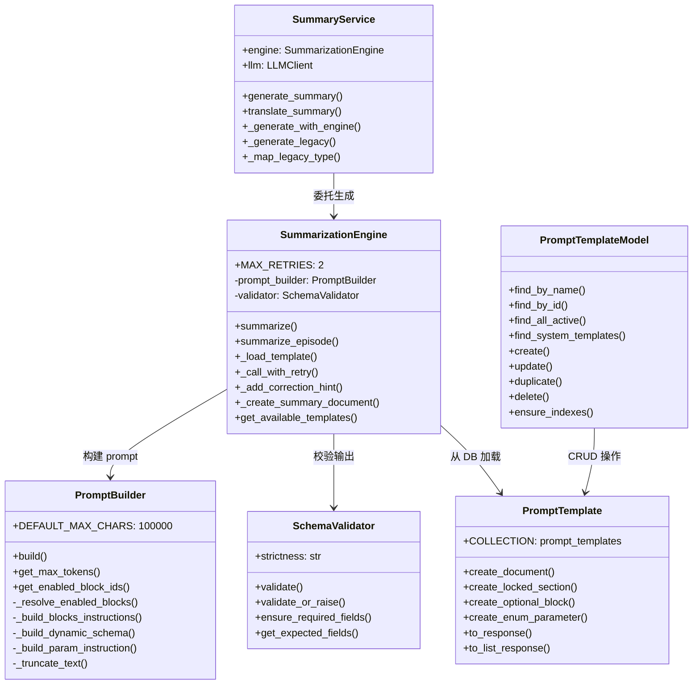

### 3.2 PromptTemplate 数据模型

一个 PromptTemplate 就是一个 JSON 文档，定义了"如何让 LLM 生成某种类型的摘要"。存储在 MongoDB 的 `prompt_templates` 集合中。

**核心字段**（定义于 `backend/app/models/prompt_template.py`）：

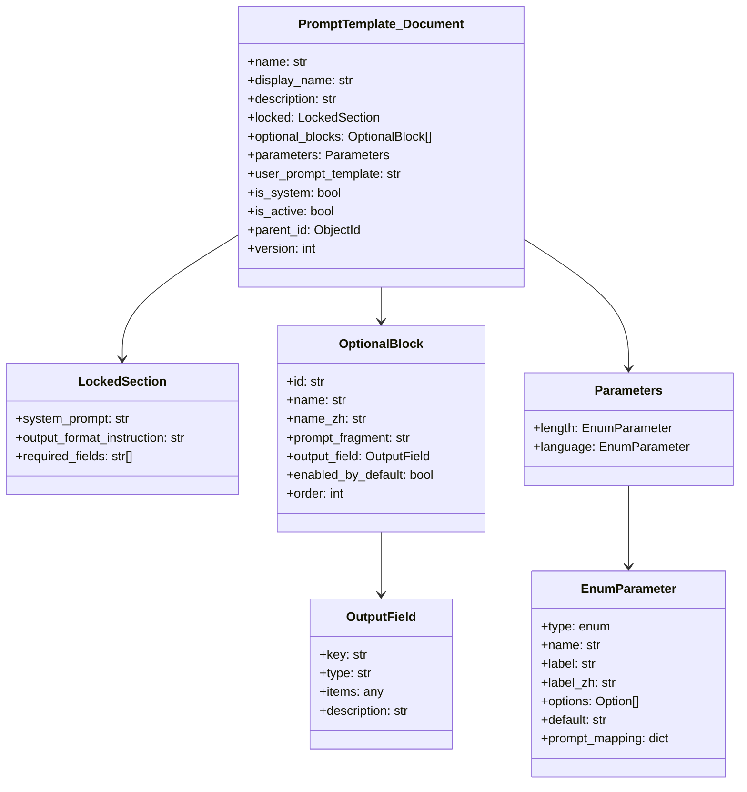

**字段详解**：

| 字段 | 说明 | 示例 |
|------|------|------|
| `name` | 唯一标识符 | `"learning"` |
| `display_name` | 前端显示名称 | `"Learning Notes"` |
| `locked` | 系统锁定区域（不可被用户修改） | 包含 system_prompt、output_format_instruction、required_fields |
| `locked.system_prompt` | LLM 系统提示词 | `"You are a professional content analyst..."` |
| `locked.required_fields` | 必须输出的字段 | `["tldr", "tags"]` |
| `optional_blocks` | 可选分析维度列表 | 见下文详细说明 |
| `parameters` | 可调参数 | length (short/medium/long)、language (en/zh) |
| `user_prompt_template` | 用户侧 prompt 模板 | 包含 `{{变量}}` 占位符 |
| `is_system` | 系统模板标记 | `true` 表示不可修改/删除 |
| `parent_id` | 复制来源模板 ID | 用户复制系统模板时设置 |

### 3.3 五个系统模板

定义于 `backend/app/core/summarization/defaults/templates.py`：

| 模板 name | display_name | 场景 | 默认启用的 blocks |
|-----------|-------------|------|-------------------|
| `learning` | Learning Notes | 通用学习笔记 | core_content, guest_background, key_points, key_concepts, action_items |
| `investment` | Investment Analysis | 投资分析 | core_content, guest_background, unique_insights, investment_signals, mentioned_tickers, market_insights, risk_alerts |
| `tech` | Tech & Product | 技术产品分析 | core_content, guest_background, unique_insights, technologies, product_insights, tech_trends |
| `startup` | Startup & Business | 创业商业分析 | core_content, guest_background, unique_insights, business_model, growth_tactics, lessons_learned |
| `interview` | Interview & Stories | 访谈故事 | core_content, guest_background, key_quotes, life_lessons, controversial_views |

### 3.4 全部 Optional Blocks 定义

系统共定义了 18 个 optional blocks，按 `order` 排列：

| order | block_id | name_zh | type | enabled_by_default |
|-------|----------|---------|------|--------------------|
| 1 | `core_content` | 核心内容 | string | 因模板而异 |
| 2 | `guest_background` | 受访者背景 | string | 因模板而异 |
| 3 | `unique_insights` | 独特见解 | array | 因模板而异 |
| 4 | `key_points` | 关键要点 | array[string] | 因模板而异 |
| 5 | `key_quotes` | 关键引用 | array[object] | 因模板而异 |
| 6 | `action_items` | 行动建议 | array[string] | 因模板而异 |
| 10 | `investment_signals` | 投资信号 | array[object] | 因模板而异 |
| 11 | `mentioned_tickers` | 提及股票 | array[string] | 因模板而异 |
| 12 | `market_insights` | 市场洞察 | array[string] | 因模板而异 |
| 13 | `risk_alerts` | 风险提示 | array[string] | 因模板而异 |
| 20 | `technologies` | 技术栈 | array[string] | 因模板而异 |
| 21 | `product_insights` | 产品洞察 | array[string] | 因模板而异 |
| 22 | `tech_trends` | 技术趋势 | array[string] | 因模板而异 |
| 30 | `business_model` | 商业模式 | string | 因模板而异 |
| 31 | `growth_tactics` | 增长策略 | array[string] | 因模板而异 |
| 32 | `lessons_learned` | 经验教训 | array[string] | 因模板而异 |
| 40 | `key_concepts` | 核心概念 | array[object] | 因模板而异 |
| 41 | `examples` | 案例举例 | array[string] | 因模板而异 |
| 42 | `resources` | 推荐资源 | array[string] | 因模板而异 |
| 50 | `life_lessons` | 人生经验 | array[string] | 因模板而异 |
| 51 | `controversial_views` | 争议观点 | array[string] | 因模板而异 |

### 3.5 PromptBuilder 如何拼 Prompt

`backend/app/core/summarization/prompt_builder.py` 的 `build()` 方法执行以下步骤：

```mermaid
flowchart TD
    A["1. 提取 system_prompt<br/>来自 template.locked.system_prompt"] --> B["2. 解析 enabled blocks<br/>用户指定 or 默认值"]
    B --> C["3. 构建 blocks_instructions<br/>所有启用 block 的 prompt_fragment<br/>按 order 排序拼接"]
    C --> D["4. 构建 dynamic_schema<br/>从 required_fields + enabled blocks<br/>的 output_field 生成 JSON Schema 描述"]
    D --> E["5. 解析参数<br/>length → prompt_mapping 映射<br/>language → prompt_mapping 映射"]
    E --> F["6. 截断 transcript<br/>超过 100000 字符时<br/>保留 60% 头部 + 30% 尾部"]
    F --> G["7. 格式化 user_prompt_template<br/>填入 title, guest, length_instruction,<br/>language_instruction, blocks,<br/>schema, transcript"]
    G --> H["返回 [system_msg, user_msg]"]

    style A fill:#1e293b,stroke:#6366f1
    style B fill:#1e293b,stroke:#6366f1
    style C fill:#1e293b,stroke:#6366f1
    style D fill:#1e293b,stroke:#6366f1
    style E fill:#1e293b,stroke:#6366f1
    style F fill:#1e293b,stroke:#6366f1
    style G fill:#1e293b,stroke:#6366f1
    style H fill:#1e293b,stroke:#22c55e
```

**max_tokens 解析优先级**（`get_max_tokens()` 方法）：

1. `params.max_tokens` 显式指定 > 2. `length` 参数对应的 `token_hint` > 3. 模板默认值 > 4. 回退 `4096`

对应关系：
- `short` → `2000` tokens
- `medium` → `4096` tokens（默认）
- `long` → `8000` tokens

### 3.6 SchemaValidator 校验机制

`backend/app/core/summarization/schema_validator.py` 实现了三级严格度校验：

```mermaid
flowchart TD
    A["LLM 返回 JSON"] --> B{"SchemaValidator.validate()"}
    B --> C["检查 required_fields<br/>(tldr, tags)"]
    C --> D["检查 enabled blocks<br/>的 output_field.key"]
    D --> E{"strictness 级别"}

    E -->|"strict"| F["全部字段必须存在<br/>+ 类型必须匹配"]
    E -->|"normal (默认)"| G["required 必须存在<br/>block 字段宽松检查"]
    E -->|"relaxed"| H["只检查 required fields"]

    F --> I{"校验通过?"}
    G --> I
    H --> I

    I -->|"是"| J["返回结果"]
    I -->|"否"| K{"重试次数 < MAX_RETRIES=2?"}
    K -->|"是"| L["_add_correction_hint()<br/>追加修正提示到 messages"]
    L --> M["重新调用 LLM"]
    M --> A
    K -->|"否"| N["ensure_required_fields()<br/>填充默认值"]
    N --> O["tldr='Summary not available'<br/>tags=[]"]

    style A fill:#1e293b,stroke:#6366f1
    style N fill:#2e1a1a,stroke:#ef4444
    style J fill:#1a2e1a,stroke:#22c55e
```

**重试逻辑**（`SummarizationEngine._call_with_retry`）：
- 最多重试 `MAX_RETRIES = 2` 次（总共最多 3 次 LLM 调用）
- 每次校验失败，将错误信息追加到最后一条 user message 末尾作为修正提示
- 重试耗尽后，调用 `ensure_required_fields()` 填充默认值，不抛异常

### 3.7 数据库文档结构

v3 摘要文档（`SummarizationEngine._create_summary_document`）：

```json
{
  "episode_id": "ObjectId(...)",
  "template_name": "learning",
  "enabled_blocks": ["core_content", "key_points", "action_items"],
  "params": {"length": "medium", "language": "zh"},
  "version": "v3",
  "tldr": "...",
  "tags": ["..."],
  "content": {
    "tldr": "...",
    "tags": ["..."],
    "core_content": "...",
    "key_points": ["..."],
    "action_items": ["..."]
  },
  "content_zh": {
    "tldr_zh": "...",
    "key_points_zh": ["..."]
  },
  "model": "gpt-4o-mini",
  "tokens_used": {"prompt": 5000, "completion": 2000},
  "generation_time_seconds": 12.5,
  "created_at": "ISODate(...)",
  "updated_at": "ISODate(...)"
}
```

v2 摘要文档（`SummaryService._create_legacy_summary_document`）：

```json
{
  "episode_id": "ObjectId(...)",
  "summary_type": "general",
  "version": "v2",
  "tldr": "...",
  "tags": ["..."],
  "content": {
    "tldr": "...",
    "key_points": ["..."],
    "why_it_matters": "...",
    "tags": ["..."]
  },
  "content_zh": { ... },
  "model": "gpt-4o-mini",
  "tokens_used": {"prompt": 4000, "completion": 1500},
  "generation_time_seconds": 10.0,
  "created_at": "ISODate(...)",
  "updated_at": "ISODate(...)"
}
```

**关键区别**：
- v3 使用 `template_name` + `enabled_blocks` + `params`
- v2 使用 `summary_type`，无 `enabled_blocks` 和 `params` 字段

---

## 4. API 层路由映射

### 4.1 端点一览

| 方法 | 路径 | 用途 | 版本 |
|------|------|------|------|
| GET | `/summaries/:episode_id` | 获取摘要 | v2 + v3 |
| POST | `/summaries/:episode_id` | 生成摘要（异步） | v2 + v3 |
| POST | `/summaries/:episode_id/translate` | 翻译摘要 | v2 + v3 |
| DELETE | `/summaries/:episode_id` | 删除摘要 | v2 + v3 |
| GET | `/summaries/templates` | 获取可用模板列表 | v3 only |
| GET | `/summaries/types` | 获取摘要类型（已弃用） | v2 only |

### 4.2 请求参数兼容层

`POST /summaries/:episode_id` 同时接受两套参数（`backend/app/api/summaries.py` 第 100-126 行）：

```mermaid
flowchart TD
    A["POST /summaries/:id"] --> B{"请求体含 template_name?"}
    B -->|"是"| C["使用 template-based API<br/>identifier_field = template_name"]
    B -->|"否"| D{"请求体含 summary_type?"}
    D -->|"是"| E["使用 legacy API<br/>identifier_field = summary_type"]
    D -->|"否"| F["默认使用 learning 模板<br/>identifier_field = template_name"]

    style C fill:#1a2e1a,stroke:#22c55e
    style E fill:#2e1a1a,stroke:#ef4444
    style F fill:#1a2e1a,stroke:#22c55e
```

### 4.3 自动翻译流程

在 `_summarize_sync()` 中（`backend/app/api/summaries.py` 第 204-269 行），摘要生成成功后会自动尝试翻译：

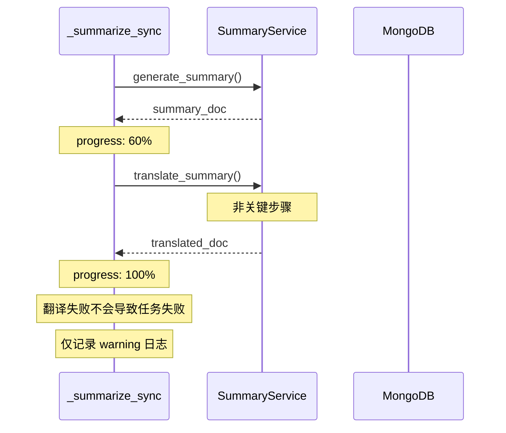

---

## 5. 前端渲染层

### 5.1 EpisodeDetailView.jsx 中的摘要渲染

`frontend/src/components/views/EpisodeDetailView.jsx`（896 行）中，摘要 tab 的渲染逻辑：

```mermaid
flowchart TD
    A["summary 对象"] --> B{"有 tldr 或<br/>investment_signals?"}
    B -->|"是"| C["开始渲染"]
    B -->|"否"| D["显示空状态"]

    C --> E["TL;DR 区块"]
    C --> F{"是 investment 模板?"}
    F -->|"是"| G["投资信号区块"]
    F -->|"否"| H["跳过"]

    G --> I["提及股票 (mentioned_tickers)"]
    I --> J["关键引用 (key_quotes)"]
    J --> K["风险提示 (risk_alerts)"]
    K --> L["关键要点 (key_points)"]

    L --> M["核心内容 (core_content)"]
    M --> N["受访者背景 (guest_background)"]
    N --> O["独特见解 (unique_insights)"]
    O --> P["行动建议 (action_items)"]
    P --> Q["核心概念 (key_concepts)"]
    Q --> R["案例举例 (examples)"]
    R --> S["推荐资源 (resources)"]
    S --> T["标签 (tags)"]

    style G fill:#2e1a1a,stroke:#ef4444
    style H fill:#1e293b,stroke:#6366f1
```

**问题**：每个字段都有独立的 JSX 渲染逻辑，没有通用 renderer。新增一个 block 字段需要同时修改后端 `Summary.to_response()` 和前端渲染代码。

### 5.2 Summary.to_response() 字段展开

`backend/app/models/summary.py` 的 `to_response()` 方法（第 55-139 行）负责将 DB 文档转换为 API 响应：

```mermaid
flowchart TD
    A["Summary.to_response(doc)"] --> B["构建基础 response<br/>id, episode_id, tldr, tags, content"]
    B --> C{"summary_type == investment?"}
    C -->|"是"| D["展开 investment 特有字段<br/>investment_signals, mentioned_tickers,<br/>market_insights, key_quotes,<br/>risk_alerts, investment_thesis"]
    C -->|"否"| E{"summary_type == general?"}
    E -->|"是"| F["展开 general 特有字段<br/>key_points, why_it_matters"]

    D --> G{"有 template_name<br/>或 version == v3?"}
    F --> G
    E -->|"否"| G

    G -->|"是"| H["展开所有 v3 字段（全量）<br/>core_content, guest_background,<br/>unique_insights, action_items,<br/>key_quotes, key_points,<br/>key_concepts, examples, resources,<br/>investment_signals, mentioned_tickers,<br/>market_insights, risk_alerts,<br/>technologies, product_insights,<br/>tech_trends, business_model,<br/>growth_tactics, lessons_learned,<br/>life_lessons, controversial_views"]

    style H fill:#2e1a1a,stroke:#ef4444
```

**这就是扩展性瓶颈**：第 103-138 行硬编码了所有可能的 v3 字段。每新增一个 block，都必须在这里添加一行 `response["xxx"] = content.get("xxx", [])`。

---

## 6. 翻译系统

### 6.1 翻译流程

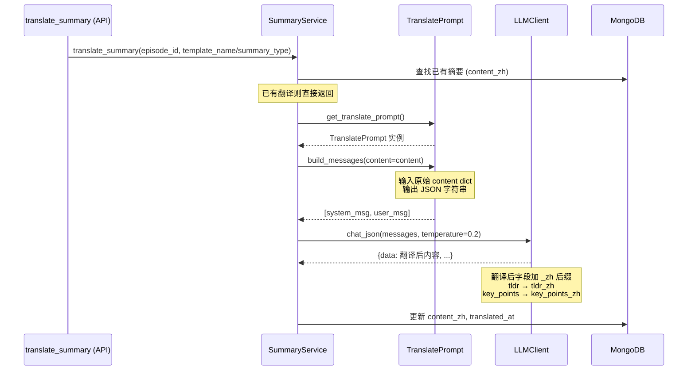

### 6.2 翻译特点

- 翻译是**独立的异步步骤**，不与摘要生成耦合
- 但在 `_summarize_sync()` 中会**自动触发翻译**（非关键，失败不影响摘要结果）
- 翻译 prompt（`TranslatePrompt`）也是硬编码在 `backend/app/services/prompts/translate.py` 中
- 翻译输出字段加 `_zh` 后缀（如 `tldr_zh`, `key_points_zh`）
- 用户可在前端通过语言切换按钮查看中文/英文

---

## 7. 设计优点

1. **模板可复用**：系统模板不可破坏（`is_system=True`），用户只能复制后编辑，保证了基础设施安全
2. **Blocks 灵活组合**：optional_blocks 机制允许按需启用分析维度，不用每次都输出所有字段
3. **JSON 输出有保障**：SchemaValidator 三级严格度 + 自动重试 + 默认值填充，确保不会因 LLM 输出问题导致系统崩溃
4. **参数可调**：length 和 language 参数影响 prompt 内容和 max_tokens，用户可按需调整
5. **翻译自动触发**：`_summarize_sync()` 中自动翻译，用户无需手动操作
6. **向后兼容**：v2 API 参数仍然有效，legacy 路径确保已有功能不受影响

---

## 8. 设计问题（重点分析）

### 8.1 v2/v3 双路径并存

**代码位置**：`backend/app/services/summary_service.py` 第 42-102 行

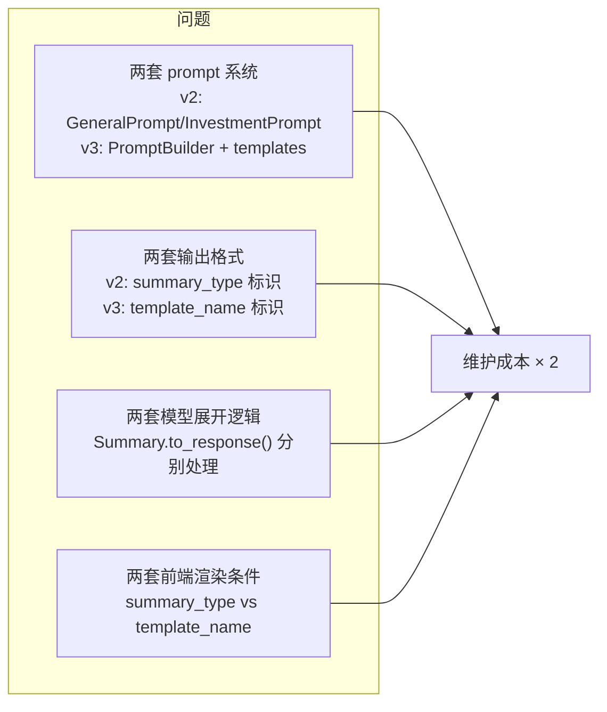

**具体影响**：
- `summaries` 集合中同时存在 `summary_type` 和 `template_name` 字段
- `summaries.py` 的 `get_summary()` 同时支持两种查询参数
- `Summary.to_response()` 先按 `summary_type` 分支，再按 `template_name` 分支
- 前端 `EpisodeDetailView.jsx` 第 583 行：`(summary.template_name === 'investment' || summary.summary_type === 'investment')` 同时检查两个字段

### 8.2 Summary.to_response() 硬编码展开

**代码位置**：`backend/app/models/summary.py` 第 90-138 行

```mermaid
graph TD
    A["新增一个 optional_block"] --> B["1. templates.py 定义 block"]
    B --> C["2. summary.py:to_response<br/>添加 response['xxx'] = content.get('xxx')"]
    C --> D["3. EpisodeDetailView.jsx<br/>添加渲染逻辑"]

    D --> E["三处代码必须同步修改<br/>遗漏任何一处 = 功能不完整"]

    style E fill:#2e1a1a,stroke:#ef4444
```

当前 `to_response()` 第 103-138 行硬编码了约 20 个字段，而且这种硬编码是**覆盖式**的 —— 即使某个字段在 content 中不存在，也会以空值 `[]` 或 `""` 展到响应顶层。这意味着前端永远无法区分"LLM 没输出这个字段"和"LLM 输出了空数组"。

### 8.3 summary_type 和 template_name 混用

**代码位置**：`backend/app/api/summaries.py` 全文

| 操作 | summary_type (v2) | template_name (v3) |
|------|-------------------|-------------------|
| GET 查询 | `?summary_type=general` | `?template_name=learning` |
| POST 生成 | `{"summary_type": "general"}` | `{"template_name": "learning"}` |
| POST 翻译 | `{"summary_type": "general"}` | `{"template_name": "learning"}` |
| DELETE 删除 | `?summary_type=general` | `?template_name=learning` |

前端 `loadSummary()` 只用 `template_name` 查询，这意味着用 v2 路径生成的摘要无法被前端正确加载。

### 8.4 用户意图无法自然表达

当前用户只能通过"选择模板 + 启用/禁用 blocks"来表达需求。但常见的负向约束无法表达：

- "我不需要嘉宾介绍，直接给要点"
- "重点关注投资相关的，不需要背景介绍"
- "只要 TL;DR 和 tags"

虽然技术上可以通过禁用 blocks 实现，但 UI 发现成本高（blocks 列表折叠在模板选项中）。

### 8.5 生成、翻译、重新生成割裂

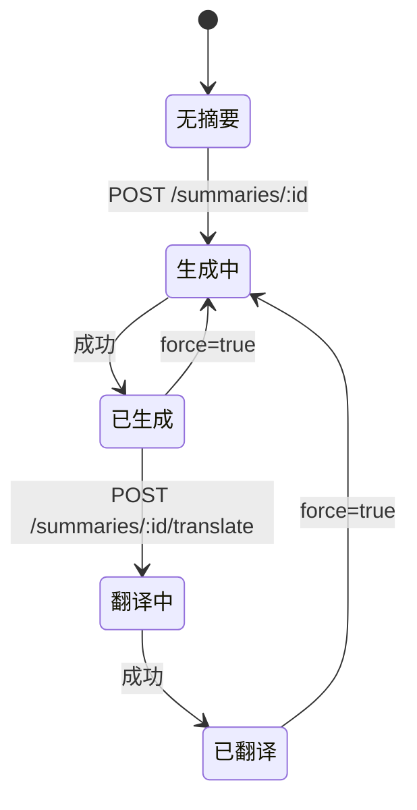

用户操作流程：
1. 点击"生成摘要" -> 等待异步任务完成
2. 自动翻译（在 `_summarize_sync` 内部）
3. 但如果翻译失败，用户需要手动点击翻译
4. 重新生成会覆盖旧数据（`force=true` + upsert）

**问题**：
- 重新生成不会自动清除旧的翻译结果
- 前端无法感知翻译是否成功（`has_translation` 在重新生成后可能为 true 但实际已过期）

### 8.6 _extract_guest 重复实现

`_extract_guest()` 方法在两个类中重复出现：
- `SummaryService._extract_guest()`（`summary_service.py` 第 311-325 行）
- `SummarizationEngine._extract_guest()`（`engine.py` 第 331-347 行）

逻辑完全相同，是代码克隆。

---

## 9. 建议的新摘要架构

### 9.1 核心模型设计

```mermaid
classDiagram
    class SummaryRecipe {
        +id: ObjectId
        +name: str
        +template_id: ObjectId
        +enabled_blocks: str[]
        +params: Dict
        +user_id: str
        +created_at: datetime
    }

    class SummaryRun {
        +id: ObjectId
        +recipe_id: ObjectId
        +episode_id: ObjectId
        +status: str
        +task_id: str
        +created_at: datetime
    }

    class SummaryResult {
        +id: ObjectId
        +run_id: ObjectId
        +episode_id: ObjectId
        +template_name: str
        +version: str
        +tldr: str
        +tags: str[]
        +blocks: SummaryBlock[]
        +content_zh: Dict
        +model: str
        +tokens_used: Dict
        +created_at: datetime
    }

    class SummaryBlock {
        +id: str
        +title: str
        +title_zh: str
        +type: str
        +content: any
    }

    class SummaryBlockRenderer {
        +render(block: SummaryBlock)
    }

    SummaryRecipe --> SummaryRun : 1:N
    SummaryRun --> SummaryResult : 1:1
    SummaryResult --> SummaryBlock : 1:N
    SummaryBlockRenderer ..> SummaryBlock : 渲染
```

### 9.2 SummaryBlock Schema

```json
{
  "id": "key_points",
  "title": "Key Points",
  "title_zh": "核心要点",
  "type": "list",
  "content": ["要点1", "要点2", "要点3"]
}
```

支持的 block.type：

| type | content 结构 | 前端渲染方式 |
|------|-------------|-------------|
| `string` | `"文本内容"` | 段落 |
| `list` | `["项目1", "项目2"]` | 编号列表 |
| `quote` | `[{"speaker": "...", "quote": "..."}]` | 引用卡片 |
| `tags` | `["tag1", "tag2"]` | 标签组 |
| `signals` | `[{"type": "bullish", "target": "...", "reason": "..."}]` | 信号卡片 |
| `concepts` | `[{"concept": "...", "explanation": "..."}]` | 概念卡片 |

### 9.3 新架构的优势

1. **后端不需要硬编码展开**：`to_response()` 直接返回 `blocks` 数组，无需逐个字段映射
2. **前端通用渲染器**：新增 block 只需定义 `type`，前端 `SummaryBlockRenderer` 按 type 自动选择渲染组件
3. **前后端解耦**：后端只管生成 blocks，前端只管按 type 渲染，互不影响
4. **扩展性强**：新增分析维度只需在 `optional_blocks` 中定义 + 在 `SummaryBlock.type` 中注册

---

## 10. 迁移方案

### Phase 1：后端新增 blocks 字段（不破坏旧数据）

**目标**：让 v3 摘要同时包含 legacy 字段和新的 `blocks` 数组。

**修改范围**：

| 文件 | 修改内容 |
|------|---------|
| `backend/app/models/summary.py` | `to_response()` 新增 `blocks` 数组字段，从 `content` 中动态生成 |
| `backend/app/core/summarization/engine.py` | `_create_summary_document()` 中保留所有现有逻辑 |

**blocks 生成逻辑**：

```mermaid
flowchart TD
    A["content dict"] --> B["遍历 enabled_blocks"]
    B --> C["对每个 block，查找其 output_field 定义"]
    C --> D["从 content 中提取对应值"]
    D --> E["构建 SummaryBlock:<br/>{id, title, title_zh, type, content}"]
    E --> F["附加到 response.blocks 数组"]
    F --> G["同时保留 legacy 字段（兼容层）"]

    style G fill:#1a2e1a,stroke:#22c55e
```

**验证标准**：
- 所有现有测试通过
- 前端现有渲染不受影响
- API 响应中新增 `blocks` 字段

### Phase 2：前端新增通用 SummaryBlockRenderer

**目标**：前端可以按 `block.type` 通用渲染，新增 block 不需要改前端代码。

**修改范围**：

| 文件 | 修改内容 |
|------|---------|
| `frontend/src/components/common/SummaryBlockRenderer.jsx` | 新建通用渲染组件 |
| `frontend/src/components/views/EpisodeDetailView.jsx` | 优先使用 blocks 渲染，fallback 到旧字段 |

**渲染优先级**：

```mermaid
flowchart TD
    A["summary 对象"] --> B{"有 blocks 数组?"}
    B -->|"是"| C["使用 SummaryBlockRenderer<br/>按 block.type 通用渲染"]
    B -->|"否"| D["使用旧硬编码渲染逻辑<br/>(fallback)"]

    style C fill:#1a2e1a,stroke:#22c55e
    style D fill:#2e1a1a,stroke:#ef4444
```

**验证标准**：
- v3 摘要使用 blocks 渲染
- v2 摘要使用 fallback 渲染
- 新增 block.type 无需前端修改

### Phase 3：清理 v2 路径

**目标**：移除 `_generate_legacy()`，统一使用 template engine。

**修改范围**：

| 文件 | 修改内容 |
|------|---------|
| `backend/app/services/summary_service.py` | 移除 `_generate_legacy()` 和 `_create_legacy_summary_document()` |
| `backend/app/services/prompts/general.py` | 可删除或标记 deprecated |
| `backend/app/services/prompts/investment.py` | 可删除或标记 deprecated |
| `backend/app/services/prompts/__init__.py` | 移除 PromptRouter 中的 general/investment 注册 |
| `backend/app/api/summaries.py` | 移除 `summary_type` 参数支持，统一使用 `template_name` |
| `backend/app/models/summary.py` | 移除 `TYPE_GENERAL`, `TYPE_INVESTMENT` 等常量 |

**数据迁移**：

```mermaid
flowchart TD
    A["查找所有 version=v2 的摘要"] --> B["补全 template_name 字段<br/>general → learning<br/>investment → investment"]
    B --> C["补全 version 字段<br/>确保所有文档都有 version"]
    C --> D["生成 blocks 数组<br/>从 content 中动态构建"]
    D --> E["验证迁移结果"]

    style E fill:#1a2e1a,stroke:#22c55e
```

**验证标准**：
- 所有摘要统一使用 `template_name` 标识
- 前端不再需要检查 `summary_type` 字段
- `PromptRouter` 中不再注册 legacy prompt 类型
- `Summary.to_response()` 不再按 `summary_type` 分支

---

## 11. 涉及文件清单

### 后端

| 文件路径 | 职责 | 版本 |
|---------|------|------|
| `backend/app/services/summary_service.py` | 摘要生成 Facade，v2/v3 路由分发 | v2 + v3 |
| `backend/app/core/summarization/engine.py` | v3 核心引擎，编排 prompt/LLM/validation | v3 |
| `backend/app/core/summarization/prompt_builder.py` | 动态 prompt 构建 | v3 |
| `backend/app/core/summarization/schema_validator.py` | LLM 输出校验 | v3 |
| `backend/app/core/summarization/defaults/templates.py` | 5 个系统模板定义 | v3 |
| `backend/app/models/prompt_template.py` | PromptTemplate 模型 + CRUD | v3 |
| `backend/app/models/summary.py` | Summary 模型 + to_response() | v2 + v3 |
| `backend/app/api/summaries.py` | API 路由层 | v2 + v3 |
| `backend/app/services/prompts/general.py` | General 硬编码 prompt | v2 (legacy) |
| `backend/app/services/prompts/investment.py` | Investment 硬编码 prompt | v2 (legacy) |
| `backend/app/services/prompts/translate.py` | 翻译 prompt | v2 |
| `backend/app/services/prompts/base.py` | Prompt 基类 | v2 |
| `backend/app/services/prompts/__init__.py` | PromptRouter | v2 |

### 前端

| 文件路径 | 职责 |
|---------|------|
| `frontend/src/components/views/EpisodeDetailView.jsx` | 摘要展示 + 模板选择 + block 开关 |
| `frontend/src/services/api.js` | summariesApi, promptTemplatesApi |

### 数据库

| 集合 | 用途 |
|------|------|
| `summaries` | 存储摘要结果（v2 + v3 混合） |
| `prompt_templates` | 存储模板定义（5 个系统模板 + 用户自定义） |
| `tasks` | 异步任务队列（transcribe, summarize, translate） |
| `episodes` | 节目元信息（has_summary, status 字段） |
| `transcripts` | 转录文本 |

---

## 12. 风险与注意事项

1. **Phase 1 必须保证向后兼容**：`blocks` 字段是新增的，不能替代或删除任何现有字段
2. **Phase 2 的 fallback 机制必须完整**：v2 摘要永远不会被清理，前端必须永远支持 fallback
3. **Phase 3 的数据迁移不可逆**：需要先在测试环境验证，确认 blocks 生成逻辑覆盖所有 v2 字段
4. **翻译 prompt 也是硬编码**：`TranslatePrompt` 与 v2 路径属于同一体系，Phase 3 时需要同步处理
5. **`_extract_guest()` 重复代码**：在 Phase 1 或 Phase 2 中应顺手提取为工具函数
6. **前端 `EpisodeDetailView.jsx` 第 690 行有 console.log 调试代码**：应在后续清理中移除
