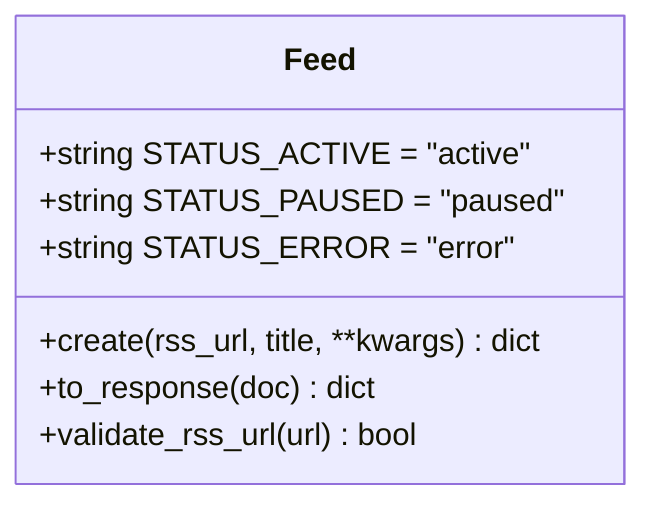
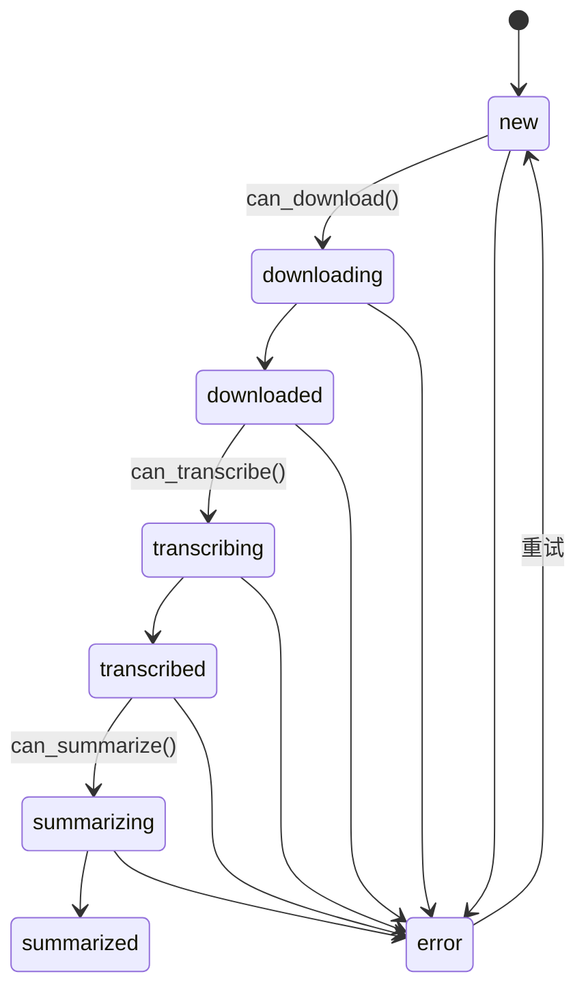
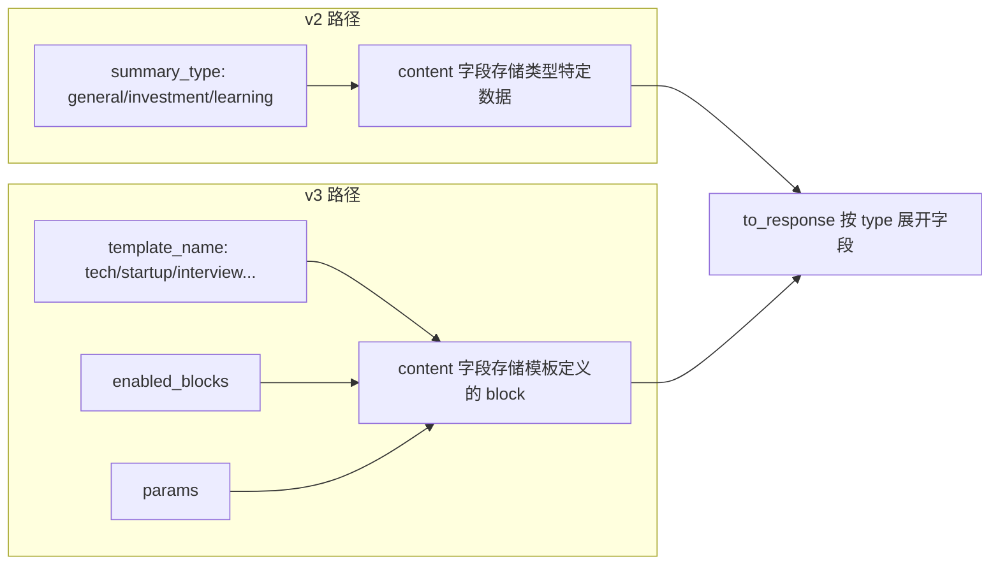
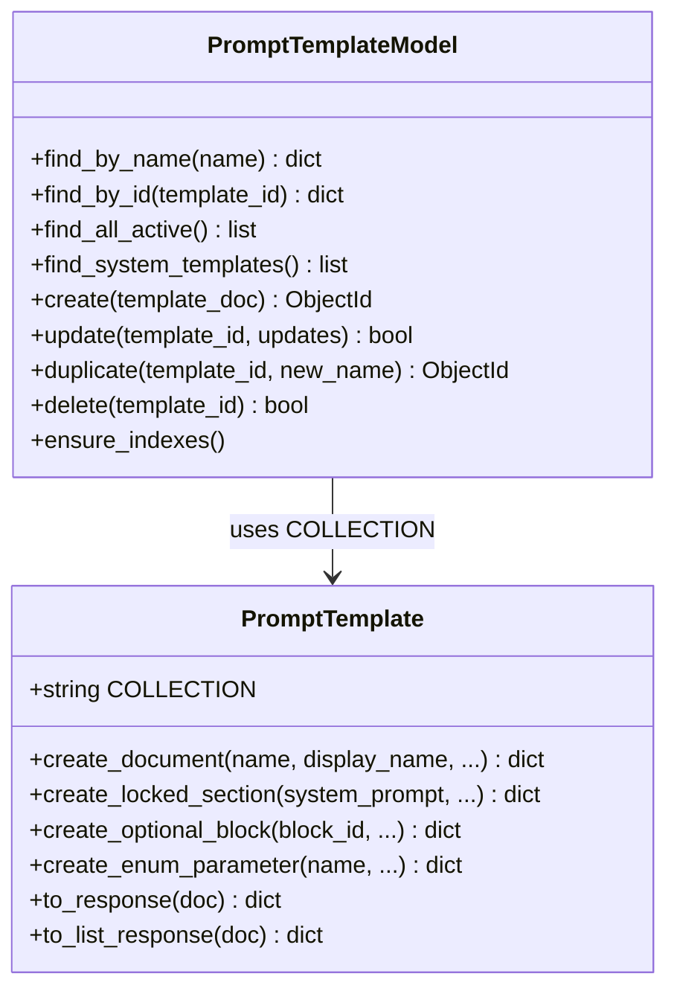
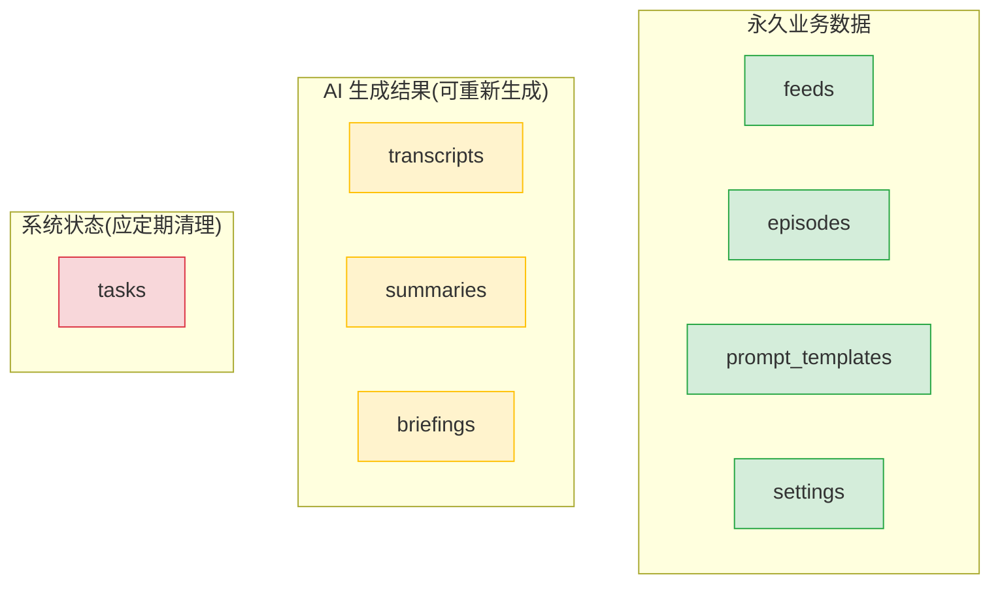
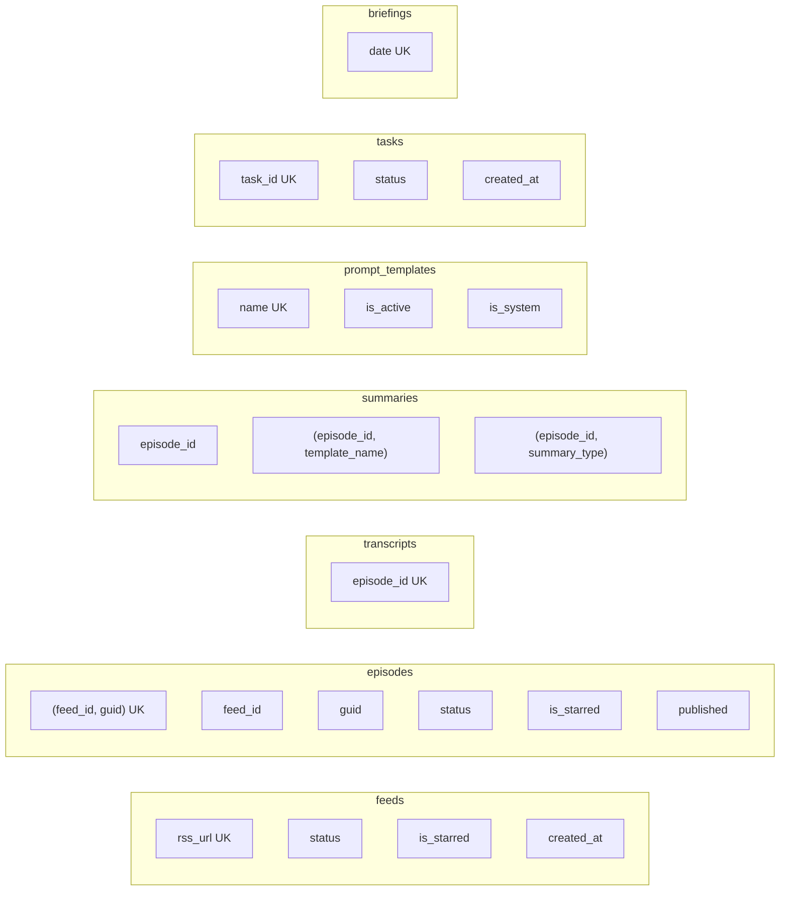

# 07 - 数据库模型

## Collection 总览

```mermaid
erDiagram
    feeds ||--o{ episodes : "1:N feed_id"
    episodes ||--o| transcripts : "1:1 episode_id"
    episodes ||--o{ summaries : "1:N episode_id"
    episodes ||--o{ tasks : "1:N episode_id"
    feeds ||--o{ tasks : "1:N feed_id"
    prompt_templates ||--o{ summaries : "template_name"
    briefings {
        string date PK
    }
    settings {
        string key PK
    }

    feeds {
        ObjectId _id PK
        string rss_url UK
        string title
        string status
        boolean is_starred
        int episode_count
        int unread_count
    }
    episodes {
        ObjectId _id PK
        ObjectId feed_id FK
        string guid
        string title
        string audio_url
        string audio_path
        string status
        boolean is_starred
        boolean has_transcript
        boolean has_summary
        int play_position
    }
    transcripts {
        ObjectId _id PK
        ObjectId episode_id FK UK
        string text
        array segments
        string source
    }
    summaries {
        ObjectId _id PK
        ObjectId episode_id FK
        string summary_type
        string template_name
        string version
        string tldr
        object content
        object content_zh
    }
    tasks {
        ObjectId _id PK
        string task_id UK
        string task_type
        string status
        int progress
    }
    prompt_templates {
        ObjectId _id PK
        string name UK
        object locked
        array optional_blocks
        boolean is_system
        boolean is_active
    }
```

## Collection 总表

| Collection | 业务含义 | 写入位置 | 读取位置 | 索引 | 性质 |
|-----------|---------|---------|---------|------|------|
| feeds | 播客订阅源 | feeds.py, auto_refresher.py | feeds.py, episodes.py, briefing_service.py | rss_url(unique), status, is_starred, created_at | 核心业务数据 |
| episodes | 单集 | feeds.py(订阅时), episodes.py(下载/标星等) | episodes.py, transcripts.py, summaries.py, briefing_service.py, stats.py | (feed_id,guid)(unique), feed_id, guid, status, is_starred, published | 核心业务数据 |
| transcripts | 转录文本 | transcripts.py | transcripts.py, summaries.py | episode_id(unique) | AI 生成结果 |
| summaries | AI 摘要 | summaries.py, summary_service.py | summaries.py, briefing_service.py, EpisodeDetailView | episode_id, (episode_id,template_name), (episode_id,summary_type) | AI 生成结果 |
| tasks | 异步任务 | task_queue.py | tasks.py | task_id(unique), status, created_at | 系统状态(无 TTL) |
| settings | 配置 | settings.py | llm_client.py, tavily_service.py, setting.py | 无 | 系统配置 |
| prompt_templates | Prompt 模板 | prompt_templates.py, init_scripts | summary_service.py, engine.py, PromptTemplatesPanel | name(unique), is_active, is_system | 系统配置 |
| briefings | 每日简报 | briefing_service.py | insights.py | date(unique) | 应用层缓存 |

---

## 详细字段说明

### feeds

**模型文件**: `backend/app/models/feed.py`



| 字段 | 类型 | 说明 |
|------|------|------|
| rss_url | string | RSS 订阅地址，unique 索引 |
| title | string | 播客名称 |
| website | string | 播客官网 |
| image | string | 封面图 URL |
| description | string | 播客描述 |
| author | string | 作者 |
| language | string | 语言 |
| status | string | 状态枚举: active / paused / error |
| last_checked | datetime | 最后检查时间 |
| last_updated | datetime | 最后更新时间 |
| check_error | string | 检查错误信息 |
| is_starred | boolean | 是否标星 |
| is_favorite | boolean | 是否收藏 |
| note | string | 用户备注 |
| tags | array | 用户标签 |
| episode_count | int | 单集数量(冗余) |
| unread_count | int | 未读数量(冗余) |
| created_at | datetime | 创建时间 |
| updated_at | datetime | 更新时间 |

**安全机制**: `Feed.validate_rss_url()` 实现 SSRF 防护，禁止 localhost、私有 IP 段(10.x, 172.16-31.x, 192.168.x)、保留地址，只允许 http/https 协议。

---

### episodes

**模型文件**: `backend/app/models/episode.py`



状态机严格线性推进，`can_download` / `can_transcribe` / `can_summarize` 三个方法各只允许一种前置状态:

- `can_download()`: 仅 `new` 可进入下载
- `can_transcribe()`: 仅 `downloaded` 可进入转录
- `can_summarize()`: 仅 `transcribed` 可进入摘要

| 字段 | 类型 | 说明 |
|------|------|------|
| feed_id | ObjectId | 所属订阅源(FK -> feeds._id) |
| guid | string | RSS 中的全局唯一标识 |
| title | string | 单集标题 |
| summary | string | 单集描述(RSS summary) |
| content | string | 单集全文(RSS content) |
| link | string | 单集网页链接 |
| published | datetime | 发布时间 |
| audio_url | string | 音频远程 URL |
| audio_type | string | MIME 类型，默认 audio/mpeg |
| audio_size | int | 文件大小(字节) |
| duration | int | 时长(秒) |
| image | string | 单集封面 |
| chapters_url | string | 章节信息 URL |
| transcript_url | string | 转录文件 URL |
| status | string | 状态枚举(8 种)，见上方状态图 |
| audio_path | string | 本地下载路径 |
| is_read | boolean | 是否已读 |
| is_starred | boolean | 是否标星 |
| is_favorite | boolean | 是否收藏 |
| play_position | int | 播放进度(秒) |
| has_transcript | boolean | 是否有转录(冗余标记) |
| has_summary | boolean | 是否有摘要(冗余标记) |
| popularity_score | int | 热度分数 |
| created_at | datetime | 创建时间 |
| updated_at | datetime | 更新时间 |

**联合唯一索引**: `(feed_id, guid)` 确保同一订阅源下不重复导入。

**兼容性处理**: `to_response` 中 `summary` 字段同时映射 `description` 做向后兼容，且输出 `published_at` 作为 `published` 的别名。

---

### transcripts

**模型文件**: `backend/app/models/transcript.py`

| 字段 | 类型 | 说明 |
|------|------|------|
| episode_id | ObjectId | 所属单集(FK -> episodes._id)，unique |
| text | string | 转录全文 |
| segments | array | 时间戳分段 |
| language | string | 语言，默认 en |
| word_count | int | 词数(自动计算) |
| source | string | 来源: whisper / official / manual |
| model | string | 转录模型，默认 base |

**注意**: AssemblyAI 转录路由(`transcripts.py`)在实际存储时额外写入了 `chapters`, `entities`, `speakers`, `duration` 等字段，但这些字段未在 `Transcript.create()` 中定义，由路由层直接构建文档。这意味着通过模型方法创建的转录文档会缺少这些字段。

**来源枚举**:

| 值 | 含义 |
|----|------|
| whisper | 本地 Whisper 转录 |
| official | 播客官方提供的转录 |
| manual | 用户手动上传 |

---

### summaries

**模型文件**: `backend/app/models/summary.py`



| 字段 | 类型 | 说明 |
|------|------|------|
| episode_id | ObjectId | 所属单集(FK) |
| summary_type | string | v2 类型: general / investment / learning |
| template_name | string | v3 模板名称 |
| version | string | 版本标识: v2 / v3 |
| tldr | string | 一句话摘要 |
| tags | array | 标签列表 |
| content | object | 完整摘要内容(结构因类型而异) |
| content_zh | object | 中文翻译(可选) |
| model | string | 使用的 LLM 模型 |
| tokens_used | object | token 用量(prompt/completion) |
| generation_time_seconds | float | 生成耗时 |
| created_at | datetime | 创建时间 |
| updated_at | datetime | 更新时间 |

**v2 / v3 字段混存问题**: 同一个 collection 中，v2 摘要通过 `summary_type` 区分，v3 摘要通过 `template_name` 区分。查询时需同时检查两个字段。

**`to_response` 展开逻辑**: 该方法将 `content` 对象中的字段展开到响应顶层。对 v2 按 `summary_type` 展开特定字段(investment_signals, key_points 等)，对 v3 按 `template_name` 展开所有可能的 block 字段。这导致响应结构不稳定，前端依赖这些动态字段名。

---

### tasks

**模型文件**: `backend/app/models/task.py`

| 字段 | 类型 | 说明 |
|------|------|------|
| task_id | string | UUID，unique 索引 |
| task_type | string | 任务类型: download / transcribe / summarize / refresh |
| episode_id | ObjectId | 关联单集(可选) |
| feed_id | ObjectId | 关联订阅源(可选) |
| status | string | 状态: pending / processing / completed / failed |
| progress | int | 进度 0-100 |
| result | object | 任务结果 |
| error_message | string | 错误信息 |
| created_at | datetime | 创建时间 |
| started_at | datetime | 开始时间 |
| completed_at | datetime | 完成时间 |

**双写机制**: `task_queue.py` 同时维护内存中的任务状态和 MongoDB 持久化存储。内存用于实时查询，MongoDB 用于持久化和重启恢复。

**注意**: `Task.to_response()` 方法已定义但未被实际使用，`tasks.py` API 路由层有独立的 `_format_task` 函数。

---

### settings

**模型文件**: `backend/app/models/setting.py`

key-value 结构，无固定 schema。

| key | 类型 | 说明 |
|-----|------|------|
| llm_configs | array | LLM 配置列表，每项含 name, base_url, api_key, model, max_tokens, temperature |
| llm_active_index | int | 当前激活的配置索引(0-4)，最多 5 个 |
| tavily_config | object | Tavily 搜索配置，含 enabled, api_keys, search_depth, max_results, include_domains, exclude_domains, days_back |

**初始化策略**: 首次访问时如无数据，从环境变量读取默认值并写入 DB。

---

### prompt_templates

**模型文件**: `backend/app/models/prompt_template.py`



| 字段 | 类型 | 说明 |
|------|------|------|
| name | string | 模板标识，unique |
| display_name | string | 显示名称 |
| description | string | 模板描述 |
| locked | object | 锁定区域(用户不可改)，含 system_prompt, output_format_instruction, required_fields |
| optional_blocks | array | 可选 block 定义，每项含 id, name, name_zh, prompt_fragment, output_field, enabled_by_default, order |
| parameters | object | 参数定义(enum/range/boolean) |
| user_prompt_template | string | 用户 prompt 模板 |
| is_system | boolean | 是否系统模板(不可修改/删除) |
| is_active | boolean | 是否启用 |
| parent_id | ObjectId | 复制来源(非系统模板才有) |
| version | int | 版本号，每次 update 自增 |
| created_at | datetime | 创建时间 |
| updated_at | datetime | 更新时间 |

---

### briefings

**代码位置**: `backend/app/services/briefing_service.py`（无独立模型文件）

| 字段 | 类型 | 说明 |
|------|------|------|
| date | string | 日期 YYYY-MM-DD，unique |
| briefing | object | 简报内容 |
| briefing.hotTopics | array | 热门话题 |
| briefing.newConcepts | array | 新概念 |
| briefing.trends | array | 趋势 |
| briefing.recommended | array | 推荐 |
| briefing.markdownReport | string | Markdown 格式报告 |

**缓存策略**: upsert，同一天内不重复生成(除非 `force=True`)。无过期清理机制。

---

## 数据生命周期



| 数据类别 | Collection | 增长模式 | 风险 |
|---------|-----------|---------|------|
| 永久业务数据 | feeds, episodes, prompt_templates, settings | 随订阅/发布缓慢增长 | 可控 |
| AI 生成结果 | transcripts, summaries, briefings | 随处理量线性增长 | 可重新生成，占用存储 |
| 系统状态 | tasks | 每次操作新增，永不清理 | 长期运行后膨胀 |

**冗余标记字段**: `episodes.has_transcript` 和 `episodes.has_summary` 与 `transcripts` / `summaries` 集合存在逻辑冗余。这是为了列表查询性能而做的反范式设计，但需要确保写入时同步更新。

---

## 索引配置

索引定义位于 `backend/app/__init__.py` 的 `ensure_indexes()` 函数，应用启动时自动创建:



**注意**: summaries 的 `episode_id` 索引在创建前会先检查并删除旧的 unique 版本(如果存在)，因为 v3 允许同一 episode 生成多种模板的摘要。

---

## 技术债

| # | 问题 | 影响 |
|---|------|------|
| 1 | v2/v3 摘要字段混存(`summary_type` + `template_name`) | 查询逻辑复杂，需同时检查两个字段 |
| 2 | Transcript 模型未覆盖所有存储字段 | 通过模型创建的文档与直接构建的结构不一致 |
| 3 | `Task.to_response` 已定义但未使用 | API 层重复实现了格式化逻辑 |
| 4 | tasks 集合无 TTL 索引 | 历史任务无限增长 |
| 5 | briefings 无过期清理 | 缓存数据持续累积 |
| 6 | `audio_path` 和 `audio_url` 命名不一致 | 前端播放未使用本地文件 |
| 7 | 缺少全文搜索索引 | 标题/描述搜索依赖 MongoDB 全表扫描 |
| 8 | settings 无 schema 验证 | 可写入任意结构的配置 |
