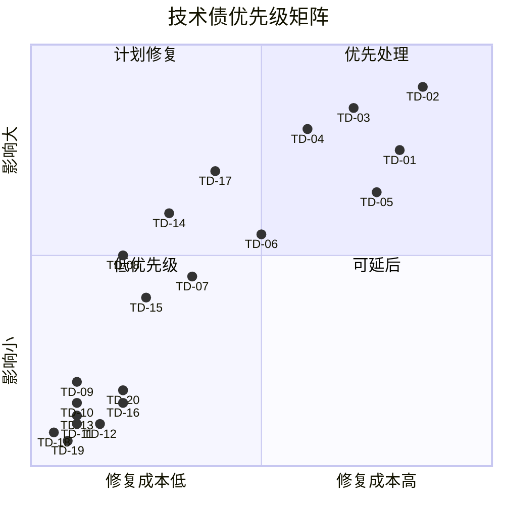
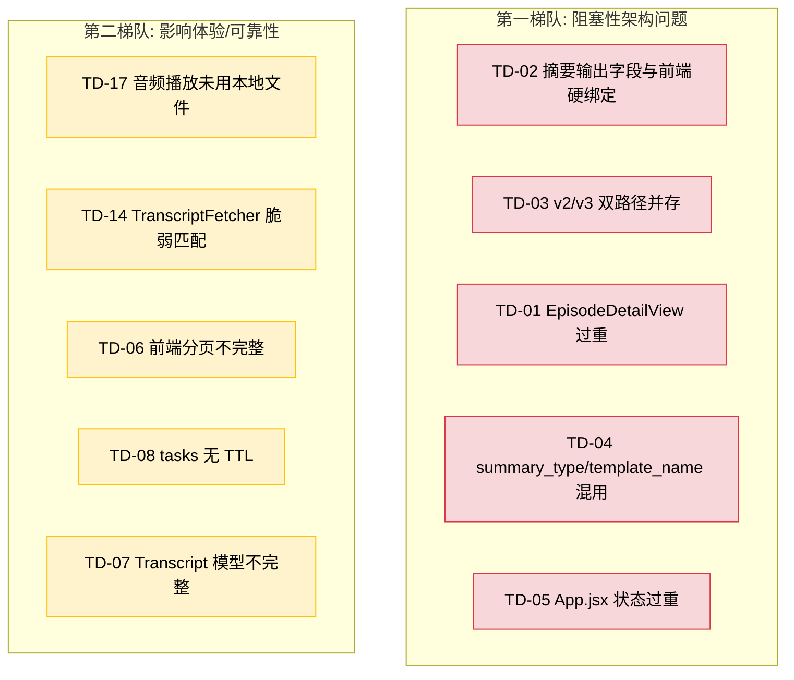
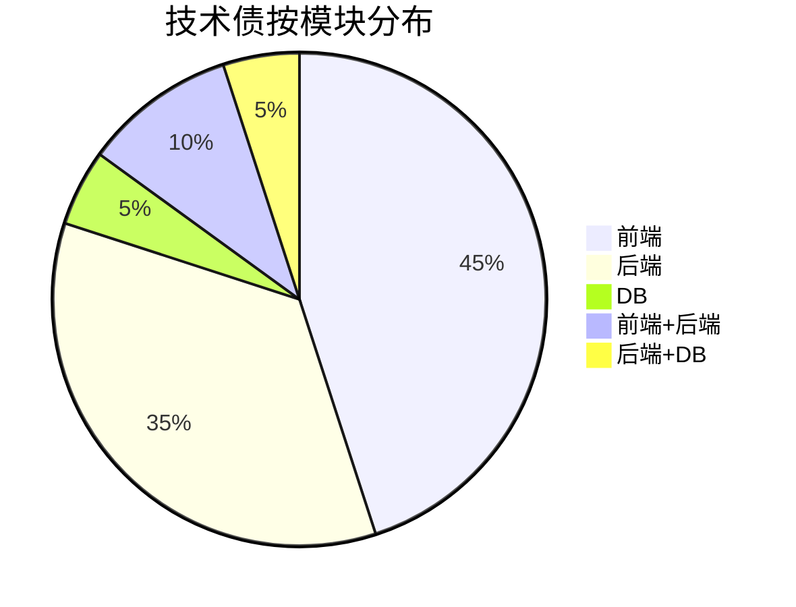
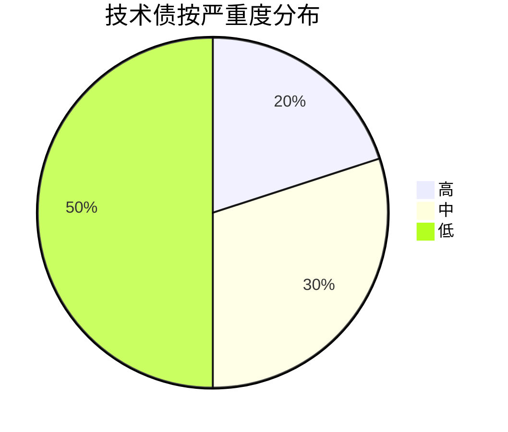
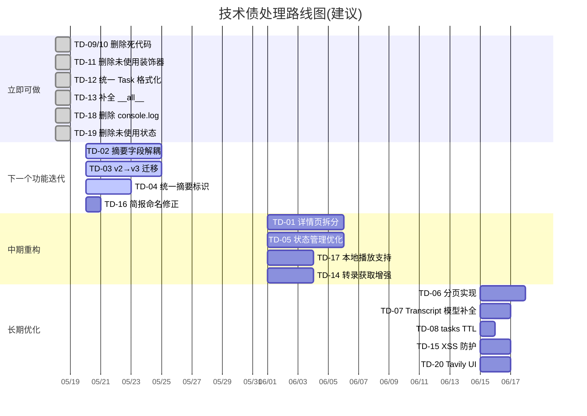

# 08 - 技术债清单

## 技术债总览



## 技术债总表

| ID | 名称 | 模块 | 严重度 | 根因 | 证据文件 |
|----|------|------|--------|------|----------|
| TD-01 | EpisodeDetailView.jsx 过重 | 前端 | 高 | 所有详情逻辑集中一个组件 | frontend/src/components/views/EpisodeDetailView.jsx (850行) |
| TD-02 | 摘要输出字段与前端硬绑定 | 前端+后端 | 高 | to_response 展开 content 字段到顶层 | backend/app/models/summary.py, EpisodeDetailView.jsx |
| TD-03 | v2/v3 双路径并存 | 后端 | 高 | 新引擎未完全替代旧系统 | backend/app/services/summary_service.py |
| TD-04 | summary_type/template_name 混用 | 后端+DB | 高 | 字段迁移未完成 | backend/app/api/summaries.py, summaries 集合 |
| TD-05 | App.jsx 状态过重 | 前端 | 中 | 全局状态集中管理无分层 | frontend/src/App.jsx (16个状态变量) |
| TD-06 | 前端分页不完整 | 前端 | 中 | episodes 列表硬编码 limit=500 | frontend/src/App.jsx loadData() |
| TD-07 | Transcript 模型不完整 | 后端 | 中 | AssemblyAI 产出的额外字段未建模 | backend/app/models/transcript.py vs api/transcripts.py |
| TD-08 | tasks 集合无 TTL | DB | 中 | 历史任务无限增长 | backend/app/__init__.py ensure_indexes |
| TD-09 | LlmSettingsView 死代码 | 前端 | 低 | 被 SettingsView+LlmConfigPanel 替代但未删除 | frontend/src/components/views/LlmSettingsView.jsx |
| TD-10 | DownloadedView/TranscribedView 死代码 | 前端 | 低 | 被 WorkspaceView 替代但未删除 | frontend/src/components/views/DownloadedView.jsx, TranscribedView.jsx |
| TD-11 | validate_json 装饰器未使用 | 后端 | 低 | 已定义但无调用 | backend/app/api/decorators.py |
| TD-12 | Task.to_response 未使用 | 后端 | 低 | tasks.py 用自己的 _format_task | backend/app/models/task.py, backend/app/api/tasks.py |
| TD-13 | __init__.py __all__ 不完整 | 后端 | 低 | 缺少 prompt_templates_bp 和 insights_bp | backend/app/api/__init__.py |
| TD-14 | TranscriptFetcher URL 后缀匹配脆弱 | 后端 | 中 | 只识别 .srt/.vtt/.json 后缀 | backend/app/services/transcript_fetcher.py |
| TD-15 | AIBriefingView dangerouslySetInnerHTML | 前端 | 中 | formatMarkdownInline 使用 | frontend/src/components/views/AIBriefingView.jsx |
| TD-16 | briefings 三层嵌套命名 | 后端 | 低 | res.briefing.briefing 结构 | backend/app/services/briefing_service.py |
| TD-17 | 音频播放只用远程 URL | 前端 | 中 | 未使用本地下载的 audio_path | frontend/src/App.jsx handlePlay |
| TD-18 | console.log 调试代码残留 | 前端 | 低 | EpisodeDetailView 690 行 | frontend/src/components/views/EpisodeDetailView.jsx |
| TD-19 | 未使用的状态变量 | 前端 | 低 | showTemplateOptions, selectedTopic | EpisodeDetailView.jsx, AIBriefingView.jsx |
| TD-20 | Tavily 配置无 UI 入口 | 前端 | 低 | API 已实现但前端未集成 | backend/app/api/settings.py, frontend/src/services/api.js |

---

## Top 10 优先级排序



| 排名 | ID | 名称 | 理由 |
|------|-----|------|------|
| 1 | TD-02 | 摘要输出字段与前端硬绑定 | 影响可扩展性，每次新增 block 都要改三处(模型、API、前端) |
| 2 | TD-03 | v2/v3 双路径并存 | 维护成本翻倍，任何摘要相关改动需同时考虑两条路径 |
| 3 | TD-01 | EpisodeDetailView 过重 | 850行单组件，新功能越来越难加，bug 修复容易引入回归 |
| 4 | TD-04 | summary_type/template_name 混用 | 数据查询复杂，容易遗漏某条路径 |
| 5 | TD-05 | App.jsx 状态过重 | 16个状态变量，新视图/功能加入时状态管理越来越混乱 |
| 6 | TD-17 | 音频播放未用本地文件 | 核心体验问题，下载后仍走远程 URL，浪费带宽 |
| 7 | TD-14 | TranscriptFetcher 脆弱匹配 | URL 无后缀的转录源完全无法识别，影响转录成功率 |
| 8 | TD-06 | 前端分页不完整 | 数据量增长后列表渲染性能下降，limit=500 不是长久之计 |
| 9 | TD-08 | tasks 无 TTL | 长期运行后数据膨胀，影响查询性能 |
| 10 | TD-07 | Transcript 模型不完整 | AssemblyAI 额外字段在模型层丢失，数据不一致 |

---

## 详细分析

### TD-01: EpisodeDetailView.jsx 过重

**严重度**: 高 | **模块**: 前端 | **证据**: `frontend/src/components/views/EpisodeDetailView.jsx` (约 850 行)

**为什么是问题**: 所有单集详情的展示逻辑(摘要展示、转录查看、音频播放控制、状态管理、模板选择)集中在一个组件中。单个文件超过 800 行，远超 React 组件的可维护阈值。

**不处理会怎样**: 组件持续膨胀，每次新增功能都要修改这个文件，merge conflict 频繁，回归风险高。

**最小修复方案**: 按功能拆分为子组件(摘要区、转录区、播放器区)，主组件只负责布局和状态传递。不影响外部接口。

**理想修复方案**: 提取自定义 hooks 管理各区域状态(useSummary, useTranscript, usePlayer)，组件纯渲染，配合 Context 或轻量状态管理。

**是否建议现在处理**: 否。当前功能可用，拆分风险高。建议在下一个涉及详情页的功能需求时顺带重构。

---

### TD-02: 摘要输出字段与前端硬绑定

**严重度**: 高 | **模块**: 前端+后端 | **证据**: `backend/app/models/summary.py` to_response(), `EpisodeDetailView.jsx`

**为什么是问题**: `Summary.to_response()` 将 `content` 对象内的字段展开到响应顶层，每种摘要类型/模板展开不同的字段名(investment_signals, key_points, tech_trends 等)。前端 `EpisodeDetailView` 直接引用这些字段名渲染。每新增一个摘要模板或 block，需要同时修改: 模型 to_response()、API 响应结构、前端渲染组件，至少三处。

**不处理会怎样**: 模板数量增长后，to_response 方法会越来越长(当前已有 30+ 字段展开)。前端组件也需要越来越多的条件判断。

**最小修复方案**: 前端改为直接读取 `content` 对象内的字段，不再依赖顶层展开字段。后端 to_response 保留展开但标记 deprecated。

**理想修复方案**: 定义摘要 block schema 注册机制，每个 block 自带渲染组件。前端通过 block id 动态渲染，不硬编码字段名。

**是否建议现在处理**: 是。这是可扩展性的核心阻塞问题，越晚改影响面越大。

---

### TD-03: v2/v3 双路径并存

**严重度**: 高 | **模块**: 后端 | **证据**: `backend/app/services/summary_service.py`

**为什么是问题**: v2 摘要通过 `summary_type` 区分类型(general/investment/learning)，v3 通过 `template_name` 使用模板引擎。两条路径的生成逻辑、存储结构、查询方式完全不同，但共享同一个 summaries 集合。service 层需要大量条件判断来分流。

**不处理会怎样**: 维护成本翻倍。任何摘要相关改动(如新增 block 类型、修改存储结构)需同时考虑 v2 和 v3，且容易遗漏。

**最小修复方案**: 将 v2 的三种类型转换为 v3 模板，统一通过模板引擎生成。保留 v2 数据但不再新增。

**理想修复方案**: 数据迁移脚本将所有 v2 摘要转换为 v3 格式，删除 v2 代码路径，summary_service 只保留模板化路径。

**是否建议现在处理**: 是。建议在下次摘要功能迭代时，优先完成 v2 到 v3 的迁移。

---

### TD-04: summary_type/template_name 混用

**严重度**: 高 | **模块**: 后端+DB | **证据**: `backend/app/api/summaries.py`, summaries 集合

**为什么是问题**: 与 TD-03 互为因果。数据库中同一集合混用两种标识字段: v2 用 `summary_type`，v3 用 `template_name`。查询摘要时需同时检查两个字段，逻辑复杂且容易遗漏。

```python
# 当前查询示例(需同时考虑两种情况)
db.summaries.find({"episode_id": ep_id, "$or": [
    {"summary_type": "general"},
    {"template_name": "general"}
]})
```

**不处理会怎样**: 新开发者无法理解查询逻辑，容易写出只查一个字段的 bug。

**最小修复方案**: 查询工具函数封装所有摘要查找逻辑，统一入口。

**理想修复方案**: 配合 TD-03 完成迁移后，废弃 `summary_type` 字段，统一使用 `template_name`。

**是否建议现在处理**: 与 TD-03 同步处理。

---

### TD-05: App.jsx 状态过重

**严重度**: 中 | **模块**: 前端 | **证据**: `frontend/src/App.jsx` (16个状态变量)

**为什么是问题**: App.jsx 承担了全局状态管理的角色，包含 feeds、episodes、currentView、selectedEpisode、playingEpisode 等 16 个状态变量。状态之间有隐含的依赖关系(如切换视图需重置选中状态)，手动维护容易遗漏。

**不处理会怎样**: 每新增一个视图或功能，App.jsx 就要加状态和相关逻辑，代码量持续增长，状态之间的依赖关系越来越复杂。

**最小修复方案**: 按功能域将状态拆分到多个自定义 hooks(useFeeds, useEpisodes, usePlayer, useNavigation)，App.jsx 只做组合。

**理想修复方案**: 引入轻量状态管理(Zustand 或 Jotai)，各组件按需订阅状态，App.jsx 只负责路由和布局。

**是否建议现在处理**: 否。当前功能可用，建议在 TD-01 重构时顺带处理。

---

### TD-06: 前端分页不完整

**严重度**: 中 | **模块**: 前端 | **证据**: `frontend/src/App.jsx` loadData() 硬编码 `limit=500`

**为什么是问题**: episodes 列表加载时一次性拉取最多 500 条数据。当订阅源多、时间跨度长时，这个限制要么导致数据截断(用户看不到旧数据)，要么导致性能问题(渲染大量 DOM 节点)。

**不处理会怎样**: 数据量超过 500 后用户无感知地丢失数据，前端渲染性能随数据量线性下降。

**最小修复方案**: 实现"加载更多"按钮或无限滚动，后端支持 skip/limit 分页参数。

**理想修复方案**: 虚拟滚动列表 + 按需加载，配合后端游标分页(基于 published 时间戳)。

**是否建议现在处理**: 中等优先级。当活跃 episodes 超过 200 条时应着手处理。

---

### TD-07: Transcript 模型不完整

**严重度**: 中 | **模块**: 后端 | **证据**: `backend/app/models/transcript.py` vs `backend/app/api/transcripts.py`

**为什么是问题**: `Transcript.create()` 只定义了 episode_id, text, segments, language, word_count, source, model 共 7 个字段。但 AssemblyAI 转录路由在实际存储时额外写入了 chapters, entities, speakers, duration 等字段。通过模型方法创建的转录文档与路由直接构建的结构不一致。

**不处理会怎样**: 如果未来有代码通过 `Transcript.create()` 创建转录，会丢失 AssemblyAI 的附加数据。依赖这些字段的功能(如章节显示)可能在重新生成后失效。

**最小修复方案**: 在 `Transcript.create()` 中添加 chapters, entities, speakers, duration 参数和默认值。

**理想修复方案**: 定义完整的 Transcript schema，将 AssemblyAI 特有字段归入 `metadata` 子对象。

**是否建议现在处理**: 中等优先级。在下次修改转录相关代码时顺带修复。

---

### TD-08: tasks 集合无 TTL

**严重度**: 中 | **模块**: DB | **证据**: `backend/app/__init__.py` ensure_indexes

**为什么是问题**: tasks 集合记录所有异步任务(download/transcribe/summarize/refresh)，无任何过期清理机制。每次操作都会产生新的 task 文档，completed/failed 状态的任务永久保留。

**不处理会怎样**: 长期运行后 tasks 集合膨胀，影响查询性能。假设每天处理 20 个单集(下载+转录+摘要=60 个任务)，一年积累约 22000 条文档。

**最小修复方案**: 为 tasks 集合添加 TTL 索引，自动清理 completed/failed 超过 30 天的任务。

**理想修复方案**: 保留近期任务用于调试，历史任务归档到单独集合或导出后删除。

**是否建议现在处理**: 低优先级。短中期内数据量可控。

---

### TD-09: LlmSettingsView 死代码

**严重度**: 低 | **模块**: 前端 | **证据**: `frontend/src/components/views/LlmSettingsView.jsx`

**为什么是问题**: 该组件已被 `SettingsView` + `LlmConfigPanel` 替代，但文件仍存在于代码库中。新开发者可能误以为这是活跃代码。

**不处理会怎样**: 代码库中积累越来越多的死代码，增加认知负担。

**最小修复方案**: 删除文件并在 import 处清理引用。

**理想修复方案**: 同 TD-10 一起清理所有已废弃的 View 组件。

**是否建议现在处理**: 是。删除死代码成本极低，可随时执行。

---

### TD-10: DownloadedView/TranscribedView 死代码

**严重度**: 低 | **模块**: 前端 | **证据**: `frontend/src/components/views/DownloadedView.jsx`, `TranscribedView.jsx`

**为什么是问题**: 这两个视图组件已被 `WorkspaceView` 替代(WorkspaceView 内部按状态筛选)，但文件未删除。

**不处理会怎样**: 与 TD-09 相同，增加代码库噪音。

**最小修复方案**: 删除文件并清理路由中的引用。

**理想修复方案**: 确认 WorkspaceView 完全覆盖旧视图功能后，批量删除。

**是否建议现在处理**: 是。与 TD-09 一起清理。

---

### TD-11: validate_json 装饰器未使用

**严重度**: 低 | **模块**: 后端 | **证据**: `backend/app/api/decorators.py`

**为什么是问题**: 已定义的 JSON 验证装饰器无任何调用点，可能是早期设计但未推行。

**不处理会怎样**: API 参数验证不一致，有的路由手动校验，有的不校验。

**最小修复方案**: 删除未使用的装饰器。

**理想修复方案**: 统一 API 参数验证策略，要么使用该装饰器，要么使用 Flask 的 request parser。

**是否建议现在处理**: 是。删除即可。

---

### TD-12: Task.to_response 未使用

**严重度**: 低 | **模块**: 后端 | **证据**: `backend/app/models/task.py`, `backend/app/api/tasks.py`

**为什么是问题**: `Task.to_response()` 在 model 层定义了完整的响应格式化逻辑，但 `tasks.py` API 路由有独立的 `_format_task` 函数。两套逻辑可能导致输出不一致。

**不处理会怎样**: 两处维护，容易出现行为差异。

**最小修复方案**: 让 tasks.py 调用 `Task.to_response()`，删除 `_format_task`。

**理想修复方案**: 统一所有 model 的 to_response 为唯一格式化入口。

**是否建议现在处理**: 是。改动很小。

---

### TD-13: __init__.py __all__ 不完整

**严重度**: 低 | **模块**: 后端 | **证据**: `backend/app/api/__init__.py`

**为什么是问题**: `__all__` 列表缺少 `prompt_templates_bp` 和 `insights_bp`，但这不影响运行(蓝图在 create_app 中直接 import 注册)。

**不处理会怎样**: 无实际影响，仅影响 `from module import *` 的行为。

**最小修复方案**: 补全 `__all__` 列表。

**理想修复方案**: 删除 `__all__`(项目未使用 star import)。

**是否建议现在处理**: 随手修即可。

---

### TD-14: TranscriptFetcher URL 后缀匹配脆弱

**严重度**: 中 | **模块**: 后端 | **证据**: `backend/app/services/transcript_fetcher.py`

**为什么是问题**: TranscriptFetcher 通过 URL 后缀(.srt, .vtt, .json)判断转录文件类型。许多播客的转录 URL 没有标准后缀(如 `/transcript/episode-123`)，导致无法识别有效的转录源。

**不处理会怎样**: 部分播客的转录文件虽然存在但无法自动获取，降低转录成功率，用户被迫手动上传。

**最小修复方案**: 增加基于 Content-Type 响应头的类型判断，先 HEAD 请求检查 Content-Type，再决定如何解析。

**理想修复方案**: 实现多策略探测: 先检查常见 URL 路径(/transcript, /caption 等)，再检查 RSS 中的 transcript tag，最后尝试 Content-Type 探测。

**是否建议现在处理**: 中等优先级。当用户反馈转录获取失败率高时应优先处理。

---

### TD-15: AIBriefingView dangerouslySetInnerHTML

**严重度**: 中 | **模块**: 前端 | **证据**: `frontend/src/components/views/AIBriefingView.jsx`

**为什么是问题**: 使用 `dangerouslySetInnerHTML` 渲染 LLM 生成的 Markdown 内容。虽然数据来源是自己的 LLM(非用户输入)，但 LLM 输出本质上不可信，存在 XSS 风险(如 LLM 生成 `<script>` 标签)。

**不处理会怎样**: 理论上存在 XSS 攻击面，虽然利用难度较高。

**最小修复方案**: 使用 DOMPurify 对 HTML 内容做消毒处理后再渲染。

**理想修复方案**: 使用安全的 Markdown 渲染库(如 react-markdown)，避免将 LLM 输出转为 HTML。

**是否建议现在处理**: 中等优先级。安全相关，建议近期处理。

---

### TD-16: briefings 三层嵌套命名

**严重度**: 低 | **模块**: 后端 | **证据**: `backend/app/services/briefing_service.py`

**为什么是问题**: API 返回的数据结构为 `{ success, briefing: { date, briefing: { hotTopics, ... } } }`，存在 `res.briefing.briefing` 三层嵌套，命名容易混淆。

**不处理会怎样**: 前端需要写 `res.briefing.briefing.hotTopics` 这样的链式访问，代码可读性差。

**最小修复方案**: 将内层 `briefing` 字段重命名为 `content` 或 `data`。

**理想修复方案**: 重新设计返回结构，避免嵌套: `{ success, date, content: {...}, cached }`。

**是否建议现在处理**: 随手改即可，但需同步修改前端。

---

### TD-17: 音频播放只用远程 URL

**严重度**: 中 | **模块**: 前端 | **证据**: `frontend/src/App.jsx` handlePlay

**为什么是问题**: `handlePlay` 函数只使用 `episode.audio_url`(远程 URL)播放音频，忽略了 `episode.audio_path`(本地下载路径)。用户下载了音频后，播放仍走网络，浪费带宽且无法离线播放。

**不处理会怎样**: 下载功能的实用价值大打折扣。用户下载了音频但仍然需要网络才能播放。

**最小修复方案**: 播放时优先检查 `audio_path` 是否存在，如存在则使用本地路径(需后端提供静态文件服务)。

**理想修复方案**: 实现完整的离线播放支持: 本地文件服务 + 播放状态持久化 + 下载状态指示。

**是否建议现在处理**: 中等优先级。影响核心体验，但需配合后端文件服务。

---

### TD-18: console.log 调试代码残留

**严重度**: 低 | **模块**: 前端 | **证据**: `frontend/src/components/views/EpisodeDetailView.jsx` 约第 690 行

**为什么是问题**: 生产代码中残留 console.log 调试输出，影响浏览器控制台清洁度，可能泄露内部数据结构。

**不处理会怎样**: 控制台输出噪音，不影响功能。

**最小修复方案**: 删除所有 console.log 语句。

**理想修复方案**: 配置 ESLint no-console 规则，使用专门的 logger 工具替代。

**是否建议现在处理**: 是。搜索并删除即可。

---

### TD-19: 未使用的状态变量

**严重度**: 低 | **模块**: 前端 | **证据**: `EpisodeDetailView.jsx` (showTemplateOptions), `AIBriefingView.jsx` (selectedTopic)

**为什么是问题**: 声明了状态变量但未在渲染或逻辑中使用，可能是功能删除后遗留。

**不处理会怎样**: 轻微的内存浪费和代码噪音。

**最小修复方案**: 删除未使用的 useState 声明。

**理想修复方案**: 配置 ESLint no-unused-vars 规则自动检测。

**是否建议现在处理**: 是。与 TD-18 一起清理。

---

### TD-20: Tavily 配置无 UI 入口

**严重度**: 低 | **模块**: 前端 | **证据**: `backend/app/api/settings.py` (API 已实现), `frontend/src/services/api.js` (前端未集成)

**为什么是问题**: 后端已完整实现 Tavily 搜索配置的 CRUD API，但前端没有对应的设置界面。用户只能通过直接调用 API 或修改数据库来配置 Tavily。

**不处理会怎样**: Tavily 功能对普通用户不可用，只有开发者能配置。

**最小修复方案**: 在设置页面添加 Tavily 配置区域(API Key、搜索深度等)。

**理想修复方案**: 与 LLM 配置面板风格统一的 Tavily 配置面板，支持多 API Key 轮询和测试连接。

**是否建议现在处理**: 否。等 Tavily 功能正式需要用户配置时再处理。

---

## 按模块统计





## 建议处理路线图



**立即可做**(1 天内): TD-09, TD-10, TD-11, TD-12, TD-13, TD-18, TD-19 -- 纯删除/小修改，无风险。

**下一个功能迭代时顺带处理**: TD-02, TD-03, TD-04, TD-16 -- 摘要系统架构问题，建议集中解决。

**中期重构窗口**: TD-01, TD-05, TD-17, TD-14 -- 需要专门的重构时间，建议安排迭代。

**长期优化**: TD-06, TD-07, TD-08, TD-15, TD-20 -- 影响可控，可在日常开发中逐步消化。
