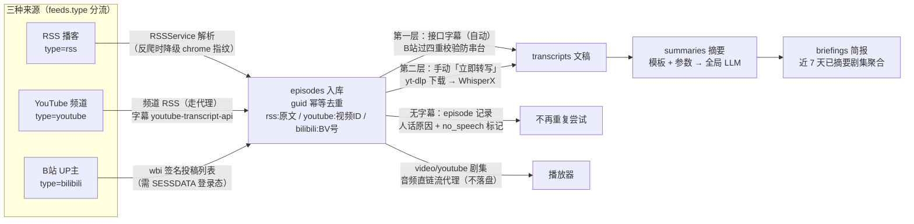
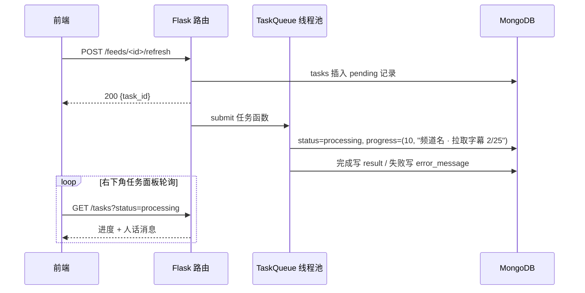
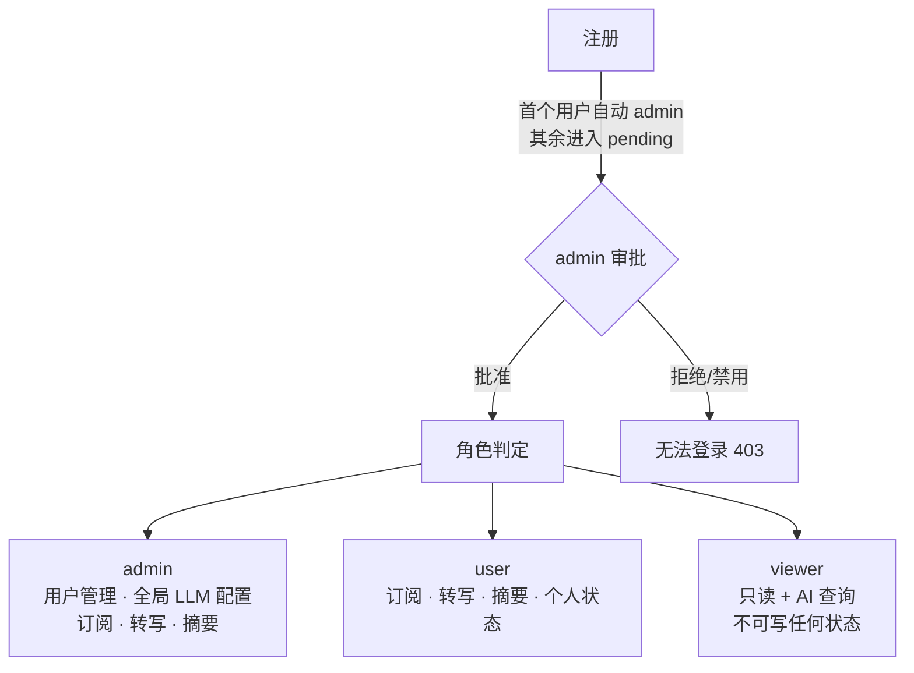

# 架构概览

> 回答三个问题：系统怎么分层、一条内容怎么流进来、谁能做什么。字段细节见[数据库设计](./database.md)，端点签名见 [API 接口](./api.md)。

## 技术栈

| 层 | 技术 |
|----|------|
| 前端 | React 18 + Vite + TailwindCSS + i18next（中/英） |
| 后端 | Python 3.13 + Flask + ThreadPoolExecutor 任务队列 |
| 数据库 | MongoDB（pymongo，无 ORM，schema 由代码约定） |
| 内容接入 | feedparser（RSS）/ yt-dlp + youtube-transcript-api（YouTube）/ curl_cffi + wbi 签名（B站） |
| AI | OpenAI 兼容 + Anthropic 双协议 LLMClient；本地 faster-whisper / WhisperX |
| 认证 | JWT (HS256)，注册审批制，三档角色 |

## 内容管线：一条内容的一生

三种来源共用同一条"入库 → 文稿 → 摘要"管线，差异只在入口的适配器：



关键设计：

- **guid 幂等**：刷新多少次同一视频/音频只入库一次；订阅本身按规范化 URL 全局去重（防重复订阅）。
- **字幕三层策略**是产品决策：接口捞的全自动（成本≈0），**本地转写一律手动**（算力由人控制）。
- **B站字幕串台防御**：时间轴 ≤ 时长×1.05 / 行密度 / 行均字数 / 标题词窗命中四重校验 + 同订阅文本查重，拒收不合规字幕（历史上旧接口曾大面积串台）。

## 异步任务系统

所有耗时操作（刷新、下载、转写、摘要、翻译）走 `TaskQueue`（ThreadPoolExecutor），HTTP 请求只入队：



- 进度支持 `(percent, message)` 元组，`progress_message` 持久化，重启后任务面板仍能显示人话进度。
- 后端重启时发现孤儿 running 任务会标记"请重试"而不是永久卡住。
- completed 任务 7 天 TTL 自动清理。
- 视频源刷新逐视频节流 2.5s（B站滑动风控，实测 1.2s 仍偶发触发）。

## 权限模型



- **共享库**：feeds / episodes / transcripts / summaries 全员可见，`owner_id` 只做归属记录、不做读取隔离。
- **个人状态隔离**：已读 / 加星 / 播放进度存 `user_episode_states`，按用户隔离——一家人各看各的进度，互不覆盖。
- **LLM 配置全局一套**：由 admin 在设置页维护（服务商 / 模型 / 任务路由），全员共用，不存 per-user API Key。
- 认证实现：`@require_auth`（登录即可）/ `@require_role("user", "admin")`（挡 viewer）/ `@require_admin`；`<audio>` 标签等无法带请求头的场景用 query 参数令牌（如 `/episodes/<id>/stream?token=`）。

## 后端模块地图

### API 层：12 个蓝图，64 个路由

| 蓝图 | 前缀 | 文件 | 路由数 | 职责 |
|------|------|------|--------|------|
| auth | `/api/auth` | `auth.py` | 3 | 注册（默认 pending）/ 登录 / me |
| admin | `/api/admin` | `admin.py` | 4 | 用户审批与管理 / 任务统计 / 健康 |
| feeds | `/api/feeds` | `feeds.py` | 9 | 订阅 CRUD + 刷新 + 三源分流 |
| episodes | `/api/episodes` | `episodes.py` | 7 | 列表 / 详情 / 个人状态 / 下载 / 在线流 |
| transcripts | `/api/transcripts` | `transcripts.py` | 6 | 转录 CRUD + 外部拉取 + 立即转写 |
| summaries | `/api/summaries` | `summaries.py` | 5 | 摘要生成 / 翻译 / 模板列表 |
| tasks | `/api/tasks` | `tasks.py` | 3 | 任务列表 / 状态 / 取消 |
| settings | `/api/settings` | `settings.py` | 13 | LLM / Tavily / AI 开关 / B站登录态 |
| prompt_templates | `/api/prompt-templates` | `prompt_templates.py` | 9 | 模板 CRUD + 初始化 |
| insights | `/api/insights` | `insights.py` | 3 | AI 简报 + PDF 导出 |
| stats | `/api` | `stats.py` | 1 | 统计（未读按用户计） |
| video_import | `/api/video-import` | `video_import.py` | 1 | 单个 YouTube 视频 URL 直接导入 |

另有 `/api/media/<path>` 由 `app/__init__.py` 注册（非蓝图），带 7 天浏览器缓存。

### 服务层（app/services/，22 个文件）

| 服务 | 行数 | 职责 |
|------|------|------|
| TranscriptFetcher | 582 | 外部转录 URL 拉取 + 标准格式解析（VTT/SRT/JSON） |
| RssService | 431 | RSS 解析；三级降级抓取（requests → chrome 指纹 → chrome+代理） |
| TaskQueue | 353 | 线程池任务队列 + 进度持久化 |
| BilibiliService | 335 | wbi 签名、投稿列表、AI 字幕（四重校验）、音频下载 |
| LLMClient | 325 | 双协议统一调用、JSON 解析、截断自动重试 |
| WhisperXService | 302 | 本地 WhisperX（词级对齐、说话人分离） |
| YouTubeService | 279 | 频道解析、官方 RSS 拉取、字幕、音频直链（流播放） |
| BriefingService | 269 | 简报生成 + 按天缓存（7 天窗口） |
| AutoRefresher | 227 | 定时刷新订阅 |
| WhisperService | 215 | 本地 faster-whisper |
| TranscriptPostprocessor | 181 | 转录后处理（中文空格/标点、可选 AI 规范化） |
| SummaryService | 143 | 摘要服务 facade |
| UserEpisodeState | 79 | 剧集个人状态读写（已读/加星/进度） |
| 其余 | — | jwt_auth / ai_control / briefing_prompts 等小模块 |

### 核心层（app/core/summarization/）

| 模块 | 行数 | 职责 |
|------|------|------|
| SummarizationEngine | 386 | 模板化摘要：加载 → 构建提示词 → 调用 → 校验 → 重试 → 保存 |
| PromptBuilder | 226 | 从模板 + 参数动态构建提示词 |
| SchemaValidator | 99 | 校验 LLM JSON 输出 |
| DefaultTemplates | 519 | 5 个系统模板（中文化） |

## 前端组件树

```
App.jsx — 路由 + 全局状态 + 播放器 + 任务面板
├── Sidebar.jsx — 订阅导航（移动端抽屉）
├── AuthView.jsx — 登录/注册（注册后提示等待审批）
├── WorkspaceView.jsx — 主工作台
├── FeedDetailView.jsx / EpisodeDetailView.jsx — 详情
│    （EpisodeDetail 含状态徽标、来源徽标、无字幕原因、立即转写、模板参数）
├── FavoritesView.jsx / AIBriefingView.jsx
├── SettingsView.jsx — 设置容器
│    ├── LlmConfigPanel — LLM 配置（admin 可见，状态灯折叠卡）
│    ├── AdminUsersPanel — 用户管理（admin 可见）
│    ├── PromptTemplatesPanel / AppSettingsPanel / AccountPanel
├── PlayerBar.jsx — 播放器（YouTube 剧集走流地址）
├── TaskPanel.jsx — 任务面板（人话进度）
└── common/ — FeedImage（平台图标兜底）、StatusBadge 等
```

## 代码规模

| 模块 | 文件数 | 行数 |
|------|--------|------|
| 后端 Python（app/） | 50 | ~11,354 |
| 前端（src/） | 30 | ~6,235 |
| 后端测试 | 26 | 116 用例 |
