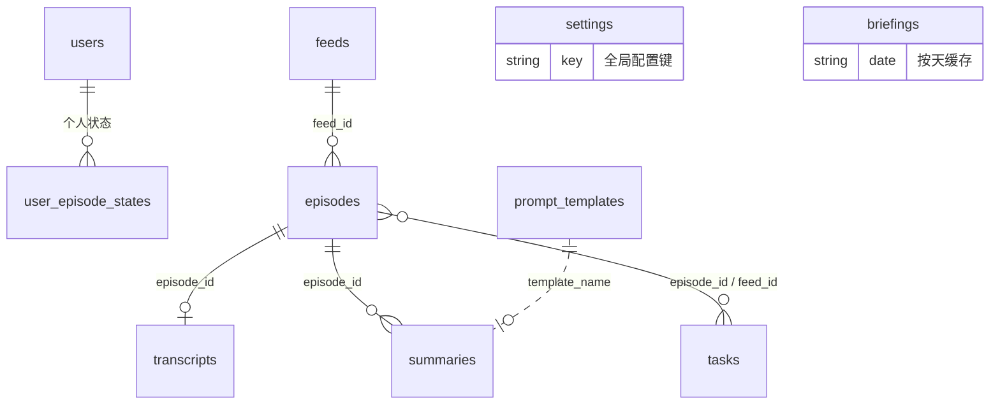

# 数据库设计

> schema 唯一真源，从 `backend/app/models/` + `app/__init__.py`（索引）+ 各服务实现提取。MongoDB 无迁移体系：加字段天然兼容，演进靠"新代码读旧文档取默认值"，因此存在少量历史字段共存——弃用字段在文末[数据治理决策](#数据治理决策)集中登记。
> 库名 `podcast`（`MONGO_DB` 可改）。

## 集合关系

共享库原则：feeds / episodes / transcripts / summaries 全员可读，`owner_id` 只做归属记录；用户维度的数据只有 `users` 和 `user_episode_states` 两张。

---

## users

| 字段 | 类型 | 说明 |
|------|------|------|
| `_id` | ObjectId | |
| `email` | string | 唯一，登录标识（可以是邮箱格式的用户名） |
| `password_hash` | string | bcrypt |
| `role` | string | `admin` / `user` / `viewer` |
| `status` | string | `pending`（注册默认，等审批）/ `active` / `disabled` |
| `created_at` / `updated_at` / `last_login_at` | datetime | `last_login_at` nullable |

**索引**: `email` unique, `role`, `status`

---

## feeds

| 字段 | 类型 | 说明 |
|------|------|------|
| `_id` | ObjectId | |
| `rss_url` | string | 源地址（RSS xml / 频道主页 / 空间页，按 type 解释） |
| `type` | string | `rss`（默认）/ `youtube` / `bilibili`——刷新时分流的依据 |
| `channel_ref` | string | youtube 存频道 channel_id；bilibili 存 UP 主 mid；rss 为空 |
| `owner_id` | string | 归属记录（共享库下不隔离读取） |
| `title` / `website` / `image` / `description` / `author` / `language` | | 元数据；youtube 建订阅时解析头像，bilibili 封面带 `@480w_270h_1c.webp` 缩略参数 |
| `status` | string | `active` / `paused` / `error` |
| `last_checked` / `last_updated` | datetime | nullable |
| `check_error` | string | nullable；最近一次刷新失败原因，成功即清空 |
| `is_starred` / `is_favorite` | bool | |
| `tags` | array | |
| `episode_count` | int | |
| `unread_count` | int | **弃用不再维护**：未读按用户隔离，列表接口实时计算 |
| `note` | string | nullable |
| `created_at` / `updated_at` | datetime | |

**索引**: `(owner_id, rss_url)` unique, `owner_id`, `status`, `is_starred`, `is_favorite`, `created_at`

订阅唯一性：代码层按**规范化 URL 全局去重**（去 utm/spm 参数、小写、去尾斜杠），同一来源不允许重复订阅。

---

## episodes

| 字段 | 类型 | 说明 |
|------|------|------|
| `_id` | ObjectId | |
| `feed_id` | ObjectId | 所属订阅 |
| `owner_id` | string | 归属记录（不隔离读取） |
| `guid` | string | 幂等键：RSS 原生 guid / `youtube:视频ID` / `bilibili:BV号` |
| `title` / `summary` / `content` / `link` | | RSS 元数据；视频源 link 指向视频页 |
| `published` | datetime | 发布时间（YouTube 取频道 RSS 的 published，B站取投稿时间戳） |
| `audio_url` | string | 远程音频地址；视频源为空（播放在线流） |
| `audio_type` | string | `audio/mpeg` / `video/youtube` / `video/bilibili` |
| `audio_size` / `duration` | int | 秒/字节；视频源 duration 可能缺（RSS 源缺失则 0） |
| `image` / `chapters_url` / `transcript_url` | | nullable |
| `status` | string | 状态机：`new` → `downloading` → `downloaded` → `transcribing` → `transcribed` → `summarizing` → `summarized`（或 `error`） |
| `local_path` / `audio_path` | string | nullable；下载后的本地文件（读取时两者都兼容） |
| `is_read` / `is_starred` / `play_position` | | **弃用**：个人状态迁至 `user_episode_states`，旧值仅历史保留 |
| `popularity_score` | int | |
| `has_transcript` / `has_summary` | bool | 完成标记，列表过滤用（有索引） |
| `transcript_source` | string | **弃用**：来源唯一真源是 `transcripts.source` |
| `last_download_error` / `last_transcript_error` / `last_summary_error` | string | nullable；`last_transcript_error` 存人话原因（频道主禁用 / AI 未生成 / 被限流） |
| `no_speech` | bool | 无人声视频转写为空的标记，防止重复手动转写 |
| `created_at` / `updated_at` | datetime | |

**索引**: `feed_id`, `(owner_id, feed_id, guid)` unique, `owner_id`, `status`, `is_starred`, `published`, `has_transcript`, `has_summary`, `(feed_id, is_read)`

---

## user_episode_states

共享库下剧集全员可见，个人状态按用户隔离（`services/user_episode_state.py`）。

| 字段 | 类型 | 说明 |
|------|------|------|
| `user_id` | string | users._id 字符串 |
| `episode_id` | ObjectId | |
| `is_read` / `is_starred` | bool | |
| `play_position` | int | 播放进度（秒） |
| `updated_at` | datetime | |

**索引**: `(user_id, episode_id)` unique, `episode_id`

写入要求 user/admin 角色（viewer 只读）。订阅列表未读数、`?is_read=` 等过滤都基于本集合按请求用户计算。

---

## transcripts

| 字段 | 类型 | 说明 |
|------|------|------|
| `_id` | ObjectId | |
| `episode_id` | ObjectId | |
| `owner_id` | string | 归属记录 |
| `text` | string | 完整文本 |
| `segments` | array | `[{start, end, text}]`，各来源统一格式 |
| `language` | string | |
| `word_count` | int | |
| `source` | string | `youtube` / `bilibili`（平台 AI 字幕）/ `local_whisperx` / `whisper` / `official` / `external` / `assemblyai` —— 前端来源徽标的依据 |
| `model` | string | 如 `bili-ai-subtitle`、whisper 模型名 |
| `postprocess` | object | nullable，后处理记录 |
| `chapters` / `entities` / `speakers` | array | nullable（AssemblyAI / WhisperX 说话人） |
| `duration` | float | nullable |
| `created_at` / `updated_at` | datetime | |

**索引**: `(owner_id, episode_id)` unique, `owner_id`

B站字幕入库前过四重校验（时间轴/密度/字数/标题词窗）+ 同订阅 md5 查重，拒收串台字幕。

---

## summaries

| 字段 | 类型 | 说明 |
|------|------|------|
| `_id` | ObjectId | |
| `episode_id` | ObjectId | |
| `owner_id` | string | 归属记录 |
| `template_name` / `enabled_blocks` / `params` | | 生成参数（模板、启用块、长度/语言等） |
| `version` | string | 当前 `v3` |
| `tldr` | string | 一句话总结 |
| `tags` | array | 关键词 |
| `content` / `content_zh` | object | LLM 输出 / 中文翻译 |
| `model` | string | |
| `tokens_used` | object | `{prompt, completion, total}` |
| `generation_time_seconds` | float | |
| `translation_model` / `translation_tokens` / `translated_at` | | nullable |
| `created_at` / `updated_at` | datetime | |

**索引**: `episode_id`, `(episode_id, template_name)`, `owner_id`

---

## tasks

| 字段 | 类型 | 说明 |
|------|------|------|
| `_id` | ObjectId | |
| `task_id` | string | UUID |
| `task_type` | string | `download` / `transcribe` / `summarize` / `translate` / `refresh` |
| `episode_id` / `feed_id` / `owner_id` | | nullable 关联 |
| `status` | string | `pending` → `processing` → `completed` / `failed` |
| `progress` | int | 0–100 |
| `progress_message` | string | nullable；人话进度（"频道名 · 拉取字幕 2/25"） |
| `result` / `error_message` | | nullable |
| `created_at` / `started_at` / `completed_at` | datetime | |

**索引**: `task_id` unique, `owner_id`, `status`, `episode_id`, `created_at`, `completed_at`（**TTL 7 天**，完成态自动清理）

后端重启会把孤儿 running 任务标记为"请重试"，不永久卡住。

---

## settings

**全局键值存储，没有 per-user 配置**（治理决策 #3）。读取入口 `get_setting_model()`（无 owner）。

| 字段 | 类型 | 说明 |
|------|------|------|
| `key` | string | 配置键 |
| `value` | any | |
| `owner_id` | | 恒为 None（历史字段保留） |
| `created_at` / `updated_at` | datetime | |

**预定义键**:

| 键 | 内容 |
|----|------|
| `llm_providers` | 服务商 `[{id, name, api_format, base_url, api_key, enabled}]`（api_key 读时置空，`has_api_key` 标记） |
| `llm_models` | 模型 `[{id, provider_id, model, enabled}]` |
| `llm_default_model_id` | 默认模型 |
| `llm_task_routes` | `{summary, briefing, transcript_normalize}` → model_id |
| `llm_configs` / `llm_active_index` | 旧版兼容键（legacy 迁移用） |
| `tavily_config` | 搜索配置 |
| `_id: "ai_analysis"` | 特殊文档 `{enabled}`——AI 总开关，按 `_id` 字符串存取 |

---

## prompt_templates

| 字段 | 类型 | 说明 |
|------|------|------|
| `_id` | ObjectId | |
| `name` | string | 唯一标识 |
| `display_name` / `description` | string | 5 个系统模板已中文化 |
| `locked` | object | 不可修改部分 `{system_prompt, output_format_instruction, required_fields}` |
| `optional_blocks` | array | 可选输出块 `[{id, name, name_zh, prompt_fragment, output_field, enabled_by_default, order}]` |
| `parameters` | object | 参数定义（enum/range/boolean） |
| `user_prompt_template` | string | 用户提示词模板 |
| `is_system` / `is_active` | bool | 系统模板不可改不可删 |
| `parent_id` | ObjectId | nullable，复制来源 |
| `version` | int | |
| `created_at` / `updated_at` | datetime | |

**索引**: `name` unique, `is_active`, `is_system`

---

## briefings

无独立模型，由 `services/briefing_service.py` 直接操作。

| 字段 | 类型 | 说明 |
|------|------|------|
| `_id` | ObjectId | |
| `date` | string | `"YYYY-MM-DD"` (UTC)，按天缓存键 |
| `briefing` | object | LLM 简报内容 |
| `episode_count` | int | |
| `created_at` | datetime | |

**索引**: `date` unique

生成窗口：仅聚合近 7 天内**发布**且有摘要的剧集。

---

## 数据治理决策（2026-09-30）

演进过程中确立的原则，改动相关逻辑前先读这里：

1. **订阅全局唯一**：按规范化 URL（去 `utm_*`/`spm*` 参数、去尾斜杠、小写）去重，共享库下不允许同一来源重复订阅（入口校验在 `api/feeds.py` `_normalize_feed_url`）。
2. **个人状态不入剧集文档**：`episodes.is_read / is_starred / play_position` 已弃用（仅历史数据保留），读写走 `user_episode_states`；feeds 列表的未读数按请求用户实时计算，`feeds.unread_count` 不再落库维护。
3. **settings 只存全局键**：LLM 配置全员共用一套（管理员维护），不允许 per-user 键；`_id: "ai_analysis"` 的文档是 AI 总开关，按 `_id` 字符串存取。
4. **弃用字段**：`episodes.transcript_source`（文稿来源唯一真源是 `transcripts.source`）；上一条中的三个个人状态字段。
5. **viewer 只读**：个人状态写入接口要求 user/admin 角色。
6. **备份**：动库前 `mongodump`（容器 `podcast-mongodb`），历史备份在仓库 `backups/` 目录（不入 Git）。
