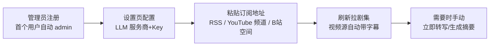

# 快速启动

> 目标：从零到能在浏览器里用。只讲操作，不解释架构（见[架构概览](./architecture.md)）。

## 环境要求

- Python 3.10–3.13（仓库 `.python-version` 固定 3.13），包管理用 [uv](https://docs.astral.sh/uv/) 0.9+
- Node.js 18+
- MongoDB 6+ 监听 `27017`；没有的话装 Docker Desktop，后端启动时会自动创建 `podcast-mongodb` 容器
- （可选）NVIDIA GPU + CUDA 12.8 用于本地转写加速；CPU 也能跑（`int8`）

## 启动后端（端口 5000）

```powershell
cd backend
Copy-Item .env.example .env   # 首次：复制配置模板
uv sync                        # 按 pyproject.toml 创建 .venv
uv run python run.py           # → http://localhost:5000
```

## 启动前端

```powershell
cd frontend
npm install
npm run dev
```

开发服务器配置端口 **3000**，被占用时 Vite 自动递增（本机常用 3002）。`/api` 请求由 Vite 代理到后端 5000，无需额外配置。

> 局域网/公网访问：Vite 已放行 `.ts.net` 域名（Tailscale Funnel 场景）。

## 配置变量（backend/.env）

全部变量见 `backend/.env.example` 与 `app/config.py`。按功能分组：

### 基础

| 变量 | 默认 | 说明 |
|------|------|------|
| `MONGO_URI` | `mongodb://localhost:27017` | MongoDB 连接 |
| `MONGO_DB` | `podcast` | 库名 |
| `JWT_SECRET` | 开发默认值 | 多用户部署必须改强随机值 |
| `AUTH_REQUIRED` | `0` | `1` 开启登录；多用户必开 |
| `MEDIA_ROOT` | `backend/media` | 下载音频的本地目录 |

### AI / LLM（可不在 .env 配，界面里配全局一套）

| 变量 | 默认 | 说明 |
|------|------|------|
| `AI_ANALYSIS_ENABLED` | `0` | AI 功能总开关（也可在设置页切） |
| `LLM_BASE_URL` / `LLM_API_KEY` / `LLM_MODEL` | 空 | 环境变量只是兜底；界面配置存 MongoDB、优先级更高 |
| `LLM_MAX_TOKENS` | `4096` | 输出超限截断时后端会自动翻倍重试一次 |

### 视频源（YouTube / B站）

| 变量 | 默认 | 说明 |
|------|------|------|
| `YOUTUBE_PROXY` | 空 | YouTube 访问代理，如 `http://127.0.0.1:7891`；国内必配 |
| `BILI_SESSDATA` | 空 | B站登录态 Cookie（F12 → Application → Cookies → SESSDATA）。失效时 B站订阅会报 login required，需重新粘贴 |
| `HF_ENDPOINT` | 空 | HuggingFace 镜像（如 `https://hf-mirror.com`），WhisperX 下载模型用 |

### 转写（本地 Whisper）

| 变量 | 默认 | 说明 |
|------|------|------|
| `WHISPER_MODEL` / `WHISPER_DEVICE` / `WHISPER_COMPUTE_TYPE` | `base` / `cpu` / `int8` | 本地转写模型与设备 |
| `WHISPERX_DIARIZE` | `0` | `1` 开启说话人分离（需 `HF_TOKEN`） |
| `TRANSCRIPTION_CLOUD_ENABLED` | `0` | AssemblyAI 云转写开关 |

## 本地转写组件（可选加载）

本地 Whisper/WhisperX 转写依赖 torch 全家桶（约 1-3GB，且与机器强相关：CUDA 轮子只适用于 NVIDIA GPU），**不在默认依赖里**。git clone 后核心功能（RSS/字幕/流播放/LLM 摘要）开箱即用；需要本地转写时在仓库根目录执行：

```powershell
python setup_local_ai.py          # 自动检测：Windows/macOS/Linux × 有无 NVIDIA GPU
python setup_local_ai.py --cpu    # 强制 CPU / Apple Silicon 通用版
python setup_local_ai.py --cuda   # 强制 CUDA 12.8 版
```

组件装进 `backend/.venv`，仓库目录不落文件。检测矩阵：Windows/Linux + NVIDIA → CUDA 轮子（GPU 加速）；macOS（Apple Silicon 走 MPS）/ 无卡机器 → 通用轮子；Android/Termux → 提示改用"PC 部署 + 手机浏览器访问"（手机不适合当宿主机）。

未安装组件时点"立即转写"或创建本地转写任务，接口会返回 400 `LOCAL_AI_NOT_INSTALLED` 并附安装命令，前端直接显示该提示。注意：之后裸跑 `uv sync`（不带 `--inexact`）会移除可选组件，更新组件请重跑安装脚本。

## 首次使用



1. 打开前端，注册账号。**第一个注册的用户自动成为 admin**；之后的注册进入 `pending`，需管理员在设置 → 用户管理里批准才能登录（注册审批制）。
2. admin 在设置 → AI Key 配置服务商和 API Key（全局一套，全员共用）。
3. 添加订阅：直接粘贴 RSS 地址、YouTube 频道页（`youtube.com/@xxx`）或 B站空间页（`space.bilibili.com/xxx`），后端自动识别类型。
4. 刷新订阅拉取剧集；视频源会自动尝试拉字幕，无字幕的剧集详情页有"立即转写"按钮（本地转写一律手动触发）。
5. 有文稿的剧集可生成 AI 摘要（可选模板和参数）。

角色说明：admin（全部权限）/ user（订阅、转写、摘要、写个人状态）/ viewer（只读 + 可用 AI 查询）。详见[架构概览](./architecture.md#权限模型)。

## 测试

```powershell
cd backend
uv run pytest                     # 全量（116 用例，2026-09-30）
uv run pytest tests/test_feeds_api.py -v   # 单个模块
```

## 常见问题

- **B站订阅报 login required**：`BILI_SESSDATA` 失效（重新登录过 B站会顶掉旧值），重新复制粘贴并重启后端。
- **YouTube 刷新超时**：检查 `YOUTUBE_PROXY` 指向的代理是否存活。
- **某些 RSS 报 403 / 超时**：后端已内置降级（chrome 指纹 → 代理），仍失败多半是源本身拒绝访问。
- **前端打开是 3000 但你想用 3002**：端口被占时 Vite 自动递增，属正常行为。
- **uv 缓存权限报错**：设 `UV_CACHE_DIR` 到项目内目录（见 README 故障排查节）。
