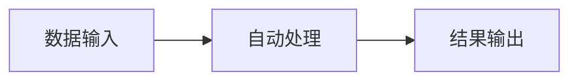

# 工作汇报模板范式（业务导向版）

> **模板版本**: v2.0
> **适用场景**: 向非技术背景的上级汇报工作成果

---

## 文档元数据块

```markdown
# [项目/任务名称]

> **汇报周期**: YYYY年MM月DD日 - YYYY年MM月DD日
> **汇报人**: 钟泽伟

---
```

---

## 第一部分：一句话总结

```markdown
## 一句话总结

[动词]了[业务问题]，通过[方案]，实现[量化结果]

**示例**:
"解决了财报数据不准确的问题，通过AI验证系统，将准确率从60%提升到95%"
```

**填写公式**:
```
[解决/优化/构建] + [什么问题] + 通过 + [什么方案] + 实现 + [量化结果]
```

---

## 第二部分：解决了什么问题

```markdown
## 解决了什么问题

### 业务痛点

**现状问题**: [描述当前存在的业务问题]

**影响范围**: [说明这个问题影响的业务/人数/数据量]

**问题根源**: [简单说明问题产生的原因，避免技术术语]

### 解决方案

**我做了什么**: [用业务语言描述解决方案，1-2句话]

**如何做到的**: [简述核心方法，不超过3点]

---
```

**填写规则**:
- 业务痛点：用老板听得懂的语言描述问题
- 影响范围：量化影响（多少人/多少数据/多少钱）
- 我做了什么：避免技术术语，讲业务动作

**示例**:
```markdown
### 业务痛点

**现状问题**: 财报日历数据存在大量错误，约40%的电话会议时间不准确

**影响范围**: 每天约100条数据，影响投资决策的及时性和准确性

**问题根源**: 数据源依赖人工录入，存在录入错误和更新延迟

### 解决方案

**我做了什么**: 搭建AI自动验证系统，自动核验每条财报信息的准确性

**如何做到的**:
1. 实时监听数据源更新
2. AI自动搜索官方来源验证
3. 标记可疑数据并修正
```

---

## 第三部分：量化效果（核心重点）

```markdown
## 量化效果

### 核心指标对比

| 指标 | 改进前 | 改进后 | 提升幅度 |
|------|--------|--------|----------|
| [指标1] | [数值] | [数值] | [百分比]% |
| [指标2] | [数值] | [数值] | [百分比]% |
| [指标3] | [数值] | [数值] | [百分比]% |

### 效果说明

* **效率提升**: [描述效率方面的改进，用数字说话]
* **成本节约**: [描述成本方面的节约，用金额或时间]
* **质量改进**: [描述质量方面的提升，用准确率等指标]

---
```

**填写规则**:
- 必须有对比：改进前 vs 改进后
- 必须量化：用具体数字
- 必须有单位：%、小时、条、元等
- 指标选择：选择老板关心的指标

**常用指标类型**:
```
效率类: 处理时间、响应速度、自动化率
质量类: 准确率、错误率、覆盖率
成本类: 人力成本、API成本、时间成本
业务类: 数据量、用户数、转化率
```

**示例**:
```markdown
## 量化效果

### 核心指标对比

| 指标 | 改进前 | 改进后 | 提升幅度 |
|------|--------|--------|----------|
| 数据准确率 | 60% | 95% | +58% |
| 日均处理量 | 50条 | 100条 | +100% |
| 人工校验时间 | 2小时/天 | 10分钟/天 | -92% |
| API调用成本 | 100% | 30% | -70% |

### 效果说明

* **效率提升**: 自动化处理替代人工校验，每天节省近2小时
* **成本节约**: API调用成本降低70%，约每月节省XXX元
* **质量改进**: 准确率从60%提升到95%，大幅减少错误数据
```

---

## 第四部分：可以做到什么

```markdown
## 现在可以做到什么

### 核心能力

1. **能力1**: [描述现在可以实现的功能/效果]
2. **能力2**: [描述现在可以实现的功能/效果]
3. **能力3**: [描述现在可以实现的功能/效果]

### 应用场景

| 场景 | 描述 | 价值 |
|------|------|------|
| [场景1] | [简述] | [业务价值] |
| [场景2] | [简述] | [业务价值] |

---
```

**填写规则**:
- 核心能力：描述"现在能做到什么"，而不是"用了什么技术"
- 应用场景：描述实际业务用途和价值

**示例**:
```markdown
## 现在可以做到什么

### 核心能力

1. **自动验证**: 每条财报数据自动核实准确性，无需人工检查
2. **实时监控**: 数据更新后5分钟内完成验证，及时发现错误
3. **智能修正**: 自动识别错误类型并修正，减少人工干预

### 应用场景

| 场景 | 描述 | 价值 |
|------|------|------|
| 日常监控 | 每天自动检查100条数据 | 确保数据质量 |
| 异常预警 | 发现可疑数据立即标记 | 及时发现风险 |
| 历史追溯 | 保留完整验证记录 | 便于问题追踪 |
```

---

## 第五部分：业务价值

```markdown
## 业务价值

### 对公司的价值

* **价值1**: [具体描述，量化优先]
* **价值2**: [具体描述，量化优先]
* **价值3**: [具体描述，量化优先]

### 对团队的价值

* **价值1**: [描述对团队的帮助]
* **价值2**: [描述对团队的帮助]

---
```

**填写规则**:
- 对公司价值：聚焦ROI、效率、成本、质量
- 对团队价值：聚焦协作、学习、可维护性

**示例**:
```markdown
## 业务价值

### 对公司的价值

* **数据质量提升**: 准确率从60%提升到95%，减少错误数据导致的决策失误
* **人力成本节约**: 每天节省2小时人工校验时间，相当于每周节省1天工作量
* **系统可扩展**: 可快速复制到其他数据源，未来无需额外开发

### 对团队的价值

* **技术沉淀**: 建立了AI验证的方法论，可复用到其他项目
* **自动化能力**: 减少重复性工作，团队可以专注于更高价值的任务
```

---

## 第六部分：下一步计划

```markdown
## 下一步计划

### 短期计划（1-2周）

* [ ] [任务1]: [预期效果]
* [ ] [任务2]: [预期效果]

### 中期规划（1个月）

* [ ] [任务1]: [预期效果]
* [ ] [任务2]: [预期效果]

### 需要的支持

* [支持1]: [说明为什么需要]
* [支持2]: [说明为什么需要]

---
```

**填写规则**:
- 短期计划：具体的、可执行的
- 中期规划：方向性的、有价值的
- 需要的支持：明确说明需要的资源

---

## 附录：简化版架构图（可选）

```markdown
## 系统工作原理（简化版）



**说明**: [用业务语言简要说明]
```

**使用规则**:
- 仅在老板询问时展示
- 用业务语言而非技术术语
- 节点不超过5个
- 简单明了

---

## 填写检查清单

### 发布前必查

- [ ] 一句话总结清晰有力
- [ ] 问题描述用业务语言
- [ ] 有至少3个量化指标
- [ ] 效果有对比（改进前后）
- [ ] 业务价值明确
- [ ] 无技术术语（或已解释）
- [ ] 有具体数据支撑
- [ ] 下一步计划可执行

### 避免的雷区

- ❌ 大篇幅技术代码
- ❌ 复杂的架构图
- ❌ 没有数据的结论
- ❌ 只有过程没有结果
- ❌ 技术术语堆砌
- ❌ 缺少量化效果

---

## 核心原则总结

### 1. 问题导向
从业务问题出发，不是从技术实现出发

### 2. 结果导向
强调"做到了什么"，不是"怎么做的"

### 3. 数据说话
每个结论都有数字支撑

### 4. 业务语言
用老板听得懂的语言，技术术语要解释

### 5. 价值明确
说明对公司的价值，而不是技术价值

---

## 快速填充模板

```markdown
# [项目名称]

> **汇报周期**: YYYY年MM月DD日 - YYYY年MM月DD日
> **汇报人**: 钟泽伟

---

## 一句话总结

[动词]了[业务问题]，通过[方案]，实现[量化结果]

---

## 解决了什么问题

**业务痛点**: [问题描述]

**影响范围**: [X人/X条数据/X金额]

**解决方案**: [简述方案]

---

## 量化效果

| 指标 | 改进前 | 改进后 | 提升 |
|------|--------|--------|------|
| [指标1] | [值] | [值] | [X%] |
| [指标2] | [值] | [值] | [X%] |

---

## 现在可以做到什么

1. [能力1]
2. [能力2]
3. [能力3]

---

## 业务价值

* **价值1**: [量化]
* **价值2**: [量化]

---

## 下一步计划

* [ ] [任务1]: [预期效果]
* [ ] [任务2]: [预期效果]
```

---

**模板版本**: v2.0
**最后更新**: 2025-12-26
