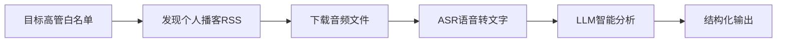
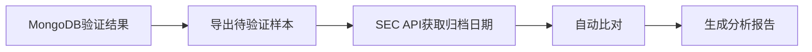

# 财报验证系统 - 准确率回测与新方向调研

> **汇报人**: 钟泽伟
> **汇报日期**: 2026年01月16日

---

## 一、本周解决的问题

**业务痛点**: 上周完成的工程化部署尚未经过实战验证，无法量化AI验证相比原始数据源的真实价值

**解决方案**: 完成为期一周的回测验证，用SEC官方归档作为"真相标准"，量化评估系统准确率；同时启动美股高管播客信息挖掘的前期调研

---

## 二、工作模块

### 模块一：工程进度 - 代码包化重构

**成果**: 将散落的验证代码统一重构为独立可复用的模块

| 指标 | 改进前 | 改进后 |
|------|--------|--------|
| **代码组织** | 分散在多个目录 | 统一独立模块 |
| **部署方式** | 多入口混乱 | 模块化一键启动 |
| **依赖管理** | 与主项目混用 | 独立依赖清单 |
| **版本控制** | 混合管理 | 独立仓库 (v2.0.0) |

**模块结构**:
```
earncal/                   # 独立模块
+-- config.py              # 统一配置
+-- core/db.py             # 数据库层
+-- services/              # 外部服务封装
|   +-- llm/               # 智能验证引擎
|   +-- sec/               # SEC数据接口
|   +-- quartr/            # 财报日历源
+-- gateway/               # 实时数据接收
+-- api/                   # 对外查询服务
+-- scripts/init_system.py # 一键初始化
```

**核心能力**:
- 支持一键初始化部署：自动创建索引、拉取数据、同步验证任务
- 区分数据来源：实时推送需24小时沉淀，主动拉取立即处理
- 智能重验证：仅在日期真正变化且与验证结果不同时触发

---

### 模块二：准确率回测验证

**验证方法**: 以SEC官方归档日期为"真相标准"，对比Quartr原始预测与AI验证结果

**回测范围**: 2026-01-07 ~ 01-14
- **原始样本**: 48个
- **剔除FPI**(非US公司): 3个
- **有效样本**(US本土): 45个
- **可验证样本**(有SEC归档): 37个
- **待验证样本**(未来预测): 8个


#### 核心指标

| 指标 | Quartr (原始数据源) | AI (智能验证系统) | 说明 |
|------|---------------------|-------------------|------|
| **准确率** | 64.4% (29/45) | 95.5% (43/45) | 基于有效样本45个（US本土公司） |
| **AI独赢案例** | - | 6 | Quartr错误，AI正确 |
| **差异分析** | - | 6 | 发布日vs归档日统计口径差异 |
| **待验证样本** | - | 8 | AI预测在未来，尚未到财报发布日 |

#### 术语解释

| 术语 | 含义 | 举例 |
|------|------|------|
| **Quartr准确率** | Quartr预测日期与SEC归档日期一致的比例 | 29/45 = 64.4% |
| **AI准确率** | AI验证日期与SEC归档日期一致的比例 | 43/45 = 95.5% |
| **AI独赢** | Quartr预测错误，但AI预测正确的案例 | 如：DJCO，Quartr预测01-08，AI预测12-29，SEC确认为12-29 |
| **差异分析** | AI命中发布日，SEC记录归档日，统计口径差异 | 如：AEHR，AI预测01-08，SEC归档01-12 |
| **待验证样本** | AI预测在未来，尚未到财报发布日，无法验证 | 如：XOM，Quartr预测01-07已过期，AI预测01-30 |

#### 案例分类 (45个有效US样本)

| 分类 | 数量 | 说明 |
|------|------|------|
| **完美匹配** | 31 | 双方预测一致且正确 |
| **AI独赢** | 6 | Quartr错误，AI正确 |
| **差异分析** | 6 | AI命中发布日，SEC记录归档日（统计口径差异） |
| **待验证** | 2 | Quartr预测已过期，AI预测在未来 |

#### AI独赢案例详情

| 代码 | 公司名称 | Quartr预测 | AI预测 | SEC实际 | 说明 |
|------|----------|------------|--------|---------|------|
| DJCO | Daily Journal | 01-08 | 12-29 | 12-29 | 非日历年(9月结)，AI准确识别 |
| RILY | B Riley Financial | 01-08 | 01-15 | 01-14 | 推迟发布，AI修正历史惯例 |
| PETS | PetMed Express | 01-08 | 12-19 | 12-19 | 提前发布，AI准确 |
| CETX | Cemtrex | 01-09 | 12-29 | 12-29 | 非日历年，AI准确 |
| BNAI | Brand Engagement Network | 01-09 | 11-25 | 11-25 | Quartr滞后45天 |
| IPW | iPower | 01-09 | 10-09 | 10-09 | Quartr严重滞后(3个月) |

#### 差异分析案例（发布日 vs 归档日）

| 代码 | 公司名称 | Quartr预测 | AI预测 | SEC实际 | 备注 |
|------|----------|------------|--------|---------|------|
| AEHR | Aehr Test Systems | 01-12 | 01-08 | 01-12 | AI命中发布日(8号)，SEC记录归档日(12号) |
| BBCP | Concrete Pumping | 01-08 | 01-08 | 01-13 | 公司实际发布比历史规律晚5天 |
| EDUC | Educational Development | 01-08 | 01-08 | 01-13 | 公司实际发布比历史规律晚5天 |
| BPTH | Bio-Path | 01-09 | 11-19 | 01-13 | 公司违约迟交2月，AI预测合规截止日 |
| MOBX | Mobix Labs | 01-09 | 12-18 | 01-13 | AI抓取到12/18初步业绩发布 |
| ANIX | Anixa Biosciences | 01-09 | 01-09 | 01-12 | 周五(9号)预测 vs 周一(12号)发布 |

#### 关键发现

1. **AI准确率显著提升**: 95.5% vs 64.4%，提升31.1个百分点
2. **AI独赢价值**: 6个案例中，Quartr完全错误而AI正确
3. **统计口径差异**: 6个案例中AI命中发布日，但SEC记录的是归档日（实际发布后几天才归档）
4. **待验证价值**: 8个案例Quartr预测已过期，AI成功识别并给出未来日期

---

### 模块三：新任务调研 - 美股高管个人播客信息挖掘

**背景**: 从上市公司高管个人播客中挖掘投资相关信息

**当前阶段**: 需求梳理与可行性调研

#### 任务流程



#### 核心任务

| 阶段 | 任务 | 技术要点 |
|------|------|----------|
| **目标筛选** | 确定跟踪的高管白名单 | 聚焦知名科技/金融公司CEO |
| **RSS发现** | 识别个人播客订阅源 | Spotify/Apple Podcasts/YouTube |
| **音频获取** | 定时拉取新音频 | yt-dlp/podcast-dl |
| **ASR转写** | 语音转文字 | Whisper/Groq/Deepgram |
| **LLM分析** | 提取投资相关信息 | 结构化输出：观点/预测/行业洞察 |

#### 待确认问题

| 问题类别 | 待明确内容 |
|----------|------------|
| **目标范围** | 跟踪哪些高管？是否有现成白名单？ |
| **更新频率** | 每日/每周汇总？ |
| **输出形式** | 摘要报告 / 关键信息提取 / 实时提醒？ |

---

## 三、发现的问题与应对

| 问题 | 影响 | 应对措施 |
|------|------|----------|
| SEC归档日期晚于实际发布日 | 回测统计误判AI为错误 | 增加新闻稿/官网公告作为辅助真相源 |
| 部分小公司合规违约延迟提交 | AI预测的是合规日期，实际推迟 | 标记高风险公司，降低置信度 |
| 播客内容获取的合规性待确认 | 可能涉及版权问题 | 需与法务/合规部门确认边界 |

---

## 四、下周计划

- [ ] 完善回测框架：增加新闻稿验证源，减少SEC归档滞后的误判
- [ ] 播客调研深化：确认目标白名单和优先级
- [ ] 系统持续运行：监控验证覆盖率和准确率

---

## 附录：回测数据流程



**说明**: 回测系统自动从数据库拉取已验证记录，调用SEC官方接口获取真实归档日期，计算准确率并生成可视化报告。
